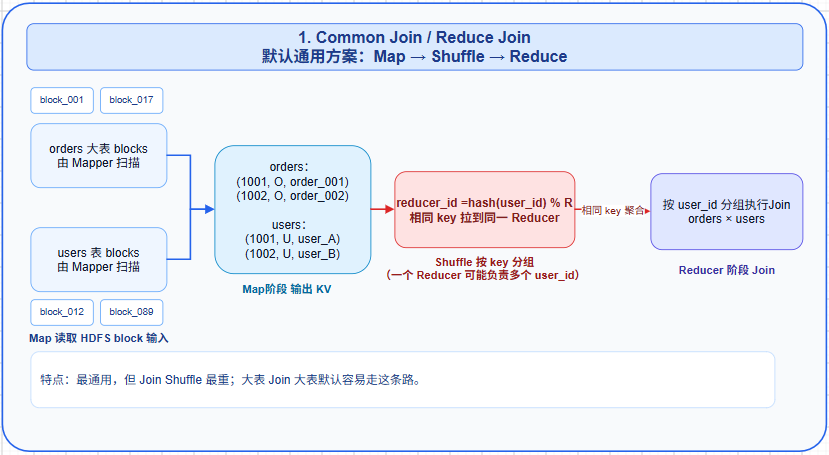
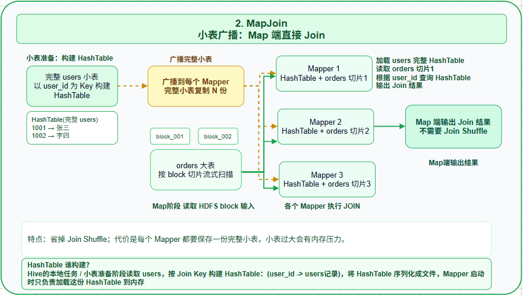
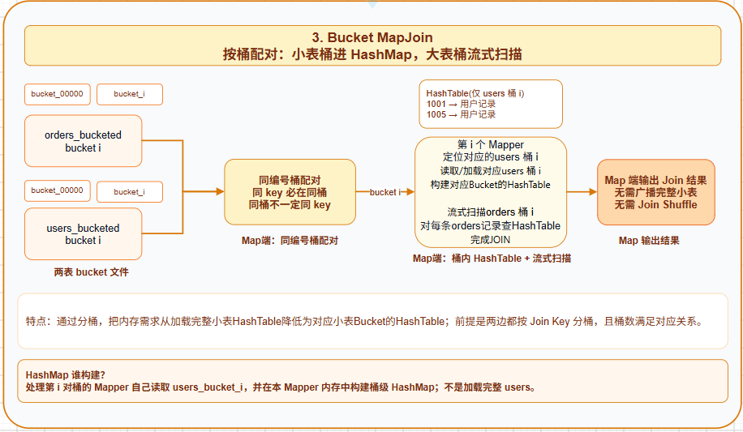
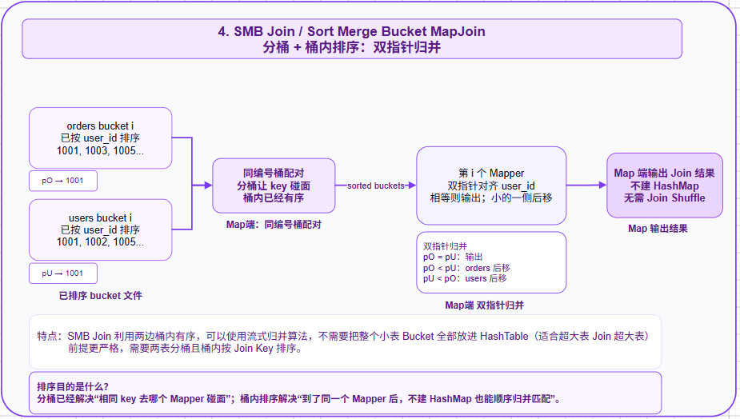

## 一、不分区+不分桶

假设两张表分别为orders、users（后面直接简称为A、B表）。执行普通JOIN（无分区、无分桶）会发生什么？

### 1.1、表结构

```sql
-- 表结构和数据
CREATE TABLE orders (
    order_id BIGINT,
    user_id BIGINT,
    amount DECIMAL(10,2),
    order_time TIMESTAMP
);

CREATE TABLE users (
    user_id BIGINT,
    name STRING,
    city STRING
);
```

### 1.2、物理存储

```textile
HDFS路径：
/user/hive/warehouse/orders/
    ├── 000000_0  (100GB，杂乱存储)
    ├── 000000_1
    └── ...
/user/hive/warehouse/users/
    ├── 000000_0  (10GB，杂乱存储)
    └── ...
```

假设 orders 表 100GB，HDFS 默认 128MB 一个 block，那么会被切成约 800 个 block，**随机分散在集群几十/几百台机器上**：

```textile
机器1: orders的block_001, block_017, block_233 ...
机器2: orders的block_002, block_089, block_456 ...
机器3: orders的block_003, users的block_012 ...
...
```

**HDFS 存储时不关心 user_id 的值**，只按"写入顺序 + 128MB 切块"分散
👉 也就是说：**同一个 user_id 对应的 A 表记录和 B 表记录，几乎一定不在同一台机器上**。

### 1.3、Join 的本质要求：相同 key 必须"碰面"

SQL 的 `ON o.user_id = u.user_id` 本质是要做：

> 对于每一个 `user_id` 值，把 A 表里所有这个 user_id 的行 + B 表里所有这个 user_id 的行，**放到同一个地方**，然后两两配对。

**举个例子**，`user_id=1001`：

- A 表（orders）里有 5 条订单
- B 表（users）里有 1 条用户信息
- Join 结果 = 5 × 1 = 5 行

要完成这个匹配，**这 6 条记录必须出现在同一个进程的内存里**，否则根本无法对比。

### 1.4、普通 Join 与 MapJoin：先看不分桶时的两条路

在“不分区 + 不分桶”的前提下，Hive 做 Join 通常有两条路线：

| 执行方式                          | 适用场景                | 核心动作                                      | 是否需要 Join Shuffle |
| ----------------------------- | ------------------- | ----------------------------------------- | ----------------- |
| **Common Join / Reduce Join** | 默认方案，两边都可能很大        | Map 端输出 Join Key，Shuffle 后在 Reduce 端 Join | 需要                |
| **MapJoin**                   | 一边是小表，能放进 Mapper 内存 | 小表广播到每个 Mapper，在 Map 端 Join               | 不需要 Join Shuffle  |

先看默认的 **Common Join**。查询语句如下：

```sql
SELECT o.*, u.name
FROM orders o
JOIN users u ON o.user_id = u.user_id;
```

#### 1.4.1、Map（Common Join：只读数据，不在 Map 端 Join）

每个 Map 任务只能读取自己机器上的一个 block（数据本地性原则）：

```text
Map任务1（在机器1上）：读 orders 的 block_001
  → 看到了 user_id = 1001, 2003, 1001, 5008 ...

Map任务2（在机器2上）：读 orders 的 block_002
  → 看到了 user_id = 1001, 3007, 8002 ...

Map任务800（在机器30上）：读 users 的 block_012
  → 看到了 user_id = 1001, 1002, 1003 ...
```

**map 任务彼此之间是隔离的，无法通信**。Map1 不知道 Map2 看到了什么，更不知道 users 表的 1001 在哪里。所以必须 Shuffle（重新洗牌），将相同user_id分发到同一个Reducer中。

Common Join 的 Map 阶段**不会把小表加载进内存做 Join**，而是把两张表都转成以 Join Key 为 key 的中间数据，并打上来源标记：

```text
orders 记录：user_id=1001, order_id=8001  →  <1001, O|8001|99.0>
users  记录：user_id=1001, name=张三       →  <1001, U|张三|成都>
```

Map 阶段只是“准备好按 `user_id` 分组的数据”，真正的匹配发生在 Reduce 阶段。

#### 1.4.2、Shuffle

Shuffle 的作用：**按 join key 对所有数据重新分组,把相同 key 的数据搬运到同一个 Reducer**。

```text
Shuffle 规则： reducer_id = hash(user_id) % R

假设 R=3：
  user_id=1001 → hash%3=0 → 全部送到 Reducer0
  user_id=2003 → hash%3=1 → 全部送到 Reducer1
  user_id=5008 → hash%3=2 → 全部送到 Reducer2
```

无论 `user_id=1001` 原本在哪台机器、哪个 block、来自 A 表还是 B 表，**Shuffle 后都会被搬到 Reducer0**。

#### 1.4.3、Reduce

- **1、收集**：到了 Reducer0，它收到的所有具有相同 JOIN键 的记录，如 `user_id=1001` 的记录长这样：
  
  ```sql
  user_id=1001, order_id=8001, amount=99.0
  user_id=1001, order_id=8002, amount=50.0
  user_id=1001, order_id=8003, amount=120.0
  user_id=1001, name="张三", city="成都"
  ```

- **2、分组**：Reducer 在内存里把来自两表的记录按JOIN键分组
  
  - A 组（orders）：3 条
  - B 组（users）：1 条

- **3、JOIN**：在组内进行笛卡尔积：3 × 1 = 3 条 Join 结果输出。

#### 1.4.4、总结

```markdown
Map阶段：
  - 启动M个Map任务读取orders表  ===> 输出键值对：<order_id,B记录>  <order_id,B记录> ...
  - 启动N个Map任务读取users表   ===> 输出键值对：<user_id,A记录>  <user_id,A记录> ...

Shuffle阶段： hash(user_id) 网络传输重新分组 ⭐⭐⭐⭐⭐ 性能瓶颈！
  - 所有记录按user_id哈希，发送到R个Reducer
  - 网络传输：100GB + 10GB = 110GB全部通过网络传输
  - 如果某个user_id有大量订单（大V用户），会发送到同一个Reducer

Reduce阶段：每个Reducer内做笛卡尔积
  - 每个Reducer接收特定user_id范围的所有记录
  - 在Reducer内存中分组：orders记录 vs users记录
  - 执行笛卡尔积：orders × users
```

#### 1.4.5、MapJoin（小表广播：Map 端直接 Join）

如果 `users` 表足够小，Hive 可以不走上面的 Shuffle + Reduce，而是把小表提前加载成内存 HashTable，并分发给每个 Mapper。

```text
Mapper 1：完整 users 小表 HashTable + orders 数据切片1
Mapper 2：完整 users 小表 HashTable + orders 数据切片2
Mapper 3：完整 users 小表 HashTable + orders 数据切片3
```

此时每个 Mapper 处理自己读到的 `orders` 数据：

```text
1. Mapper 启动时，先把完整 users 小表加载到各自的内存 HashTable中
2. Mapper 流式扫描 orders 的一个 block
3. 每读到一条 orders 记录，就用 order.user_id 去 HashTable 查 users
4. 查到就直接输出 Join 结果
```

所以 MapJoin 的核心是：**小表广播，大表流式扫描，Join 在 Map 端完成**。

```text
Common Join：两边数据都按 user_id Shuffle 到 Reducer
MapJoin：    小表复制到每个 Mapper，大表不按 Join Key Shuffle
```

##### 1.4.5.1、MapJoin 的 HashTable 到底是谁构建的？

不是 Reducer 构建，也不是每个 Mapper 再去完整扫描一遍 `users` 表。可以理解为：**Hive 在执行计划里先安排一个本地任务 / 小表准备阶段，把小表读出来并构造成 HashTable 文件，然后分发到各个 Mapper；Mapper 启动时再把这份 HashTable 加载到自己的内存中使用。**

简化过程如下：

```text
1. Hive 判断 users 是小表，选择 MapJoin 计划
2. 小表准备阶段读取 users 数据
3. 按 Join Key 构建 HashTable：user_id -> users记录
4. 将 HashTable 序列化成文件
4. 通过分布式缓存等机制将HashTable 序列化文件分发到每个 Mapper 所在节点
5. 每个 Mapper 启动后加载 HashTable 到内存
6. Mapper 扫描 orders 切片，查 HashTable 完成 Join
```

所以 MapJoin 的“广播”不是把原始 SQL 表概念性地广播，而是把**已经适合查询的 HashTable/小表数据结构**分发给 Mapper 使用。

MapJoin 的代价也很明显：**每个 Mapper 都要保存一份完整小表**。如果小表其实不小，就会造成内存压力，甚至 OOM。

通过 `hive.auto.convert.join=true`，Hive 可以在合适条件下把普通 Join 自动转换成 MapJoin：

```text
普通 JOIN
  ↓
判断是否有足够小的输入
  ├── 有：转换成 MapJoin
  └── 没有：继续使用 Common Join
```

常见相关参数如下：

| 参数                                              | 常见默认值      | 含义                         |
| ----------------------------------------------- | ----------:| -------------------------- |
| `hive.auto.convert.join`                        | `true`     | 自动将合适的 JOIN 转成 MapJoin     |
| `hive.auto.convert.join.noconditionaltask`      | `true`     | 编译期满足大小条件时，直接生成 MapJoin 计划 |
| `hive.mapjoin.smalltable.filesize`              | `25000000` | 判断“小表”的输入文件大小阈值，约 25 MB    |
| `hive.auto.convert.join.noconditionaltask.size` | 版本相关       | 直接转换时的小表输入总大小阈值            |

注意：`hive.mapjoin.smalltable.filesize=25000000` 判断的是**输入文件大小**，不是小表构建成 HashTable 后真实占用的内存。

如果小表本身压缩率很高、字段很多、或者一对多记录很多，构建成 HashTable 后的内存占用可能明显大于输入文件大小，所以生产环境不能只看文件大小阈值，还要看实际执行内存。

到这里可以先记住两句话：

- **Common Join**：不要求小表，通用，但需要 Shuffle。
- **MapJoin**：要求一边足够小，省掉 Join Shuffle，但要把完整小表复制到每个 Mapper。

### 1.5、引申出分区/分表的概念

到这里应该能明白：为什么"都在HDFS存储了"，Join还要网络传输到内存才能计算了吧！

| 易产生的误解                | 真相                                                                          |
| --------------------- | --------------------------------------------------------------------------- |
| HDFS 是共享存储，数据已经"在一起"了 | HDFS 是**分布式存储**，数据**物理上分散**在几百台机器的磁盘上                                       |
| 读取就能 Join             | 读取只能拿到"局部数据"，Join 需要"全局按 key 聚合"                                            |
| Shuffle 没必要           | **Shuffle 是分布式计算里"让相同 key 相遇"的唯一手段**<br/>（除非用 Map Join / Bucket Join 提前规划好） |

## 二、分区+不分桶

### 2.1、表结构

设置按天作为分区条件，虽然 CREATE中只声明了order_id、user_id、amount三列，但是由于分区字段的存在，实际上表是有**dt**这列的

```sql
CREATE TABLE orders_partitioned (
    order_id BIGINT,
    user_id BIGINT,
    amount DECIMAL(10,2)
)
PARTITIONED BY (dt STRING);  -- 按天分区

CREATE TABLE users (  -- users表通常不分区，因为用户维度表变化慢
    user_id BIGINT,
    name STRING,
    city STRING
);
```

### 2.2、物理存储

因为是按照 dt 分区，所以表中有几天就会在下面新建几个子文件夹，每个文件夹表示一天

```markdown
HDFS路径：
/user/hive/warehouse/orders_partitioned/
    ├── dt=2024-01-01/  (1GB)
    ├── dt=2024-01-02/  (1GB)
    ├── dt=2024-01-03/  (1GB)
    └── ... (共100天，100GB)

/users/
    └── 000000_0  (10GB)
```

### 2.3、执行过程

```sql
-- 带分区条件的查询
SELECT o.*, u.name
FROM orders_partitioned o
JOIN users u ON o.user_id = u.user_id
WHERE o.dt = '2024-01-01';  -- 关键：使用分区条件
```

#### 2.3.1、Map

```text
分区裁剪后，只读取 orders_partitioned 的 dt='2024-01-01' 目录。

Map任务1：读取 orders_partitioned/dt=2024-01-01/ 下的某个 block
  输出：<user_id, O|订单记录>

Map任务2：读取 orders_partitioned/dt=2024-01-01/ 下的另一个 block
  输出：<user_id, O|订单记录>

Map任务3：读取 users 表的某个 block
  输出：<user_id, U|用户记录>
```

- **分区裁剪（Partition Pruning）**：只扫描 `dt>='2024-01-01'` 的目录，**100GB 可能只读 10GB**
- 但读出来的数据**只是减少了输入量，`user_id` 依然没有按桶组织**
- 因此 Map 阶段仍然只是输出 Join Key，不能在本地直接完成 Join

#### 2.3.2、Shuffle

- user_id 在分区内**完全随机分布**，`user_id=1001` 可能出现在任何一个分区的任何一个文件
- **依然要按 user_id 哈希，全网传输 → Shuffle 不可避免**

Shuffle 的作用：按 join key 对所有数据重新分组,把相同 key 的数据搬运到同一个 Reducer。

```text
Shuffle 规则： reducer_id = hash(user_id) % R

假设 R=3：
  user_id=1001 → hash%3=0 → 全部送到 Reducer0
  user_id=2003 → hash%3=1 → 全部送到 Reducer1
  user_id=5008 → hash%3=2 → 全部送到 Reducer2
```

无论 `user_id=1001` 原本在哪台机器、哪个 block、来自 A 表还是 B 表，**Shuffle 后都会被搬到 Reducer0**。

#### 2.3.3、Reduce

到了 Reducer0，它收到的所有 `user_id=1001` 的记录长这样：

```text
user_id=1001, order_id=8001, amount=99.0
user_id=1001, order_id=8002, amount=50.0
user_id=1001, order_id=8003, amount=120.0
user_id=1001, name="张三", city="成都"
```

Reducer 在内存里**按表来源分成两组**：

- A 组（orders）：3 条
- B 组（users）：1 条

然后做笛卡尔积：3 × 1 = 3 条 Join 结果输出。

#### 2.3.4、总结

```markdown
Map阶段：
  - orders表：只启动Map任务读取dt=2024-01-01分区（1GB）===> 输出键值对：<order_id,B记录> <order_id,B记录> ...
  - users表：启动Map任务读取全部（10GB） ===> 输出键值对：<user_id,A记录> <user_id,A记录> ...

Shuffle阶段：
  - 所有记录按user_id哈希，发送到R个Reducer
  - 网络传输：1GB(orders) + 10GB(users) = 11GB
  - 相比普通JOIN的110GB，减少90%！

Reduce阶段：(同普通JOIN)
  - 每个Reducer接收特定user_id范围的所有记录
  - 在Reducer内存中分组：orders记录 vs users记录
  - 执行笛卡尔积：orders × users
```

**分区 = 减少输入数据量，但 Shuffle 一分都没少。** 如果 WHERE 条件不带分区字段，分区等于白做。

### 2.4、分区设计原则

**分区适合低基数或可控基数的字段**，分区不宜过多，否则产生大量小文件（每个分区数据量建议：100MB-2GB）

例如：

- 日期 `dt`
- 小时 `hour`
- 地区 `region`
- 业务类型 `biz_type`

不适合直接把 `user_id` 作为分区字段，因为可能产生数百万个小目录和大量分区元数据

```sql
-- 按时间分区（最常用）
PARTITIONED BY (dt STRING, hour STRING)

-- 按业务维度分区
PARTITIONED BY (country STRING, province STRING)
```

## 三、分桶+不分区

分桶会用到一个关键词：`CLUSTERED BY`。例如 `CLUSTERED BY (user_id) INTO 32 BUCKETS` 表示：写入表数据时，Hive 会根据 `user_id` 的 Hash 结果，把数据稳定地分散到 32 个桶文件中。

bucket_id对应的是桶的唯一标识，`hash`是将`user_id`映射为桶编号`bucket_id`的映射函数，计算过程如下

```sql
bucket_id = hash(user_id) % 32
```

假设

```plain
hash(32) % 32 = 0
hash(33) % 32 = 1
hash(34) % 32 = 2
hash(64) % 32 = 0
```

那么就可以获得`user_id`对应的桶

```plain
user_id=32 → bucket_00000
user_id=33 → bucket_00001
user_id=34 → bucket_00002
user_id=64 → bucket_00000
```

这里需要注意两个方向：

- 相同的 `user_id`，Hash 结果相同，因此一定进入同一个桶；
- 不同的 `user_id`，也可能由于 Hash 冲突进入同一个桶。

**分区和分桶的区别如下**

| 对比项                       | `PARTITIONED BY` 分区 | `CLUSTERED BY ... INTO N BUCKETS` 分桶   |
| ------------------------- | ------------------- | -------------------------------------- |
| 数据划分方式                    | 根据列值直接划分            | 根据列值计算 Hash 后划分                        |
| 典型公式                      | 一个分区值对应一个目录         | `hash(桶列) mod 桶数`                      |
| 物理表现                      | 通常是目录               | 通常是文件                                  |
| 数量                        | 由实际分区值数量决定          | 建表时指定固定桶数                              |
| 是否保存为元数据                  | 是                   | 是                                      |
| 查询时常用优化                   | Partition Pruning   | Bucket Pruning、Bucket Join、SMB Join、抽样 |
| 典型字段                      | `dt`、地区、业务类型        | `user_id`、`deptno`、Join Key            |
| 是否适合高基数字段                 | 通常不适合               | 比分区更适合                                 |
| 能否直接通过普通 `WHERE` 大幅减少目录扫描 | 可以                  | 需要执行引擎支持 Bucket Pruning 等优化            |

前提回顾：没有使用分桶时，Hive 主要有两种 Join 路线：

- **Common Join**：两张表都按 `user_id` Shuffle，把相同 `user_id` 拉到同一个 Reducer 中 Join。
- **MapJoin**：如果一张表足够小，就把完整小表广播到每个 Mapper，大表流式扫描，在 Map 端 Join。

Common Join 的过程如下：

```plain
orders ──按 user_id Shuffle──┐
                            ├── Reducer Join
users  ──按 user_id Shuffle──┘
```

MapJoin 的过程如下：

```plain
完整 users 小表 ──广播──→ Mapper1 + orders切片1
完整 users 小表 ──广播──→ Mapper2 + orders切片2
完整 users 小表 ──广播──→ Mapper3 + orders切片3
```

而分桶的核心价值是：**提前按照 Join Key 把数据组织好**。如果 `orders` 和 `users` 都按 `user_id` 分桶，那么同一个 `user_id` 如果在两张表中都存在，就一定会落到同编号桶里。

例如：

```plain
orders 中的 user_id=32 → bucket_00000
users  中的 user_id=32 → bucket_00000
```

这样 Join 时就不需要把所有数据按 `user_id` 重新 Shuffle 到 Reducer，而是可以让 Mapper 直接处理“同编号桶”。

四种 Join 可以按下面这条线理解：

```plain
Common Join
  默认通用方案：Map 读两表 → 按 Join Key Shuffle → Reducer Join

MapJoin
  小表优化方案：完整小表广播到每个 Mapper → 大表流式扫描 Join

Bucket MapJoin
  分桶优化方案：不再广播完整小表，只读取小表桶i + 大表桶i

SMB Join
  分桶 + 排序优化方案：小表也不装 HashMap，两边桶内有序，双指针归并
```

**同样是两张分桶表，Hive 在 Map 阶段可以继续分成两种 Join 算法：Bucket MapJoin 和 SMB Join。**

这里容易混淆的一点是：**Bucket MapJoin 不是“MapJoin + 换个存储位置”这么简单**。它真正改变的是小表加载范围：

```text
普通 MapJoin：
  每个 Mapper 都拿到完整 users 小表
  Mapper1: 完整 users + orders切片1
  Mapper2: 完整 users + orders切片2
  Mapper3: 完整 users + orders切片3

Bucket MapJoin：
  第 i 个 Mapper 只拿 users 的桶 i
  Mapper0: users桶0 + orders桶0
  Mapper1: users桶1 + orders桶1
  Mapper2: users桶2 + orders桶2
```

两者都可以省掉 Join Shuffle，但省掉 Shuffle 的原因不同：

| 方案             | 为什么不需要 Join Shuffle               | 代价                   |
| -------------- | --------------------------------- | -------------------- |
| MapJoin        | 小表完整复制到每个 Mapper，大表每条记录都能本地查小表    | 每个 Mapper 都保存完整小表    |
| Bucket MapJoin | 两边按同一 Join Key 分桶，同一个 key 一定在同编号桶 | 要求两边提前正确分桶，且桶数满足对应关系 |

### 3.1、表结构：小表桶 + 大表桶（Bucket Map Join / HashMap）

这里的“小表桶 + 大表桶”不是说一张表只有小桶、一张表只有大桶，而是说：

- 两张表都按同一个 Join Key 分桶，比如都按 `user_id` 分 32 个桶
- `users_bucketed` 相对较小，至少“单个桶”能放进一个 Map 任务的内存
- `orders_bucketed` 相对较大，不适合整桶放进内存，所以采用流式扫描

每个 Map 任务只处理一对同编号桶：

```text
Map任务0：处理 orders 桶0 + users 桶0
Map任务1：处理 orders 桶1 + users 桶1
...
Map任务31：处理 orders 桶31 + users 桶31
```

```sql
CREATE TABLE orders_bucketed (
    order_id BIGINT,
    user_id BIGINT,
    amount DECIMAL(10,2),
    order_time TIMESTAMP
)
CLUSTERED BY (user_id) INTO 32 BUCKETS;  -- 按user_id分32个桶

CREATE TABLE users_bucketed (
    user_id BIGINT,
    name STRING,
    city STRING
)
CLUSTERED BY (user_id) INTO 32 BUCKETS;  -- 同样分32个桶

-- 设置参数启用 Bucket Map Join
SET hive.optimize.bucketmapjoin = true;
```

以 `Map任务0` 为例：

```text
1. Map任务0 先读取 users 桶0
   在当前 Mapper 内存中构建 HashMap：
   key   = user_id
   value = 这个 user_id 对应的用户记录

2. Map任务0 再流式扫描 orders 桶0
   每读到一条订单，就拿 order.user_id 去 HashMap 里查

3. 查到了，就直接输出 Join 结果
```

#### 3.1.1、Bucket MapJoin 的 HashMap 又是谁构建的？

Bucket MapJoin 中，HashMap 通常由**处理这一对桶的 Mapper 自己构建**。第 `i` 个 Mapper 只读取 `users` 的桶 `i`，把这个小表桶构造成内存 HashMap；然后再扫描 `orders` 的桶 `i` 去查这个 HashMap。

```text
第 i 个 Mapper：
  1. 读取 users_bucket_i
  2. 构建 HashMap：user_id -> users记录
  3. 流式读取 orders_bucket_i
  4. 用 orders.user_id 查 HashMap
  5. 输出 Join 结果
```

和普通 MapJoin 相比，区别非常关键：

```text
MapJoin：
  HashTable = 完整 users 表
  每个 Mapper 都加载一份完整 users

Bucket MapJoin：
  HashMap = users 的某一个桶
  第 i 个 Mapper 只加载 users_bucket_i
```

所以 Bucket MapJoin 的优势不是“是否有 Shuffle”这一点，因为 MapJoin 本来也没有 Join Shuffle；它的优势是：**把完整小表广播，缩小成对应小表桶读取，降低内存和网络压力。**

所以这个方案可以记成：**小表桶进内存，大表桶一条条扫**。

它不要求桶内排序，只要求两边都按 Join Key 分桶，并且桶号能对应上。适合“事实表 Join 维度表”，比如 `orders` 很大，`users` 相对较小。

### 3.2、表结构：大表桶 + 大表桶（SMB Join / Sort Merge Bucket Join）

SMB Join 比 Bucket MapJoin 多一个关键前提：**桶内有序**。所以建表时不仅要 `CLUSTERED BY (user_id)`，还要声明 `SORTED BY (user_id)`。

注意：`SORTED BY` 不是查询时临时排序，而是要求数据写入桶文件时就按 `user_id` 排好序。查询时 Hive 才能直接顺序归并。

```sql
CREATE TABLE orders_bucketed (
    order_id BIGINT,
    user_id BIGINT,
    amount DECIMAL(10,2),
    order_time TIMESTAMP
)
CLUSTERED BY (user_id) SORTED BY (user_id) INTO 32 BUCKETS;  -- 按user_id分32个桶 + 排序：

CREATE TABLE users_bucketed (
    user_id BIGINT,
    name STRING,
    city STRING
)
CLUSTERED BY (user_id)  SORTED BY (user_id) INTO 32 BUCKETS;  -- 同样分32个桶 + 排序：


SET hive.optimize.bucketmapjoin = true;
SET hive.optimize.bucketmapjoin.sortedmerge = true;
SET hive.auto.convert.sortmerge.join = true;
```

如果两张表都很大，比如 `orders_bucketed` 很大，`users_bucketed` 也很大，那么即使只看某一个桶，`users` 的桶也可能放不进内存。这个时候就不能再依赖 HashMap。

SMB Join 的做法是：**两张表不仅要分桶，还要让每个桶内部按 Join Key 排好序**。

排序的目的不是为了“能不能在 Map 端 Join”。只要两边正确分桶，Bucket MapJoin 已经可以在 Map 端 Join。排序真正解决的是另一个问题：**桶内匹配时还要不要把一边加载成 HashMap。**

```text
Bucket MapJoin：
  users 桶 i → 加载成 HashMap
  orders 桶 i → 流式扫描并查 HashMap

SMB Join：
  users 桶 i 已按 user_id 排序
  orders 桶 i 已按 user_id 排序
  两边顺序读取，用双指针归并
  不需要构建 HashMap
```

如果两边桶都很大，`users_bucket_i` 也可能放不进内存，那么 Bucket MapJoin 的 HashMap 方案就会有风险。SMB Join 通过桶内排序，把“内存查找”变成“顺序归并”，因此更适合大表 Join 大表。

所以建表语句里会多出 `SORTED BY (user_id)`：

```sql
CLUSTERED BY (user_id) SORTED BY (user_id) INTO 32 BUCKETS
```

这样同一个桶里的数据大概长这样：

```text
orders 桶0：1001, 1003, 1005, 1008, ...
users  桶0：1001, 1002, 1005, 1009, ...
```

Map 任务就可以像“合并两个有序数组”一样，用双指针顺序扫描：

```text
orders指针 = 1001，users指针 = 1001，相等，输出 Join 结果
orders指针 = 1003，users指针 = 1002，users 小，users 指针后移
orders指针 = 1003，users指针 = 1005，orders 小，orders 指针后移
orders指针 = 1005，users指针 = 1005，相等，输出 Join 结果
```

所以这个方案可以记成：**两边都不装进内存，而是依赖桶内有序，边读边归并**。

### 3.3、两种方式对比

| 对比项       | Bucket Map Join / HashMap | SMB Join / Sort Merge Bucket Join |
| --------- | ------------------------- | --------------------------------- |
| 典型场景      | 大表 Join 小表                | 大表 Join 大表                        |
| 是否需要分桶    | 需要，两边按 Join Key 分桶        | 需要，两边按 Join Key 分桶                |
| 是否需要桶内排序  | 不需要                       | 需要 `SORTED BY (join_key)`         |
| Map 阶段怎么做 | 小表桶加载到 HashMap，大表桶流式扫描    | 两边桶都顺序读取，双指针归并                    |
| 内存压力      | 取决于小表桶大小                  | 很低，不需要把一边整桶放入内存                   |
| 核心记忆      | 装小表，扫大表                   | 两边有序，顺序归并                         |

一句话总结：**HashMap 方案靠“内存查找”提速，SMB Join 靠“有序归并”省内存；两者都依赖分桶来避免 Shuffle。**

也可以这样记：

```text
分桶解决：相同 Join Key 去哪里碰面
HashMap 解决：桶内如何快速查找匹配
排序解决：桶内不用 HashMap 也能顺序匹配
```

### 3.4、物理存储

```markdown
HDFS路径：
/user/hive/warehouse/orders_bucketed/
    ├── 000000_0  (桶0：user_id哈希后%32=0的记录)
    ├── 000001_0  (桶1)
    ├── ...
    └── 000031_0  (桶31)

/users_bucketed/
    ├── 000000_0  (桶0)
    ├── ...
    └── 000031_0  (桶31)
```

### 3.5、执行过程（Bucket MapJoin / SMB Join）

```sql
SELECT o.*, u.name
FROM orders_bucketed o
JOIN users_bucketed u ON o.user_id = u.user_id
WHERE o.order_time >= '2024-01-01';
```

#### 3.5.1、Map

先把三种 Map 端 Join 的差别放在一起看：

```text
普通 MapJoin：
  每个 Mapper = 完整小表 + 大表的一个数据切片

Bucket MapJoin：
  第 i 个 Mapper = 小表桶 i + 大表桶 i

SMB Join：
  第 i 个 Mapper = 已排序的小表桶 i + 已排序的大表桶 i
  通过双指针顺序归并，不再构建小表 HashMap
```

假设：orders：800 GB、users：8 GB

普通 MapJoin：每个 Mapper 都尝试加载完整 users则很可能发生 OOM。

```plain
Mapper 1：users整表8 GB + orders切片1
Mapper 2：users整表8 GB + orders切片2
Mapper 3：users整表8 GB + orders切片3
```

Bucket MapJoin：每个 Mapper 只加载对应小表桶（如果users分成8个桶，那么每桶约1 GB）

```plain
orders bucket 0 → users bucket 0，约1 GB
orders bucket 1 → users bucket 1，约1 GB
orders bucket 2 → users bucket 2，约1 GB
```

**也就是说，Bucket MapJoin 不是简单地“多开一个参数”，而是依赖数据已经按 Join Key 分桶。它把普通 MapJoin 的“广播完整小表”缩小成“只读取对应编号的小表桶”。**

##### 3.5.1.1、Bucket MapJoin (小表桶+大表桶) 小表桶加载到HashMap+大表桶流式扫描匹配

**同一个 `user_id` 如果在 A 表和 B 表中都存在，一定会落到两边的同编号桶。**

因为两边都用 `hash(user_id) % 32` 分桶，所以 `user_id=1001` 在 A 表如果落到桶 X，在 B 表也一定落到桶 X。

但要注意：桶 X 里不只 `user_id=1001`，也可能有其他 Hash 后结果相同的 `user_id`。所以更准确的说法是：**同 key 必在同桶，同桶不代表同 key**。

```text
启动 32 个 Map 任务，每个任务只处理一对桶

第 i 个 Map 任务：
1. 读取 users 表的桶 i，加载到内存 HashMap
   Key   = user_id
   Value = 用户记录
2. 流式扫描 orders 表的桶 i
3. 每读到一条 order，就用 order.user_id 去 HashMap 查 users
4. 查到匹配记录后，直接输出 Join 结果
```

##### 3.5.1.2、Sort Merge Bucket Join (大表桶+大表桶)

Bucket MapJoin 虽然避免了 Shuffle，但仍需要把小表的对应 Bucket 构建成内存 HashTable；如果两边桶都很大，`users` 桶 i 也放不进内存，就不适合再建 HashMap。
SMB Join 利用两边桶内有序（两边桶文件内部已经按 Join Key 排序），可以使用流式归并算法，不需要把整个小表 Bucket 全部放进 HashTable。

```text
启动 32 个 Map 任务，每个任务只处理一对桶

1. 第i个Map任务：
   顺序读取 users 表桶 i
   顺序读取 orders 表桶 i
   两边都已经按 user_id 排序
2. 使用双指针对齐 user_id
3. user_id 相等时输出 Join 结果
   哪边 user_id 小，哪边指针后移
4. 输出结果
```

这样连 HashMap 都不用建，**双指针归并**即可，内存压力很低，适合超大表 Join 超大表。

#### 3.5.2、Shuffle（跳过）

**Shuffle阶段** ✅ **完全跳过！**

- 因为相同 key 已经在同一个桶里"碰面"了，**没有跨机器传输的必要**

#### 3.5.3、Reduce（跳过）

对于单纯的等值 Join 来说，Map 阶段已经完成了匹配，不需要 Reducer 再把相同 `user_id` 的记录重新聚到一起。

- Map 任务0处理所有 `hash(user_id) % 32 = 0` 的记录
- Map 任务1处理所有 `hash(user_id) % 32 = 1` 的记录
- 同一个 `user_id` 只会属于一个桶，因此不会跨多个 Map 任务重复匹配

#### 3.5.4、总结

```markdown
Bucket MapJoin：
  - 第 i 个 Map 任务读取 orders 桶 i + users 桶 i
  - users 桶 i 加载到 HashMap
  - orders 桶 i 流式扫描并查 HashMap
  - Map 端直接输出 Join 结果

SMB Join：
  - 第 i 个 Map 任务读取已排序的 orders 桶 i + users 桶 i
  - 两边按 user_id 顺序归并
  - 不需要把某一边整桶加载为 HashMap
  - Map 端直接输出 Join 结果

共同点：
  - 相同 Join Key 已经通过分桶规则落到同编号桶
  - Join 阶段不需要 Shuffle
```

### 3.6、特殊分桶

#### 3.6.1、情况1：只对一张表分桶

```sql
-- orders分桶，users未分桶
SELECT o.*, u.name
FROM orders_bucketed o  -- 分桶表
JOIN users u            -- 未分桶表
ON o.user_id = u.user_id;

-- 执行过程：
-- 如果users小：Map Join（广播users表到所有Map任务）
-- 如果users大：Reduce Join（退化为普通JOIN，分桶优势很小）
-- 最差的分桶情况
```

只有A表分桶，B表广播

```textile
Map任务数：64个（A表的每个桶一个任务）
每个Map任务处理：
  - order表：1个桶文件（1/64的A表数据）
  - users表：如果users小,Map Join（广播整个users表到64个Map任务）
            如果users大：Reduce Join（退化为普通JOIN，分桶优势很小）
  - 内存压力：每个任务都需要缓存整个B表
网络传输：B表被传输64次
```

#### 3.6.2、情况2：分桶但桶数不同

```sql
-- orders分64，users分32
SELECT o.*, u.name
FROM order_64_bucket o  -- 分桶表
JOIN users_32_bucket u            -- 未分桶表
ON o.user_id = u.user_id;
```

理想情况（两表都是64桶）

```sql
-- 最优效率：Bucket Map Join
Map任务数：64个
每个Map任务处理：
  - order表：1个桶文件（1/64的数据）
  - users表：1个桶文件（1/64的数据）
  - 总计：每个任务处理 1/32 的总数据量
无Shuffle，完全本地JOIN
```

混合情况（A表64桶，B表32桶）

```sql
-- 次优但高效的方案
Map任务数：64个
每个Map任务处理：
  - 处理users表的任务：1个桶文件（1/32的B表数据）
  - 处理order表的任务：2个桶文件（2/64 = 1/32的A表数据）
  - 注意：实际是order表和users表分开处理，但对应关系一致
无Shuffle，完全本地JOIN
```

#### 3.6.3、情况3：分桶JOIN后还要GROUP BY

```sql
SELECT u.city, COUNT(*) as order_count, SUM(o.amount) as total_amount
FROM orders o
JOIN users u ON o.user_id = u.user_id
GROUP BY u.city;
```

执行计划变化

```markdown
Map阶段（Bucket Map Join）：
  - 每个Map任务执行本地JOIN
  - 然后执行本地预聚合（Partial Aggregation）
  - 输出：<city, (count, sum)>

Reduce阶段（这次有了！）：
  - 收集所有Map任务的本地聚合结果
  - 按city合并：sum(count), sum(sum)
  - 输出最终结果
```

**注意**：此时仍然有Reduce，但：

1. Reduce的输入已经是**聚合后的中间结果**，数据量小很多
2. 主要的JOIN工作已经在Map端完成，避免了大数据Shuffle

## 四、分桶+分区

### 4.1、表结构

```sql
CREATE TABLE orders_partitioned (
    order_id BIGINT,
    user_id BIGINT,
    amount DECIMAL(10,2)
)
PARTITIONED BY (dt STRING);  -- 按天分区
CLUSTERED BY (user_id) SORTED BY (user_id) INTO 32 BUCKETS;  -- 按user_id分32个桶 + 排序：

CREATE TABLE users (  -- users表通常不分区，因为用户维度表变化慢
    user_id BIGINT,
    name STRING,
    city STRING
);
CLUSTERED BY (user_id) SORTED BY (user_id) INTO 32 BUCKETS;  -- 按user_id分32个桶 + 排序：

SET hive.optimize.bucketmapjoin = true; -- 允许优化器把 Join 转成 Bucket Map Join
SET hive.optimize.bucketmapjoin.sortedmerge = true; -- 允许优化器把 Join 转成 SMB Join
SET hive.auto.convert.sortmerge.join = true;
```

### 4.2、物理存储

```textile
HDFS路径：
/user/hive/warehouse/orders_partitioned/
    ├── dt=2024-01-01/  (1GB)
    │   ├── 000000_0  ← 桶0文件
    │   ├── 000001_0  ← 桶1文件
    │   ├── ...
    │   └── 000031_0  ← 桶31文件
    ├── dt=2024-01-03/  (1GB)
    │   ├── 000000_0  ← 桶0文件
    │   ├── 000001_0  ← 桶1文件
    │   ├── ...
    │   └── 000031_0  ← 桶31文件
    └── ... (共100天，100GB)

/users_bucketed/
    ├── 000000_0  (桶0)
    ├── ...
    └── 000031_0  (桶31)
```

### 4.3、执行过程

```sql
-- 带分区条件的查询
SELECT o.*, u.name
FROM orders_partitioned o
JOIN users u ON o.user_id = u.user_id -- 关键：使用分桶条件
WHERE o.dt = '2024-01-01';  -- 关键：使用分区条件
```

#### 4.3.1、Map

由于使用`PARTITIONED BY (dt STRING);`根据天进行了分区，

```sql
启动 32 个 Map 任务，每个任务只处理一对桶

1. 第i个Map任务：
    双指针归并读取users表桶i的数据
    双指针归并读取order表桶i的数据
    在内存中直接JOIN（因为相同user_id必然在同一编号桶中）
2. 输出结果
```

**Map阶段** ✅ 优化点：

- **分区裁剪（Partition Pruning）**：只扫描 `dt>='2024-01-01'` 的目录，**100GB 可能只读 10GB**
- 但读出来的数据**user_id 依然是乱的**

那么连 HashMap 都不用建，**双指针归并**即可，内存几乎为 0，可处理超大表 Join 超大表。

#### 4.3.2、Shuffle（跳过）

**Shuffle阶段** ✅ **完全跳过！**

- 因为相同 key 已经在同一个桶里"碰面"了，**没有跨机器传输的必要**

#### 4.3.3、Reduce（跳过）

在map阶段就已经join并合并结果了，是**完整的数据分组**！不需要 Reducer将相同userId的记录合并

- Map任务0处理了**所有**user_id哈希值为0的记录
- Map任务1处理了**所有**user_id哈希值为1的记录
- 没有跨任务的重叠数据（每个任务的userId本来就是相同的），所以不需要合并

#### 4.3.4、总结

```markdown
Map阶段：
  - 启动M个Map任务读取orders表  ===> 输出键值对：<order_id,B记录>  <order_id,B记录> ...
  - 启动M个Map任务读取users表   ===> 输出键值对：<user_id,A记录>  <user_id,A记录> ...
  - 读取orders表的桶i文件 + users表的桶i文件
  - 在内存中直接JOIN（因为相同user_id必然在同一编号桶中）
- 输出结果
无Shuffle阶段！⭐⭐⭐⭐⭐
```

**分区 = 减少输入数据量，但 Shuffle 一分都没少。** 如果 WHERE 条件不带分区字段，分区等于白做。

## 五、总结：Common Join、MapJoin、Bucket MapJoin、Sort-Merge Bucket MapJoin

| 类型             | JOIN 位置 | JOIN 阶段 Shuffle | 内存中存什么                  | 物理布局要求               | 优势                                                        | 适用情况       |
| -------------- | ------- | --------------- | ----------------------- | -------------------- | --------------------------------------------------------- | ---------- |
| Common Join    | Reducer | 有               | Reducer 缓存某些 Key 对应的数据  | 无特殊要求                |                                                           | 小表 JOIN 小表 |
| MapJoin        | Mapper  | 无               | 完整小表 HashTable          | 小表整体能装入 Mapper 内存    | 省掉 Join Shuffle；代价是每个 Mapper 都要保存一份**完整小表**               | 小表 JOIN 大表 |
| Bucket MapJoin | Mapper  | 无               | 对应小表 Bucket 的 HashTable | 两边按 Join Key 分桶且桶数兼容 | 从加载完整小表HashTable降低为对应**小表Bucket的HashTable**               | 中表 JOIN 大表 |
| SMB MapJoin    | Mapper  | 无               | 少量当前 Key 数据             | 两边分桶且桶内按 Join Key 排序 | 不需要将整个小表 Bucket 构建成 HashTable，利用归并算法实现Join<br/>可以边读边 JOIN | 大表 JOIN 大表 |

### 5.1、Common Join：

- Mapper 分别扫描 orders 和 users，输出以 user_id 为 Key、带有表来源标记的记录。

- Shuffle 根据 user_id 进行 Hash 分区，保证相同 user_id 的两表记录进入同一个 Reducer。

- Reducer 再按 user_id 分组并完成 JOIN，最后各自输出结果文件。



---

### 5.2、MapJoin：

- MapRed Local Task 将小表 `users` 的 `(user_id, 记录)` 做成内存 HashTable，提供给每个 Mapper

- Mapper 扫描 `orders` 的数据切片，在 Map 端完成 JOIN，没有 JOIN Shuffle 和 Reducer。



---

### 5.3、Bucket MapJoin：

- 前提是 MapJoin，并且表的分桶列相同、桶数成倍数关系

- 每个 Mapper 只读取与大表 Bucket 对应的小表 Bucket，并将对应小表 Bucket 构建或加载为 HashTable（不是加载完整 users 表），在 Map 端完成 JOIN，不经过 Shuffle 和 Reducer。



---

### 5.4、Sort-Merge Bucket MapJoin

- 前提是满足 Bucket MapJoin 条件，桶内又排好序

- Mapper 读取两边对应的分桶文件后利用归并算法直接 JOIN，没有 Shuffle 和 Reducer。



---

## 六、最佳实践总结

1. **分桶设计原则**：
   
   选择高基数、常作为JOIN条件的列
   
   桶数计算：总数据量 / 每个桶目标大小(200MB-1GB) 例如：100GB数据，目标500MB/桶 → 200个桶
   
   确保频繁JOIN的表在JOIN键上分桶，且桶数相同或成倍数
   
   ```sql
   -- 最佳：桶数相同
   CREATE TABLE table_a CLUSTERED BY (key) INTO 64 BUCKETS;
   CREATE TABLE table_b CLUSTERED BY (key) INTO 64 BUCKETS;
   
   -- 可接受：桶数成倍数（大表桶数是小表的整数倍）
   CREATE TABLE large_table CLUSTERED BY (key) INTO 64 BUCKETS;  -- 大表
   CREATE TABLE small_table CLUSTERED BY (key) INTO 32 BUCKETS;  -- 小表
   
   -- 避免：桶数不成倍数
   CREATE TABLE table_a CLUSTERED BY (key) INTO 64 BUCKETS;
   CREATE TABLE table_b CLUSTERED BY (key) INTO 30 BUCKETS;  -- 不好！
   ```
- **配置调优**：
  
  ```sql
  -- 确保启用桶优化
  SET hive.optimize.bucketmapjoin = true; -- 打开bucketmapjoin
  SET hive.optimize.bucketmapjoin.sortedmerge = true; -- 打开bucket sorted  merge mapjoin
  SET hive.enforce.bucketing = true;  -- 确保写入时正确分桶（只有hive2之前的版本需要设置）
  SET hive.enforce.sorting = true;    -- 如果使用sortedmerge，需要排序（只有hive2之前的版本需要设置）
  ```

- **监控与验证**：
  
  ```sql
  -- 查看桶的统计信息
  DESCRIBE FORMATTED table_a;
  
  -- 检查桶数是否匹配
  SHOW TBLPROPERTIES table_a;
  SHOW TBLPROPERTIES table_b;
  
  -- 查看执行计划确认优化
  EXPLAIN EXTENDED
  SELECT /*+ MAPJOIN(b) */ a.*, b.*
  FROM table_a a JOIN table_b b ON a.key = b.key; 
  ```

## 七、性能量化对比

假设：

- 总数据量：A表（100GB），B表（10GB）
- 集群节点：10个
- 每个节点内存：16GB

**效率对比表**

| 场景               | 任务类型         | 总数据移动          | 内存使用                         | 网络开销 | 执行时间估算      |
| ---------------- | ------------ | -------------- | ---------------------------- | ---- | ----------- |
| 不分桶（Reduce Join） | Map + Reduce | 110GB全部Shuffle | 中等                           | 极高   | 慢（5-10分钟）   |
| **只有A分桶，B广播**    | Map Only     | B表广播10次（100GB） | 极高（每个节点存10GB B表）             | 高    | 中等（2-3分钟）   |
| **A64桶，B32桶**    | Map Only     | 无Shuffle，本地读取  | 低（每个任务约0.3GB A + 0.3GB B）    | 极低   | 快（1-2分钟）    |
| **都分桶64桶**       | Map Only     | 无Shuffle，本地读取  | 最低（每个任务约0.16GB A + 0.16GB B） | 极低   | 最快（30秒-1分钟） |

- **内存效率**：混合分桶每个任务只处理1/32的数据，内存压力小
- **网络效率**：混合分桶无Shuffle，只有A分桶需要广播整个B表
- **计算效率**：两者都是Map-Only，但混合分桶的数据本地性更好

## 八、参数设置

### 8.1、common Join -> MapJoin

common Join进阶到MapJoin的参数在默认情况下是开启的，涉及的参数如下（最主要的参数`hive.auto.convert.join=true`）

| 参数                                              | 常见默认值      | 含义                                                                                                            |
| ----------------------------------------------- | ---------- | ------------------------------------------------------------------------------------------------------------- |
| `hive.auto.convert.join`                        | `true`     | 自动将合适的 JOIN 转成 MapJoin<br/>普通 JOIN<br/> ↓<br/>判断是否有足够小的输入<br/> ├── 有：转换成 MapJoin<br/> └── 没有：继续使用 Common Join |
| `hive.auto.convert.join.noconditionaltask`      | `true`     | 满足大小条件时直接生成 MapJoin，和下面的参数配合使用<br/>设置后当编译阶段已经能确定小表足够小时，直接生成 MapJoin 计划，而不保留 Common Join 备用计划                  |
| `hive.auto.convert.join.noconditionaltask.size` | 版本相关       | 直接转换时的小表输入总大小阈值<br/>限制一次 MapJoin 中准备加载到内存的多个小表输入大小总和                                                          |
| `hive.mapjoin.smalltable.filesize`              | `25000000` | 表示输入文件大小，不是小表构建成 HashTable 后的真实内存占用，不是开关                                                                      |

查看默认值的方法（下面是我在Hive 4.1.0 Docker 环境下的输出情况）

```sql
SET hive.auto.convert.join; -- true 
SET hive.auto.convert.join.noconditionaltask; -- true
SET hive.auto.convert.join.noconditionaltask.size; --10000000
SET hive.mapjoin.smalltable.filesize; -- 25000000 
SET hive.optimize.bucketmapjoin; -- false 
```

不过，开启只是“允许转换”，不代表一定转换。还需要满足：

- 有一侧足够小；
- 小表 HashTable 能放入执行任务内存；
- Join 类型和执行计划支持；
- 优化器能够获取或估算输入大小。

### 8.2、MapJoin -> Bucket MapJoin

MapJoin进阶到Bucket MapJoin的参数需要手动设置`SET hive.optimize.bucketmapjoin=true;`。作用是满足分桶条件时允许优化器利用桶之间的对应关系把 Join 转成 Bucket Map Join

此外，通常还需要满足：

- 两张表都是正确的分桶表，且桶数相同或具有兼容的整数倍关系；
- Join Key 是两边的分桶列；
- 两边分桶列的数据类型及 Hash 规则兼容；
- 执行计划选择 MapJoin

### 8.3、Bucket MapJoin -> SortMerge Bucket MapJoin

Bucket MapJoin进阶到SortMerge Bucket MapJoin（SMB Join）的参数也需要手动设置 `SET hive.optimize.bucketmapjoin.sortedmerge=true;`。作用是满足“分桶且桶内有序”的数据布局时允许进一步利用桶内排序执行Merge Join。
通常还需要配合 `hive.auto.convert.sortmerge.join=true`。完整配置如下：

```sql
SET hive.optimize.bucketmapjoin=true; -- 允许利用桶之间的对应关系
SET hive.optimize.bucketmapjoin.sortedmerge=true; -- 允许进一步利用桶内排序执行Merge Join
SET hive.auto.convert.sortmerge.join=true; -- 允许优化器自动选择Sort-Merge Join
```

### 8.4、Hive 之前的旧参数

查询阶段参数：`hive.enforce.bucketing`和 `hive.enforce.sorting`它们解决的是查询时，优化器是否利用已经存在的正确分桶和排序布局。
如果是较老版本的 Hive，它们有必要；如果是 Hive 2.x 之后的标准 INSERT ... SELECT 写入流程，通常已经不需要手动设置，Hive会根据目标表的分桶和排序元数据规划写入，不再要求用户通过这两个参数显式开启。

这两个参数控制的是写入分桶表时，数据是否真的按照表定义进行 Hash 分发和桶内排序。

```plain
写入阶段
│
├── 按Bucket列Hash分发：会根据目标表的 INTO 8 BUCKETS 信息规划正确的分发，使数据按定义进入对应桶。
│      旧版：hive.enforce.bucketing
│
└── Bucket内部按Sort列排序：根据目标表的 SORTED BY 信息保证桶内排序。
       旧版：hive.enforce.sorting

                👇

形成正确的物理数据布局

                👇

查询阶段
│
├── hive.optimize.bucketmapjoin
│      使用Bucket MapJoin
│
└── hive.optimize.bucketmapjoin.sortedmerge
       使用SMB Join
```

例如有人直接把普通文件复制进表目录，即便开启`SET hive.optimize.bucketmapjoin=true;` 和 `SET hive.optimize.bucketmapjoin.sortedmerge=true;`优化器可能根据元数据认为数据满足要求，但实际物理布局并不正确。

后果可能是：Bucket MapJoin 优化无法正常生效、某些情况下可能得到错误结果、或者Hive回退到其他执行计划
