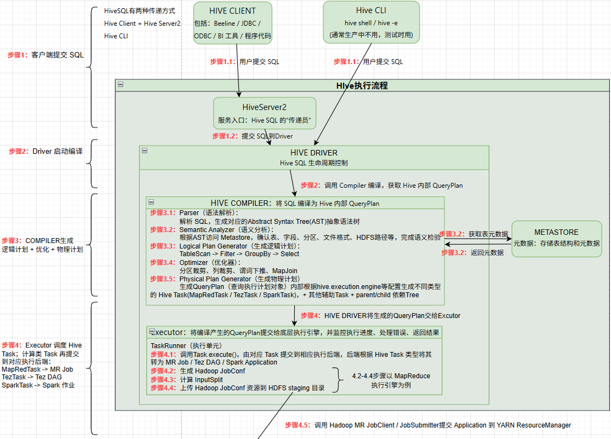
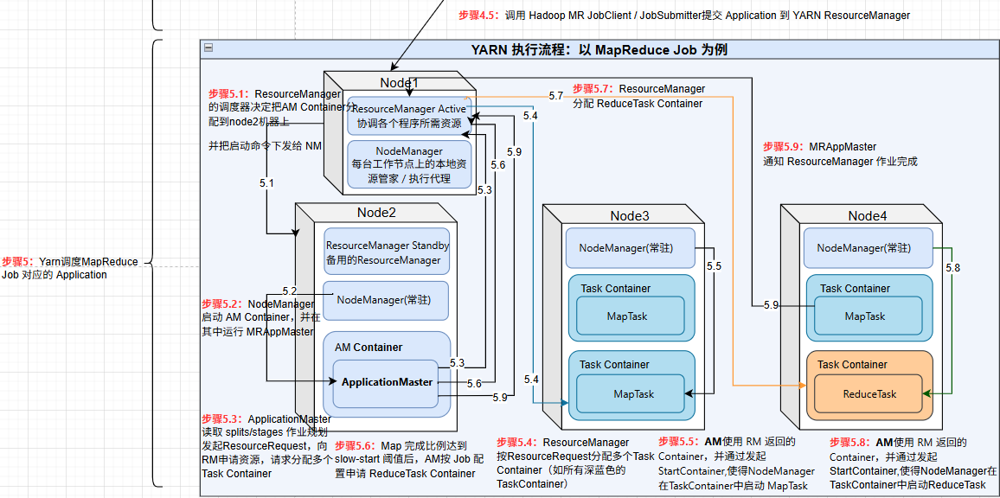

---

title: "【十一】Hive 执行计划：SQL 编译、任务生成与 YARN 调度流程"
date: 2026-06-20T22:18:36+08:00
draft: false
tags: ["Hive", "执行计划", "EXPLAIN", "MapReduce", "YARN"]
categories: ["Hive"]
description: "梳理 Hive SQL 从客户端提交、HiveServer2 接收、Driver 编译优化，到生成 MapReduce 并提交 YARN 调度执行的完整流程。"

---


首先需要声明一下Hive是运行在Hadoop上层的数据仓库工具，它依赖 HDFS 和 YARN 运行，但不属于 Hadoop 内核，而是 Hadoop 生态圈的重要成员。

- **Hadoop 核心**​ 包含三大组件：**HDFS**（分布式存储）、**YARN**（资源调度）、**MapReduce**（分布式计算框架）。
  
  此外Hadoop 还包含 Common 等基础模块，但这里不涉及

- **Metastore** 是 Hive 的元数据管理服务，用于保存表结构、分区、存储位置、文件格式等元数据信息。Metastore 后端通常使用关系型数据库保存这些元数据；本地测试可使用 Derby，生产环境常用 MySQL/PostgreSQL 等外部数据库。

---

本文讲解 Hive SQL 从客户端提交，到 Hive 编译成内部 QueryPlan，再由执行引擎提交到集群运行的底层过程，简要概括如下：

当 Hive 使用 MapReduce 引擎时，Compiler 会将 SQL 编译成包含 `MapRedTask` 的 Hive QueryPlan。`MapRedTask` 是 Hive 对一个 MapReduce Job 的封装，它携带了本次 SQL 的 Operator Tree、输入输出路径、Shuffle Key、Reducer 数量等信息。

Executor 执行 `MapRedTask` 时，会通过 Hadoop API 提交一个Hadoop MapReduce Job。随后 MapReduce 框架根据输入切片、Reducer 数量和 JobConf创建出来运行时任务实例 `MapTask / ReduceTask` 。

`MapTask / ReduceTask`在 YARN Container 中运行，并加载 Hive 的通用 Mapper/Reducer 类执行逻辑来执行 SQL 对应的 Operator Tree。

需要说明：本文主要以 MapReduce 执行引擎为例。如果使用 Tez 或 Spark，Hive 内部编译流程类似，但提交到执行后端和 YARN 的细节不同。

# HQL->QueryPlan概述图

概述图的步骤和标题是一一对应的，所以可以结合后面的详细步骤来看



# 步骤1：客户端提交 SQL

用户通过 Beeline/JDBC+Hive server2 或 Hive CLI提交 SQL

### 1.1 通过 Beeline/JDBC + Hive Server2 提交SQL

HiveServer2，简称 **HS2**，可以理解为 Hive 的服务端网关（一般绑定 10000端口）

你启动 HS2 后，它会监听 Thrift 请求、处理 **认证（Kerberos/LDAP/Plain…）**、建立 **Session**、每个 Session 的执行请求会走到 **HS2 内部的 Driver**

- 启动HS2
  
  ```shell
  $ hive --service hiveserver2 &
  # 使用 nohup 让它在后台持续运行(前台运行的话关闭窗口则消失)
  $ nohup bin/hive --service metastore >> logs/metastore.log 2>&1 & # 先启动metastore，再启动hiveserver2
  $ mkdir -p /logs # 进入￥HIVE_HOME后创建日志目录（如果不存在的话）
  $ nohup bin/hive --service hiveserver2 >> logs/hiveserver2.log 2>&1 &
  ```

- JDBC 建立连接
  
  ```shell
  beeline -u "jdbc:hive2://hs2-host:10000/default"
  ```
  
  JDBC 程序也是类似：
  
  ```java
  Connection conn = DriverManager.getConnection(
      "jdbc:hive2://hs2-host:10000/default",
      "user",
      "password"
  );
  ```

- HS2 为这次连接创建一个 Session 上下文，包含：用户身份、当前数据库、Hive 配置参数、临时表信息、执行上下文、权限上下文
  
  执行下面语句时，配置就会保存在当前 Session 中。
  
  ```sql
  set hive.execution.engine=tez;
  use dwd;
  ```

| Hive Server2能力 | 说明                                          |
| -------------- | ------------------------------------------- |
| 接收客户端连接        | Beeline、JDBC、ODBC、BI 工具                     |
| 用户认证           | Kerberos、LDAP、用户名密码等                        |
| Session 管理     | 每个用户连接一个或多个 Session                         |
| SQL 接收与执行      | 将 SQL 交给内部 Hive Driver                      |
| 权限控制           | 集成 Ranger/Sentry/SQL Standard Authorization |
| 并发管理           | 多用户同时提交 SQL                                 |
| 结果返回           | 将查询结果返回给客户端                                 |

### 1.2 通过Hive CLI 提交SQL

- Hive CLI 是“客户端自己就是 Hive 执行入口，直接在机器上执行：`hive -e "select count(*) from table_name;"`（目前几乎不用）

# 步骤2：Driver 内部启动编译

HiveServer2 收到 SQL 后，会在服务端调用 Hive 的 Driver.

**Driver** 收到 SQL 后，调用 **Compiler** 进行编译。

```plain
SQL 文本
  ↓
AST：SQL 的语法结构
  ↓
语义分析：确认这些表、字段、函数、分区是否真的存在、是否合法
  ↓
逻辑计划 / Operator Tree：描述这条 SQL 要做哪些计算
  ↓
Hive 内部 QueryPlan
  ↓
Executor 调度 Hive Task
  ↓
如果是 MapReduce 引擎，MapRedTask 再提交 MR Job 到 YARN
```

# 步骤3：COMPILER生成 Hive 内部 QueryPlan

**Compiler** 负责把 SQL 变成物理执行计划，具体包括（注意：这里还不是最终交给YARN的 Job ）

```plain
Driver传递给Compiler的 SQL 文本
↓
Parser 解析器（step 1）
↓
AST 抽象语法树
↓
Semantic Analyzer 语义分析（step 2）
↓
Logical Plan 逻辑执行计划（step 3）
↓
Optimizer 优化器（step 4）
↓
Physical Plan 物理执行计划（step 5）
↓
Execution Engine 执行引擎
↓
MapReduce / Tez / Spark 等任务
```

### 步骤3.1：Parser（语法解析）

解析 SQL，生成对应的Abstract Syntax Tree(AST)抽象语法树 

Parser 会识别出具体子句，并判断语法是否错误：

```context
SELECT 子句
FROM 子句
WHERE 子句
GROUP BY 子句
聚合函数 COUNT(*)
```

如果 SQL 语法写错，会在这个阶段报错，如下：

```sql
SELECT FROM user_log;
```

SQL 最后会被解析成抽象语法树 AST，也就是 Abstract Syntax Tree。（可以简单理解为： **Hive 把 SQL 变成一棵结构化的语法树**）

例如 SQL：

```sql
SELECT province, COUNT(*)
FROM user_log
WHERE dt = '2026-06-01'
GROUP BY province;
```

可以抽象理解为：

```plain
TOK_QUERY
 ├── TOK_FROM
 │    └── user_log
 ├── TOK_INSERT
 │    ├── TOK_SELECT
 │    │    ├── province
 │    │    └── COUNT(*)
 │    ├── TOK_WHERE
 │    │    └── dt = '2026-06-01'
 │    └── TOK_GROUPBY
 │         └── province
```

AST 还不是最终执行计划，只是 SQL 的结构化表达。

在 Hive 中，AST 主要作为后续语义分析的输入。Semantic Analyzer 会基于 AST 访问 Metastore，确认表、字段、分区、文件格式、HDFS 路径等信息，然后生成 Hive 内部的逻辑计划 Logical Plan和 Operator Tree。

### 步骤3.2：Semantic Analyzer（语义分析）

根据AST访问 **Metastore**，确认表、字段、分区、文件格式、HDFS路径等，完成语义检验

语义分析会检查如下内容（一定会访问 **Metastore**）：

| 检查内容     | 例子                                     |
| -------- | -------------------------------------- |
| 表是否存在    | `user_log` 是否存在                        |
| 字段是否存在   | `province` 是否是表字段                      |
| 字段类型是否合法 | 字符串能否参与当前计算                            |
| 聚合是否合法   | `SELECT a, COUNT(*)` 是否需要 `GROUP BY a` |
| 权限是否合法   | 当前用户是否有读写权限                            |
| 分区是否合法   | 分区字段是否存在                               |

例如下面的错误写法：

```sql
SELECT city, COUNT(*)
FROM user_log;
```

如果没有：`GROUP BY city`

Hive 会报错，因为非聚合字段 `city` 不能和聚合函数一起随便查询。

## 步骤3.3：Logical Plan Generator（生成逻辑计划）

逻辑执行计划关注的是：**这条 SQL 逻辑上要做哪些操作**

比如：

```Plain
读取 user_log
过滤 dt = '2026-06-01'
选择 province 字段
按 province 分组
计算 COUNT(*)
输出结果
```

它不太关心具体用几个 Map Task、几个 Reduce Task，也不一定关心具体在哪台机器执行。

逻辑计划里的常见操作包括：

```Plain
TableScan
Filter
Select
Join
GroupBy
ReduceSink
FileSink
Limit
Union
PTF / Window
```

## 步骤3.4：Optimizer（优化器）

生成初始逻辑计划后，Hive 会做一系列优化

常见优化包括：

| 优化类型        | 作用                     |
| ----------- | ---------------------- |
| 谓词下推        | 尽早执行 `WHERE` 过滤        |
| 分区裁剪        | 只读取需要的分区               |
| 列裁剪         | 只读取 SQL 用到的列           |
| Map 端聚合     | 在 Map 阶段先做局部聚合         |
| Join 重排     | 调整多表 Join 顺序           |
| MapJoin     | 小表广播到 Map 端，避免 Shuffle |
| CBO 成本优化    | 基于统计信息选择更优计划           |
| 向量化执行       | 批量处理数据，减少逐行计算开销        |
| Reduce 数量估算 | 根据数据量估算 Reducer 数量     |

例如这条 SQL：

```sql
SELECT province, COUNT(*)
FROM user_log
WHERE dt = '2026-06-01'
GROUP BY province;
```

如果 `dt` 是分区字段，Hive 会做分区裁剪：只扫描 dt='2026-06-01' 这个分区而不是扫描整张表。

## 步骤3.5：Physical Plan Generator（生成物理计划）

物理计划仍然 **是Hive 自己的执行描述，是查询执行计划封装java对象 QueryPlan（带引擎类型）**，还不是物理层面可以在集群底层执行的 MapReduce/Tez/Spark 的 Job

- ✅ 物理执行计划 = Hive 视角（描述“怎么计算”）

- ✅ Job = 执行引擎视角（描述“怎么在集群上跑”）

QueryPlan不是单个任务，而是包含整条 SQL 执行所需的全量信息：Task 节点 + parent/child 依赖Tree

```plain
QueryPlan（整条 SQL 的计划封装）
│
├── rootTasks（入口 Task，告诉 Executor 从哪些 Task 开始执行）
│   │
│   ├── MapRedTask / TezTask / SparkTask（任务依赖图，决定 Task 执行顺序）
│   │   │
│   │   └── MapredWork（这里以MapRedTask为例内部的工作描述，此外还有TezWork，SparkWork）
│   │       ├── MapWork
│   │       └── ReduceWork
│   │           │
│   │           └── Operator Tree（Work 内部的算子树）
│   │                  ├── TableScanOperator
│   │                  ├── FilterOperator
│   │                  ├── SelectOperator
│   │                  ├── GroupByOperator
│   │                  ├── ReduceSinkOperator
│   │                  └── FileSinkOperator
│   │
│   ├── MoveTask（移动临时目录结果到最终表/分区目录）
│   ├── StatsTask（收集统计信息）
│   ├── DDLTask（执行 DDL）
│   ├── ConditionalTask （条件分支任务，例如 MapJoin 选择）
│   └── 其他 Task
├── FetchTask（小查询直接拉取结果,不启动 MR/Tez/Spark 计算任务）
├── inputs（输入对象，记录读取了哪些表/分区/路径）
├── outputs（输出对象，记录写到了哪些表/路径）
├── schema（视图，用于结果返回和客户端展示）
├── queryProperties（参数配置，决定查询特性，例如是否有 join/groupby/orderby）
├── queryId（日志、追踪、YARN application 关联）
└── queryString（用于审计、日志、Explain、Hook）
```

简略层级拆分如下

```plain
QueryPlan
└── Task DAG
    └── Task(执行节点)
        └── Work(Task节点内部要干的活)
            └── Operator Tree(Work里的具体操作)
```

### 1）rootTasks/Task DAG

每个 Task 节点的 `payload` 已经是"面向具体引擎"的了。从上面的示例可以看出`QueryPlan`是整条 SQL 的计划封装，描述整个 SQL 怎么执行。

Compiler 在编译阶段会参考 `hive.execution.engine` 等配置，生成不同类型的计算 Task，例如 `MapRedTask`、`TezTask` 或 `SparkTask`。每种Task又会对应不同的Work：`MapredWork / TezWork / SparkWork`

其中**Task DAG**内部的层级可以分为三层：`Task -> Work -> Operator`

```plain
Task DAG（最顶层：QueryPlan 中的任务依赖图）
 └──MapRedTask（第一层：Task DAG 中的一个计算类 Task 节点）
     └── MapredWork  （第二层：work，Task 内部的工作描述）      
          ├── MapWork   (operator tree for map side:
          │               ├── root operator: TableScan → Filter → Select → ReduceSink（第三层：operator，Work 内部的算子树）    
          │               ├── input format class
          │               ├── serde class
          │               └── tag / path info
          │
          ├── ReduceWork (operator tree for reduce side:
          │               ├── root operator: GroupBy → Select → FileSink
          │               ├── reducer key/value schema
          │               └── numReduceTasks
          │
          └── paths / aliases / partitions ...
```

#### 第一层：rootTasks / Task DAG（任务骨架）

这是 QueryPlan 最核心的部分。rootTasks 表示没有父依赖、可以最先执行的 Task。

Compiler 在编译阶段会参考 `hive.execution.engine` 等配置，生成不同类型的计算 Task，例如 `MapRedTask`、`TezTask` 或 `SparkTask`。Executor 执行时并不是再临时选择引擎，而是调度 QueryPlan 中已经生成好的 Task DAG。

**不同执行引擎会生成不同的 Task 子类**：

| 引擎             | Task 子类（核心）  | 本质                                                                                                                                |
| -------------- | ------------ | --------------------------------------------------------------------------------------------------------------------------------- |
| **MapReduce**​ | `MapRedTask` | MapRedTask -> Hadoop MapReduce Job -> MapTask / ReduceTask<br/>内含：Map operator tree / Reduce operator tree、需要的 `JobConf`信息、输入输出路径 |
| **Tez**​       | `TezTask`    | TezTask -> Tez DAG -> Vertex / Tez Task<br/>内含：一个 **Tez DAG 描述**（Vertices / Edges / Vertex config）                                |
| **Spark**​     | `SparkTask`  | SparkTask -> Spark Job / Stage DAG -> Spark Task<br/>内含：SparkWork（RDD action 描述）→ 通过 Hive on Spark 提交                             |

Hive 的一个 SQL 往往会被拆成多个执行阶段，**Task DAG** 描述 Hive 层 Task 的依赖关系。例如复杂 SQL 可能是：

```plain
MapRedTask_1
  ↓
MapRedTask_2
  ↓
MoveTask
  ↓
StatsTask
或者
MapRedTask_A
      ↓
MapRedTask_C
      ↑
MapRedTask_B
```

**Task DAG**告诉 `Executor`：哪些 Task 可以并行？哪些 Task 必须等待上游完成？哪些 Task 失败会导致整个查询失败？

其他非计算类 Task有：

| Task 类型     | 作用              | 举例                                                                                                               |
| ----------- | --------------- | ---------------------------------------------------------------------------------------------------------------- |
| `MoveTask`  | 把临时目录结果移动到最终表目录 | INSERT OVERWRITE 通常先写临时目录`/tmp/hive/xxx`<br/>成功后再移动到正式表目录：`/warehouse/result_table/`<br/>来避免任务失败污染正式目录。          |
| `StatsTask` | 收集表/分区统计信息      | 统计信息后续可以服务优化器<br/>`row count`、`file size`、`partition statistics`<br/>`column statistics`                         |
| `FetchTask` | 小结果直接拉回客户端      | 如果满足条件，Hive 可能不启动 MR/Tez/Spark，<br/>而是直接通过 FetchTask 从文件读取少量结果返回客户端<br/>例如：`SELECT * FROM small_table LIMIT 10;` |
| `DDLTask`   | 执行建表、删表等元数据操作   | 直接操作 Metastore/HDFS 元数据<br/>`CREATE/DROP/ALTER TABLE`                                                            |

rootTasks = MapRedTask时，可能执行的步骤：

```sql
Stage-1: MapRedTask
    读取 dwd_user/dt=2026-06-17
    过滤 dt
    按 province 做 partial aggregation
    shuffle by province
    reduce 端做 final aggregation
    输出到临时目录

Stage-2: MoveTask
    将临时目录移动到 ads_user_cnt 的目标目录

Stage-3: StatsTask
    更新表或分区统计信息
```

#### 第二层：Task 内部结构（Work + Operator）

计算类 Task 内部通常有 Work，Work 是Task 内部的工作描述

```plain
MapRedTask
└── MapWork（描述 Map 阶段做什么）
    └── Operator Tree（scan/filter/groupby）
└── ReduceWork（描述 Reduce 阶段做什么：）
    └── Operator Tree（final agg/filesink）
```

Tez 下可能是：

```plain
TezTask
└── TezWork
     ├── MapWork
     ├── ReduceWork
     ├── MergeJoinWork
     └── BaseWork DAG    
```

Spark 下可能是：

```plain
SparkTask
└── SparkWork
     ├── MapWork
     ├── ReduceWork
     └── Spark Work DAG  
```

#### 第三层：执行元信息 Operator

Operator Tree 是 Hive 内部表达数据处理逻辑的算子树

常见 Operator：

| Operator           | 作用               |
| ------------------ | ---------------- |
| TableScanOperator  | 扫描表数据            |
| FilterOperator     | 过滤数据             |
| SelectOperator     | 选择字段/表达式         |
| GroupByOperator    | 聚合               |
| ReduceSinkOperator | 产生 shuffle 边界    |
| JoinOperator       | join             |
| FileSinkOperator   | 写出结果             |
| LimitOperator      | limit            |
| UnionOperator      | union            |
| ScriptOperator     | transform/script |

例如

```sql
SELECT user_id, COUNT(*)
FROM page_view
WHERE dt = '2026-06-16'
GROUP BY user_id;
```

Operator Tree 可能是：

```plain
TableScan
  ↓
Filter
  ↓
Select
  ↓
GroupBy partial
  ↓
ReduceSink(ReduceSink 通常代表需要 shuffle)
  ↓
GroupBy final
  ↓
FileSink
```

### 2）inputs / outputs：输入输出实体

QueryPlan 会记录该 SQL 涉及的输入和输出，不是单纯给 Task 用的，也服务 Hive 的治理和管理能力

例如输入：

```plain
page_view 表
page_view 的 dt='2026-06-16' 分区
对应 HDFS 路径
```

输出:

```plain
user_pv_result 表
目标分区
目标 HDFS 路径
```

这些信息用于：

- 权限检查

- 血缘分析

- 锁管理

- Hook

- 审计日志

- Explain

- 执行监控

### 3）schema：结果结构

对于查询类 SQL，QueryPlan 还需要知道返回结果的 schema

```sql
SELECT user_id, COUNT(*) AS pv
FROM page_view
GROUP BY user_id;
```

结果 schema 类似：

```plain
user_id string
pv bigint
```

用于：

- 返回给客户端  

- JDBC ResultSet metadata  

- Beeline 展示列名  

- FetchTask 读取结果

### 4）queryId / queryString / queryState

这些用于追踪和管理查询，在生产排查 Hive/Spark/Scope 类任务时，这类 ID 非常重要。例如：

```plain
queryId = hive_20260618141414_xxxxx
queryString = 原始 SQL
```

作用包括：

- 日志排查

- YARN application 关联

- 审计

- Hook

- Explain

- 错误定位

- 查询历史

### 5）queryProperties：查询特征信息

queryProperties 记录这条 SQL 的特征，例如：

```plain
是否有 join
是否有 group by
是否有 order by
是否是 CTAS
是否是 analyze
是否是 query
是否需要 reducer
是否涉及 script
是否有 window function
```

这些信息可能影响：

- 优化策略

- 执行路径

- Explain 展示

- 结果处理方式

# 步骤4：Executor 执行计划

## 步骤3回顾：

注意：以下所有内容都是在假设执行引擎是**MapReduce**的前提下展开的

步骤3 `COMPLILER` 会将 SQL 编译成包含`MapRedTask`生成的 `Hive QueryPlan` 这里还只是Hive内部才看的懂的执行说明：Hive Task+调度上下文，直接交给Hadoop是无法识别的，所以才需要`Driver`内部的`Executor`

这个 MapRedTask 是 Hive 对一个 MapReduce Job 的封装，内部包含很多信息，例如：

```plain
输入表路径
输出临时目录
Map 端 Operator Tree
Reduce 端 Operator Tree
表的 SerDe 信息
列信息
过滤条件
聚合逻辑
Join 逻辑
Group By 逻辑
Reduce 数量
Shuffle Key
JobConf 配置
```

`COMPLILER` 编译完成后，把 `QueryPlan` 对象返回给 `Driver`；`Driver` 在执行阶段把这个 `QueryPlan` 交给内部的执行逻辑 `Executor` 去调度

## Executor 调度

Executor 执行 `MapRedTask` 时，会通过 Hadoop API 提交一个Hadoop MapReduce Job。随后 MapReduce 框架根据输入切片、Reducer 数量和 JobConf创建出来运行时任务实例 `MapTask / ReduceTask` 。

这里插入一个问题：我们俗称的 Hive on MR 的“MapReduce 程序”在这些步骤的哪里？

如果你自己写 MapReduce 程序，通常是这样：

```java
Mapper 类
Reducer 类
Driver 类
JobConf 配置
```

但 Hive 不会为每条 SQL 临时生成一份新的 Java 源码，然后编译成新的 Mapper/Reducer 类，Hive 通常使用的是一套通用的Mapper / Reducer 框架，例如类似：

```java
ExecMapper
ExecReducer
```

**也就是说广义上底层真实操作HDFS的”MapReduce 程序“就在这里，由 Hadoop MapReduce 框架创建出来的运行时任务实例MapTask / ReduceTask = Hive 通用 Mapper/Reducer 类 + 本次 SQL 对应的 Operator Tree + JobConf 配置**

最后Hadoop MapReduce 框架将生成MapTask / ReduceTask提交到 YARN。直观的衔接步骤如下

```plain
Driver.compile(sql)
    ↓
Compiler.compile()
    ↓
生成 QueryPlan
    ↓
Driver 持有 QueryPlan
    ↓
Driver.execute(queryPlan)
    ↓
Executor
    ↓
TaskRunner
    ↓
MapRedTask.execute()
    ↓
生成 Hadoop JobConf
    ↓
计算 InputSplit（根据表数据在 HDFS 上的文件大小、Block Size，算出要起几个 Map）
    ↓
上传 job 资源到 HDFS staging 目录（MRAppMaster 和 MapTask/ReduceTask 启动时需要的执行说明书和依赖包）
    ↓
调用 Hadoop MR JobClient / JobSubmitter
    ↓
提交 Application 到 YARN ResourceManager
```

步骤3中我们知道`QueryPlan`中最重要的就是`QueryPlan.rootTasks`，因为`Executor` 的第一步就是找到没有父依赖的 root task，然后开始调度。

**Executor 本质上是：Hive Task DAG 的调度器**，通过 `TaskRunner` 的执行包装器来运行各种类型的 Task。

Compiler 可能生成：

```plain
QueryPlan
└── rootTasks
    └── MapRedTask
        └── childTasks
            └── MoveTask
                └── childTasks
                    └── StatsTask
```

Executor 执行顺序是：

```plain
1. 执行 MapRedTask
2. MapRedTask 成功后，执行 MoveTask
3. MoveTask 成功后，执行 StatsTask
4. 全部成功，Driver 标记 SQL 成功
```

# QueryPlan->Yarn概述图

当执行引擎选择 MapReduce 时，MR Job 提交到 YARN 后具体运行步骤如下



# 步骤5：YARN 执行 MapReduce Job

YARN 是“全局一套 + 每节点一部分”，在一个 Hadoop/YARN 集群中：

- YARN = 决定"在哪台机器的哪个进程里跑"

- HDFS = 决定"数据存在哪、怎么读"

**YARN中包含如下组成部分：**

- **ResourceManager（RM）**：<mark>RM 管全局资源</mark>，是全局唯一的 *active*主服务（生产一定是 **HA：一个Active RM + 一个Standby RM**）

- **ApplicationMaster（AM）**：AM 管单个应用，现在已知一次 Hive SQL 在 **MapReduce 引擎下**会生成的一个或多个 MapReduce Job，一个 MapReduce Job通常对应一个 YARN Application，这个 Application 通常由一个正在运行的 AM 负责协调；如果 AM 失败，YARN 可能按配置重试。
  
  - 一开始由 **RM** 批准、并经过**NM 在某个节点上拉起的一个 Container， AM则会在这个里Container运行**。
  
  - **在 Tez 引擎下**，Hive SQL 通常会被编译成 Tez DAG。Tez DAG 与 YARN Application 的对应关系受 Tez Session 等配置影响，不确定，需要结合具体版本/实现确认。

- **NodeManager（NM）**：<mark>NM 管本机资源</mark>，每台机器(每个Node)一个的常驻守护进程（daemon），一直活着，负责心跳汇报资源、接RM/AM指令拉起/清理容器

- **Container**：<mark>Container 是资源槽位</mark>，是 YARN 分配给某个 Application 的资源分配单元，包含内存、vcore、环境变量、本地化资源、启动命令等运行上下文。任务(Application)跑完/失败就销毁；一台机器**空闲的时候 container 数量是 0**，不是永远挂着多个 container。
  
  - YARN Container = 资源分配单位，不等于 JVM。根据执行引擎的不同，Container 里包含的内容也有区别
    
    **Task Attempt**​特指一个 Task（Map 任务或 Reduce 任务）的某一次具体执行实例。一个 Container 在同一时刻只会服务于一个 Task Attempt。之所以叫 “Attempt”，是因为分布式系统中任务可能因节点故障、资源竞争等原因失败，系统会多次“尝试”执行同一个 Task，每一次尝试就是一个 Task Attempt。只要有一次 Attempt 成功，这个 Task 就算完成。
    
    | 场景                               | Container 里通常跑什么                                  |
    | -------------------------------- | ------------------------------------------------- |
    | MapReduce AM Container           | MRAppMaster JVM                                   |
    | MapReduce Task Container         | YARNChild JVM，里面运行一个 MapTask 或 ReduceTask attempt |
    | Tez AM Container                 | Tez ApplicationMaster JVM                         |
    | Tez Task Container               | Tez Container JVM，可复用，执行多个 Tez Task               |
    | Spark on YARN Executor Container | Executor JVM，里面可以并发/连续执行多个 Spark Task             |
    | 非 Java 程序                        | Python / Shell / C++ / 其他进程                       |

**Container里的MapTask/ReduceTask 是真正干活的进程**

| 粒度                              | 数量规则                                                                                                                                                                                                                                                                                             |
| ------------------------------- | ------------------------------------------------------------------------------------------------------------------------------------------------------------------------------------------------------------------------------------------------------------------------------------------------ |
| 整个集群                            | 只有一个active状态的**ResourceManager（RM）**，集群n个机器就对应了n个node，其中有一个node安装了ResourceManager，每个node都安装了**NodeManager（NM）**<br/>                                                                                                                                                                             |
| 某台机器                            | 即某个node，包含一个**NodeManager（NM）**。<br/> 当需要执行Application任务时，RM会给node分配一个**AM Container**资源 用于运行**ApplicationMaster**<br/>**NodeManager（NM）** 则启动对应的**ApplicationMaster（AM）**<br/>根据任务的不同**ApplicationMaster（AM）** 会继续向**ResourceManager（RM）** 申请多个**Task Container**用于执行MapTask / ReduceTask 等具体任务 |
| Container                       | 某台机器上可以同时运行 0~N 个 AM Container 和 0~N 个 Task Container，具体数量受资源、队列、调度策略和当前负载限制。<br/>在 MapReduce 场景下，一个 AM Container 通常运行 MRAppMaster，一个 Task Container 通常运行一个 MapTask 或 ReduceTask attempt。<br/>                                                                                                   |
| Application（以 MapReduce Job 为例） | 在 MapReduce 引擎下，一个 MR Job 通常对应一个 YARN Application；一个 Application 通常由**一个正在运行的 AM 协调，1 个 AM**（生命周期跟着Job走，Job结束AM就退）。如果同一时刻跑10个Job = 10个AM，分布在不超过10台机器（也可能更集中，看调度）                                                                                                                                 |

如果这个 Job 需要：

- 1 个 ApplicationMaster
- 3 个 MapTask
- 1 个 ReduceTask

那么分配结果可能如下

```plain
Node1
├── ResourceManager Active
└── NodeManager

Node2
├── ResourceManager Standby(备用的ResourceManager，提供高可用)
└── NodeManager
    └── Container 1 → MRAppMaster(启动Application)

Node3
└── NodeManager
    ├── Container 2 → MapTask 1
    └── Container 3 → MapTask 2

Node4
└── NodeManager
    ├── Container 4 → MapTask 3
    └── Container 5 → ReduceTask 1
```

## 步骤 5.1：RM分配 AM 所需 Container

回顾：

在步骤4.4：**Client**​ 把作业资源（jar、job.xml、splits 元数据等）上传到共享存储（如 HDFS）

在步骤4.5：调用 Hadoop MR JobClient / JobSubmitter提交 Application 到 YARN ResourceManager之后（MapReduce 在 YARN 上运行时，一个 MR Job 本质上会对应一个 YARN Application。）

提交时会告诉 ResourceManager：

```plain
Application 名称
用户
队列
ApplicationMaster 启动命令
ApplicationMaster 所需资源
staging 目录位置
job.xml 位置
job.jar 位置
安全 token
```

ResourceManager 收到后，会生成一个YARN Application ID：`application_XXXX_YYYY`

---

RM 接纳 **Application** ， **调度器（Capacity/Fair）+ 策略**​ 决定把 **AM 容器(AM Container)** 分配到哪台 NM；然后 RM 让那台 **NM 启动该 AM Container**，再把启动命令下发给 NM。图中假设为node2中的NM，用于配置启动**ApplicationMaster**的环境

## 步骤 5.2：NodeManager 启动 AM Container，并在其中运行 MRAppMaster

步骤 5.1中**RM 接纳 App 后**把 **ApplicationMaster Container** 调度出来，再把启动命令下发给 NM

**NM 启动 AM Container**→ 在里面执行 **ApplicationMaster** 进程（比如 `MRAppMaster`）

## 步骤 5.3：ApplicationMaster 分析任务，并请求资源

之前的步骤4.5中包含Hive Excutor中生成的 job.xml、split 信息，但是这些**属于上层（Hive→MR 的编译/翻译产物）**，不是 YARN 的概念。

YARN 只知道：这是一个 **Application**，它有 **AM**

1、AM 从作业规划（splits/stages）计算需要多少 map task、多少 reduce task、每个 task 的资源形态

- 比如 HDFS 上有 10 个 input split，那么通常会有 10 个 MapTask。

- MRAppMaster 向 ResourceManager 申请资源
  
  ```plain
  我要 10 个 Map container
  每个 container 需要 2GB 内存、1 vcore
  最好靠近数据所在节点
  ```

2、AM 向 RM 发送 **ResourceRequest**（需要的资源、优先级、可能还带 locality 偏好），并根据RM返回的 **allocated containers**​ 去 **向 NodeManager 发送 StartContainer 请求派发 Task（给 NM launch）**

## 步骤 5.4：ResourceManager 按ResourceRequest返回containers给AM

这里需要注意RM不具备思考的功能，只是根据**ResourceRequest**的内容进行分配（在“满足资源”的前提下尽量满足 locality preference）

- **RM 只负责资源调度/分配（资源维度：内存、vcore、队列、ACL、节点健康、标签等）**

- “根据数据分配”更多是 **AM 在做 locality 偏好（NODE_LOCAL/RACK_LOCAL/ANY）**，并把偏好写进 ResourceRequest；RM 尽量尊重（但不保证一定 local）

## 步骤 5.5：NodeManager 启动 MapTask

AM 会构造 task-launch 上下文（环境变量、jar、参数等）

→ 向目标 NM 发起 **StartContainer**

→ NM 在该 **Task Container**里启动 JVM 

→ 跑 **MapTaskRunner**，MapTask 执行 Hive 的 Map Operator Tree，每个 MapTask 启动后，会读取自己的 input split。然后执行类似这样的逻辑

```plain
读取一行数据
  ↓
反序列化成 Hive Row
  ↓
TableScanOperator
  ↓
FilterOperator
  ↓
SelectOperator
  ↓
GroupByOperator(partial)
  ↓
ReduceSinkOperator
  ↓
输出 shuffle key/value
```

## 步骤 5.6：MapTask 进展到阈值，MRAppMaster 申请 ReduceTask Container

需要注意：

- 是否有 Reduce 阶段，是 Hive 编译生成 MR Job 时决定的。
- Reducer 数量也是 Job 配置的一部分。
- MRAppMaster 不是根据 SQL 重新判断是否需要 Reduce。

AM 会跟踪 MapTask 的执行进度。当 Map 完成比例达到配置的 slow-start 阈值后，如果该 MR Job 配置了 Reduce 阶段，**ApplicationMaster**会继续向 **ResourceManager** 申请 **ReduceTask Container资源**用于**ReduceTask**

## 步骤 5.7：ResourceManager 分配 ReduceTask Container

## 步骤 5.8：NodeManager 启动 ReduceTask

reduce 启动后会做 shuffle fetch、sort、reduce、输出（未完成 map 输出也会边产出边拉）

## 步骤 5.9：MRAppMaster 通知 ResourceManager 作业完成

所有 task 完成（或失败达到上限），AM 向 RM 报告最终状态，RM 标记 Application 结束；AM 退出，NM 清理相关 Container 本地临时数据。
