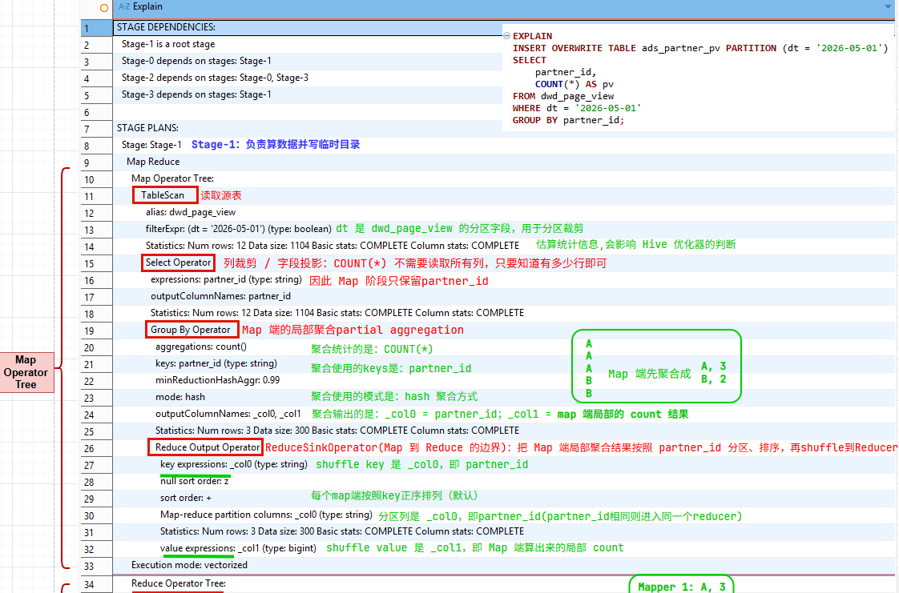
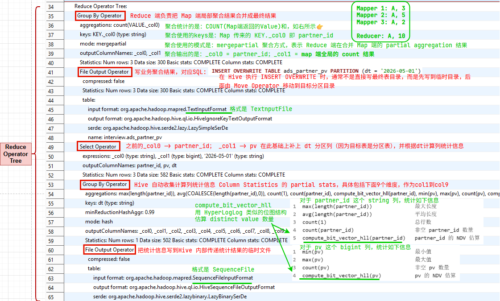
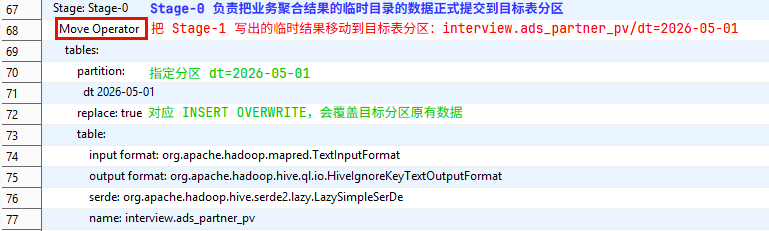
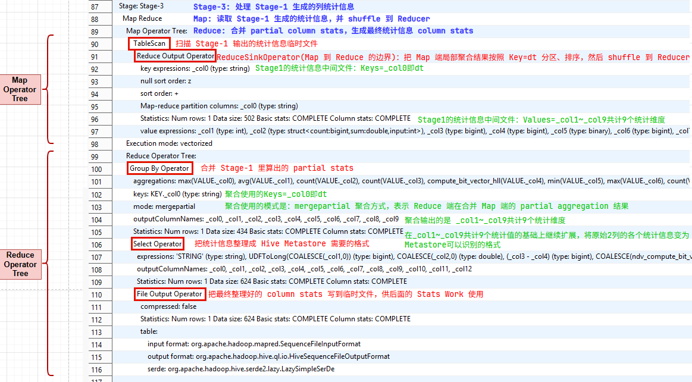
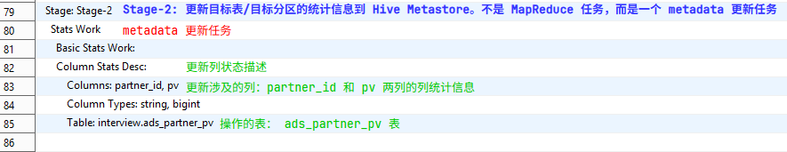
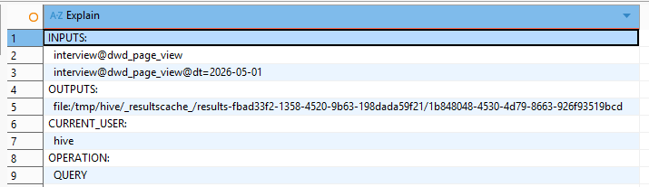
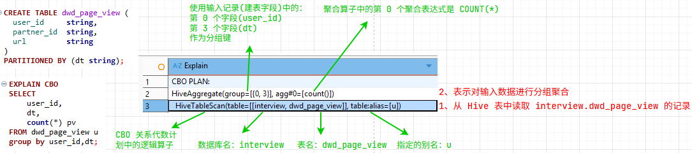

# 1、什么是执行计划？

## 1.1 回顾 SQL -> Hive Task的过程

具体详见[【十一】Hive 执行计划：SQL 编译、任务生成与 YARN 调度流程](https://eleanora-lyh.github.io/MyLearningNotes/posts/hive/11hivesql%E5%BA%95%E5%B1%82%E6%89%A7%E8%A1%8C%E8%BF%87%E7%A8%8B/)

Hive Compiler 经过 Parser、Semantic Analyzer、Optimizer、Physical Plan Generator 后会生成的物理执行计划**QueryPlan**。

```plain
SQL
 ↓
Parser
 ↓
AST
 ↓
Semantic Analyzer
 ↓
Logical Plan
 ↓
Optimizer
 ↓
Physical Plan Generator
 ↓
QueryPlan / Task DAG / Operator Tree(现在讨论的位置在这里)
 ↓
Executor
 ↓
Execution Backend: MR / Tez / Spark
 ↓
YARN / HDFS
```

物理计划仍然 **是Hive 自己的执行描述，是查询执行计划封装java对象 QueryPlan（带引擎类型）**，还不是物理层面可以在集群底层执行的 MapReduce/Tez/Spark 的 Job

- ✅ 物理执行计划 = Hive 视角（描述“怎么计算”）

- ✅ Job = 执行引擎视角（描述“怎么在集群上跑”）

QueryPlan不是单个任务，而是包含整条 SQL 执行所需的全量信息：Task 节点 + parent/child 依赖Tree

```plain
QueryPlan（整条 SQL 的计划封装）
│
├── rootTasks（入口 Task，告诉 Executor 从哪些 Task 开始执行）
│   │
│   ├── MapRedTask / TezTask / SparkTask（任务依赖图，决定 Task 执行顺序）
│   │   │
│   │   └── MapredWork（这里以MapRedTask为例内部的工作描述，此外还有TezWork，SparkWork）
│   │       ├── MapWork
│   │       └── ReduceWork
│   │           │
│   │           └── Operator Tree（Work 内部的算子树）
│   │                  ├── TableScanOperator
│   │                  ├── FilterOperator
│   │                  ├── SelectOperator
│   │                  ├── GroupByOperator
│   │                  ├── ReduceSinkOperator
│   │                  └── FileSinkOperator
│   │
│   ├── MoveTask（移动临时目录结果到最终表/分区目录）
│   ├── StatsTask（收集统计信息）
│   ├── DDLTask（执行 DDL）
│   ├── ConditionalTask （条件分支任务，例如 MapJoin 选择）
│   └── 其他 Task
├── FetchTask（小查询直接拉取结果,不启动 MR/Tez/Spark 计算任务）
├── inputs（输入对象，记录读取了哪些表/分区/路径）
├── outputs（输出对象，记录写到了哪些表/路径）
├── schema（视图，用于结果返回和客户端展示）
├── queryProperties（参数配置，决定查询特性，例如是否有 join/groupby/orderby）
├── queryId（日志、追踪、YARN application 关联）
└── queryString（用于审计、日志、Explain、Hook）
```

## 1.2 什么是Explain 输出

- QueryPlan ：是 Hive 内部执行用的完整计划对象；

- EXPLAIN ：QueryPlan 中核心执行结构的文本化展示，但不等于完整的 QueryPlan 对象，而是面向用户排查 SQL 执行逻辑的文本化视图，主要包括：
  
  1. **抽象语法树（AST）**：SQL 解析后的内部表示，验证语法是否正确。
  
  2. **逻辑执行计划**：描述数据流的操作顺序（如表扫描、过滤、投影、Join、聚合等），不涉及物理实现。
  
  3. **物理执行计划**：具体的 MapReduce 阶段划分，例如：
     
     - **Map 操作**：输入文件路径、列裁剪、过滤条件（谓词下推情况）。
     
     - **Shuffle 信息**：分区键、排序规则、数据倾斜风险提示。
     
     - **Reduce 操作**：聚合函数、分组字段、输出格式。
  
  4. **统计信息**：预估的数据量（行数、大小），用于判断是否需要优化。
  
  5. **依赖关系**：Stage 之间的前后顺序（如 Join 的 MapJoin 自动转换）。

# 2、示例准备

下面通过一个HQL语句实际的`EXPLAIN`输出，来学习一下执行计划

## 2.1 建表+设置执行引擎

创建明细表 `dwd_page_view`

```sql
CREATE TABLE dwd_page_view (
  user_id     string,
  partner_id  string,
  url         string
)
PARTITIONED BY (dt string);

-- 插入数据
insert into dwd_page_view values
('user1','partner2','url2','2026-05-01'),
('user1','partner3','url3','2026-05-01'),
('user1','partner4','url4','2026-05-01'),
('user2','partner2','url2','2026-05-01'),
('user2','partner3','url3','2026-05-02');
```

创建目标汇总表 `ads_partner_pv`

```sql
CREATE TABLE ads_partner_pv (
  partner_id string,
  pv         bigint
)
PARTITIONED BY (dt string);

-- 插入数据
INSERT INTO TABLE ads_partner_pv PARTITION (dt = '2026-05-02')
VALUES ('partner3', 1);
```

因为不同的 Hive 执行引擎，输出结构会不同，这里先查看 hive sql 的执行引擎

```sql
set hive.execution.engine;
-- 输出：hive.execution.engine=tez
```

切换 hive sql 执行引擎，此处因为是以学习目的，所以以最基础的MR引擎为例，执行 `set hive.execution.engine=mr;`（切换为其他引擎的话如下）

```sql
-- 切换到 Spark（Hive on Spark）
set hive.execution.engine=spark;

-- 切换到 Tez
set hive.execution.engine=tez;

-- 切回 MR（老引擎，基本淘汰）
set hive.execution.engine=mr;
```

执行`EXPLAIN`解析HQL

```sql
EXPLAIN
INSERT OVERWRITE TABLE ads_partner_pv PARTITION (dt = '2026-06-01')
SELECT
    partner_id,
    COUNT(*) AS pv
FROM dwd_page_view
WHERE dt = '2026-06-01'
GROUP BY partner_id;
```

这里INSERT的逻辑目标是：

1. 从 `dwd_page_view` 的 `dt=2026-06-01` 分区读数据

2. 按 partner_id 分组聚合

3. 计算 COUNT(*) 即每个 partner_id 的 pv

4. 把结果写入 `ads_partner_pv` 的 `dt=2026-06-01` 分区

## 2.2 EXPLAIN的实际输出

实际上按照 `set hive.execution.engine=mr` （MapReduce为底层的执行引擎可以得到如下的输出）

```plain
STAGE DEPENDENCIES:
  Stage-1 is a root stage
  Stage-0 depends on stages: Stage-1
  Stage-2 depends on stages: Stage-0, Stage-3
  Stage-3 depends on stages: Stage-1

STAGE PLANS:
  Stage: Stage-1
    Map Reduce
      Map Operator Tree:
          TableScan
            alias: dwd_page_view
            filterExpr: (dt = '2026-05-01') (type: boolean)
            Statistics: Num rows: 12 Data size: 1104 Basic stats: COMPLETE Column stats: COMPLETE
            Select Operator
              expressions: partner_id (type: string)
              outputColumnNames: partner_id
              Statistics: Num rows: 12 Data size: 1104 Basic stats: COMPLETE Column stats: COMPLETE
              Group By Operator
                aggregations: count()
                keys: partner_id (type: string)
                minReductionHashAggr: 0.99
                mode: hash
                outputColumnNames: _col0, _col1
                Statistics: Num rows: 3 Data size: 300 Basic stats: COMPLETE Column stats: COMPLETE
                Reduce Output Operator
                  key expressions: _col0 (type: string)
                  null sort order: z
                  sort order: +
                  Map-reduce partition columns: _col0 (type: string)
                  Statistics: Num rows: 3 Data size: 300 Basic stats: COMPLETE Column stats: COMPLETE
                  value expressions: _col1 (type: bigint)
      Execution mode: vectorized
      Reduce Operator Tree:
        Group By Operator
          aggregations: count(VALUE._col0)
          keys: KEY._col0 (type: string)
          mode: mergepartial
          outputColumnNames: _col0, _col1
          Statistics: Num rows: 3 Data size: 300 Basic stats: COMPLETE Column stats: COMPLETE
          File Output Operator
            compressed: false
            Statistics: Num rows: 3 Data size: 300 Basic stats: COMPLETE Column stats: COMPLETE
            table:
                input format: org.apache.hadoop.mapred.TextInputFormat
                output format: org.apache.hadoop.hive.ql.io.HiveIgnoreKeyTextOutputFormat
                serde: org.apache.hadoop.hive.serde2.lazy.LazySimpleSerDe
                name: interview.ads_partner_pv
          Select Operator
            expressions: _col0 (type: string), _col1 (type: bigint), '2026-05-01' (type: string)
            outputColumnNames: partner_id, pv, dt
            Statistics: Num rows: 3 Data size: 582 Basic stats: COMPLETE Column stats: COMPLETE
            Group By Operator
              aggregations: max(length(partner_id)), avg(COALESCE(length(partner_id),0)), count(1), count(partner_id), compute_bit_vector_hll(partner_id), min(pv), max(pv), count(pv), compute_bit_vector_hll(pv)
              keys: dt (type: string)
              minReductionHashAggr: 0.99
              mode: hash
              outputColumnNames: _col0, _col1, _col2, _col3, _col4, _col5, _col6, _col7, _col8, _col9
              Statistics: Num rows: 1 Data size: 502 Basic stats: COMPLETE Column stats: COMPLETE
              File Output Operator
                compressed: false
                table:
                    input format: org.apache.hadoop.mapred.SequenceFileInputFormat
                    output format: org.apache.hadoop.hive.ql.io.HiveSequenceFileOutputFormat
                    serde: org.apache.hadoop.hive.serde2.lazybinary.LazyBinarySerDe

  Stage: Stage-0
    Move Operator
      tables:
          partition:
            dt 2026-05-01
          replace: true
          table:
              input format: org.apache.hadoop.mapred.TextInputFormat
              output format: org.apache.hadoop.hive.ql.io.HiveIgnoreKeyTextOutputFormat
              serde: org.apache.hadoop.hive.serde2.lazy.LazySimpleSerDe
              name: interview.ads_partner_pv

  Stage: Stage-2
    Stats Work
      Basic Stats Work:
      Column Stats Desc:
          Columns: partner_id, pv
          Column Types: string, bigint
          Table: interview.ads_partner_pv

  Stage: Stage-3
    Map Reduce
      Map Operator Tree:
          TableScan
            Reduce Output Operator
              key expressions: _col0 (type: string)
              null sort order: z
              sort order: +
              Map-reduce partition columns: _col0 (type: string)
              Statistics: Num rows: 1 Data size: 502 Basic stats: COMPLETE Column stats: COMPLETE
              value expressions: _col1 (type: int), _col2 (type: struct<count:bigint,sum:double,input:int>), _col3 (type: bigint), _col4 (type: bigint), _col5 (type: binary), _col6 (type: bigint), _col7 (type: bigint), _col8 (type: bigint), _col9 (type: binary)
      Execution mode: vectorized
      Reduce Operator Tree:
        Group By Operator
          aggregations: max(VALUE._col0), avg(VALUE._col1), count(VALUE._col2), count(VALUE._col3), compute_bit_vector_hll(VALUE._col4), min(VALUE._col5), max(VALUE._col6), count(VALUE._col7), compute_bit_vector_hll(VALUE._col8)
          keys: KEY._col0 (type: string)
          mode: mergepartial
          outputColumnNames: _col0, _col1, _col2, _col3, _col4, _col5, _col6, _col7, _col8, _col9
          Statistics: Num rows: 1 Data size: 434 Basic stats: COMPLETE Column stats: COMPLETE
          Select Operator
            expressions: 'STRING' (type: string), UDFToLong(COALESCE(_col1,0)) (type: bigint), COALESCE(_col2,0) (type: double), (_col3 - _col4) (type: bigint), COALESCE(ndv_compute_bit_vector(_col5),0) (type: bigint), _col5 (type: binary), 'LONG' (type: string), _col6 (type: bigint), _col7 (type: bigint), (_col3 - _col8) (type: bigint), COALESCE(ndv_compute_bit_vector(_col9),0) (type: bigint), _col9 (type: binary), _col0 (type: string)
            outputColumnNames: _col0, _col1, _col2, _col3, _col4, _col5, _col6, _col7, _col8, _col9, _col10, _col11, _col12
            Statistics: Num rows: 1 Data size: 624 Basic stats: COMPLETE Column stats: COMPLETE
            File Output Operator
              compressed: false
              Statistics: Num rows: 1 Data size: 624 Basic stats: COMPLETE Column stats: COMPLETE
              table:
                  input format: org.apache.hadoop.mapred.SequenceFileInputFormat
                  output format: org.apache.hadoop.hive.ql.io.HiveSequenceFileOutputFormat
                  serde: org.apache.hadoop.hive.serde2.lazy.LazySimpleSerDe
```

我们按照输出的顺序，仔细分析一下这一大坨的组成部分

## 2.3 EXPLAIN输出 与 物理执行计划QueryPlan 的关系

在2.1中我简单列了一下**EXPLAIN输出 与 物理执行计划QueryPlan 的关系**，可以理解为**QueryPlan >= EXPLAIN输出**，通过EXPLAIN的输出我们可以看到HQL时底层的执行顺序/过程，进而分析如何优化。

但是二者的具体的对应关系并没有列出来，也没有解释为什么可以这么对应，下面的是我整理出对应关系，有利于联动理解EXPLAIN的输出

在HQL到物理层面执行时，HIVE DRIVER 的 COMPILER 输出的物理执行计划QueryPlan，并交给YARN去调度。QueryPlan的层级关系如下

```plain
QueryPlan
└── Task DAG
    └── Task(执行节点)
        └── Work(Task节点内部要干的活)
            └── Operator Tree(Work里的具体操作)
```

而恰好现在EXPLAIN 输出的层级和QueryPlan的层级可以对应上

```plain
EXPLAIN 输出:
└── STAGE DEPENDENCIES:(负责表达 DAG 边)
└── STAGE PLANS:(负责表达每个节点内部做什么)
    └── Stage(对应Task，执行节点)
        └── Map Reduce / Move Operator / Stats Work(对应Work，节点内部要干的活)
            └── Map Operator Tree / Reduce Operator Tree(对应Operator Tree，表示具体操作)
```

那么从最外层到最内层的映射，可以得出如下结论（从功能上说可以对应，但不能说“完全一模一样）

- （1）整个 EXPLAIN 输出  ≈ QueryPlan

- （2）EXPLAIN 的 `STAGE DEPENDENCIES + STAGE PLANS` ≈ QueryPlan 中的 `Task DAG` 的文本展示

- （3）EXPLAIN `Stage` ≈ QueryPlan 中的 `Task`
  
  例如
  
  | EXPLAIN Stage           | QueryPlan 中大致对应的 Task 类型 |
  | ----------------------- | ------------------------ |
  | `Stage-1 Map Reduce`    | `MapRedTask`             |
  | `Stage-0 Move Operator` | `MoveTask`               |
  | `Stage-2 Stats Work`    | `StatsTask`              |
  | `Stage-3 Map Reduce`    | `MapRedTask`             |

- （4）EXPLAIN 的 `Map Reduce / Move Operator / Stats Work` ≈ QueryPlan 中的 `Work`

- （5）EXPLAIN 的 `Map Operator Tree / Reduce Operator Tree` ≈ QueryPlan 中的 `Operator Tree`

汇总成表，如下：

| Hive 内部概念         | EXPLAIN 中看到的内容                                                     | 是否可以等价理解                       |
| ----------------- | ------------------------------------------------------------------ | ------------------------------ |
| `QueryPlan`       | 整个 EXPLAIN 输出                                                      | 可以近似理解，但 EXPLAIN 是文本化视图，不是完整对象 |
| `Task DAG`        | `STAGE DEPENDENCIES` + `STAGE PLANS`                               | 可以近似理解                         |
| `Task`            | `Stage: Stage-1 / Stage-0 / Stage-2 / Stage-3`                     | 基本可以对应                         |
| `Task dependency` | `STAGE DEPENDENCIES`                                               | 基本可以对应                         |
| `Work`            | Stage 下面的 `Map Reduce` / `Move Operator` / `Stats Work` 等内容        | 基本可以对应                         |
| `MapWork`         | `Map Operator Tree` 所在部分                                           | 基本可以对应                         |
| `ReduceWork`      | `Reduce Operator Tree` 所在部分                                        | 基本可以对应                         |
| `Operator Tree`   | `TableScan / Select / Group By / Reduce Output / File Output` 等树结构 | 基本可以对应                         |
| Hadoop MR Job     | `Stage-1 Map Reduce` 或 `Stage-3 Map Reduce` 运行时提交后的 Job            | 不是 EXPLAIN 本身，EXPLAIN 只是计划     |

# 3、Explain 输出的组成部分

`EXPLAIN` 展示的是 Hive Compiler 生成并优化后的物理执行计划的文本化视图，即Task DAG 视图，其输出可以分成两大块

1. **STAGE DEPENDENCIES** 展示 Task DAG 的依赖关系

2. **STAGE PLANS** 展示每个 Task 内部 Work 的执行内容

## 3.1 第一部分：STAGE DEPENDENCIES

**STAGE DEPENDENCIES** 展示的是：Hive 这条 SQL 被拆成了几个执行阶段，以及这些阶段之间的依赖关系

2.2的EXPLAIN实际示例中`STAGE DEPENDENCIES`如下：

```plain
STAGE DEPENDENCIES:
  Stage-1 is a root stage
  Stage-0 depends on stages: Stage-1
  Stage-2 depends on stages: Stage-0, Stage-3
  Stage-3 depends on stages: Stage-1
```

其依赖关系可以画成这样：

```plain
         Stage-1
     (业务计算+生成列统计信息)
          /     \
     Stage-0   Stage-3
(Move中间结果) (生成最终的统计信息)   
          \     /
          Stage-2
(Stats Work,将统计信息写入 Hive Metastore)
```

每个Stage的实际的作用如下（这里大概了解一下，在后面会仔细讲）：

| Stage     | 作用                                                                              | 依赖关系                 |
| --------- | ------------------------------------------------------------------------------- | -------------------- |
| `Stage-1` | 主要的 MapReduce 任务，主要包含两部分<br/>（1）计算聚合的业务结果，并输出到中间临时文件中<br/>（2）计算列的统计信息，并输出到临时文件中 | root stage，最先执行      |
| `Stage-0` | Move 任务<br/>把Stage-1中记录了业务结果的中间临时文件移动到目标表分区                                     | 依赖 Stage-1           |
| `Stage-3` | MapReduce 任务<br/>合并 Stage-1 (2)中生成的列统计信息                                        | 依赖 Stage-1           |
| `Stage-2` | Stats Work任务<br/>在Stage-0 和 Stage-3结束后将最终的统计信息写入 Hive Metastore                 | 依赖 Stage-0 和 Stage-3 |

为什么 Stage-2 同时依赖 Stage-0 和 Stage-3？

因为更新统计信息时需要两个前提：

- 数据已经被移动到正式目标分区，也就是 Stage-0 完成。（标志着：结果表已经输出成功）

- 列统计信息已经计算完成，也就是 Stage-3 完成。（标志着：结果表的表和文件的映射已经输出成功）

二者缺一不可，必须是互相印证的才能保证数据的一致性：

- 如果当结果表输出成功（Stage-0）就更新Hive Metastore，此时对应统计信息（Stage-3）还没计算完，那么Hive Metastore记录的统计信息和实际情况就不相符了

- 如果当列统计信息生成完（Stage-3）就更新Hive Metastore，此时实际的结果表输出（Stage-0）还没有写入完成，那么Hive Metastore记录的统计信息和实际情况也不相符了

## 3.2 第二部分：STAGE PLANS

**STAGE PLANS**展示的是每个 Stage 内部具体做什么

示例HQL的Task DAG层级关系如下：

```plain
Task DAG
  ├── Task 1: MapRedTask
  │     └── Work: MapredWork / MapReduceWork
  │           ├── MapWork
  │           │     └── Map Operator Tree
  │           └── ReduceWork
  │                 └── Reduce Operator Tree
  │
  ├── Task 2: MoveTask
  │     └── Work: MoveWork
  │
  ├── Task 3: StatsTask
  │     └── Work: StatsWork
  │
  └── Task 4: MapRedTask
        └── Work: MapredWork / MapReduceWork
              ├── MapWork
              └── ReduceWork
```

对应的Explain输出的层级关系如下：

```plain
STAGE DEPENDENCIES
  Stage 之间的依赖，也就是 Task DAG 的边

STAGE PLANS
  Stage: Stage-1
    Map Reduce
      Map Operator Tree
      Reduce Operator Tree

  Stage: Stage-0
    Move Operator

  Stage: Stage-2
    Stats Work

  Stage: Stage-3
    Map Reduce
      Map Operator Tree
      Reduce Operator Tree
```

下面按照Stage-1、Stage-0、Stage-3、Stage-2的顺序一句句看Explain的输出：

### 3.2.1 Stage1

Stage-1 是root stage，最先执行。是最主要的 MapReduce 任务，共结果上看主要做了两件事：

（1）计算聚合的业务结果，并输出到中间临时文件中

（2）计算列的统计信息，并输出到临时文件中

由于任务实际上是在多个机器即多个node上运行的，所以当以`partner_id`为聚合条件时，各个机器是互相独立分别执行`group by` 操作的。

每个机器上都会有各个`partner_id`对应的count值，这时就需要Shuffle，将相同Hash值（Hash值通过`partner_id`生成）的记录弄到同一台机器上，才能进行数据合并。

详细过程请看图

### 👉 图：Stage1的Map阶段

Stage1下的Map：在机器多上以`partner_id`为聚合条件，互相独立地执行了`group by` 操作，并通过 Shuffle 将相同hash值（由`partner_id`作为参数产生的hash值）的记录移动到同一台机器（Reducer）上



需要注意：
从上图中可以看到算子树Operator Tree和算子Operator具有下面的缩进关系

```plain
Map Operator Tree
    TableScan
        Select Operator
            Group By Operator
                Ruduce Output Operator
```

从“展示方式”上看，像深度优先遍历打印出来的树，但是从“执行语义”上看，这里的缩进表示的是父子关系，数据从父算子流向子算子（父算子的输出，作为子算子的输入）

是这样一条从上到下的数据处理流水线

```plain
TableScan 读出一批数据
  ↓
Select Operator 立刻处理这批数据
  ↓
Group By Operator 聚合这批数据
  ↓
Reduce Output Operator 准备输出 shuffle 数据
```

在数据流方向上是顺序处理的，但不是“一步全部执行完再执行下一步”的那种顺序，而是**一边读，一边投影，一边聚合，一边准备输出**

### 👉 图：Stage1的Reduce阶段

Stage1下的Reduce有两个任务：（1）合并Map聚合的结果 （2）收集插入后目标表的新的统计信息



#### （1）合并Map聚合的结果

分配到同一个Reducer的聚合结果会按照 `partner_id`为聚合条件，将Map中传入的数据`(_col0=partner_id,_col1=count)` 进行再次聚合，举例如下

```plain
Mapper 1: A, 3
Mapper 2: A, 5
Mapper 3: A, 2

Reducer: A, 10
```

这里要说一下，为什么还要按照 `partner_id`为聚合条件将Map中传入的数据进行再次聚合，而不是直接全部聚合。因为同一个Reducer的其`partner_id`不一定相同
shuffle到同一个Reducer的记录只是具有相同的hash值（由`partner_id`作为参数产生的hash值），但不代表相同的hash值的记录其`partner_id`就一定相同

```plain
已知能够shuffle到一个Reducer的，Hash(partner_id)值一定是相同的
∵ 相同的输入通过函数会得到相同的输出
∴ 相同的partner_id通过Hash(partner_id)值一定是相同的，会被shuffle到同一个Reducer

但是hash值相同不代表partner_id相同，所以直接反过来是不成立的（数学理论上讲这就是一个充分不必要条件：正向成立，反向不成立）
```

#### （2）收集统计信息

`INSERT OVERWRITE` 这类写入操作可能会触发 **Basic Stats / Column Stats** 的收集与更新，更新列统计信息不是 SQL 正确执行的硬性要求，而是在Hive 的**统计信息自动收集相关配置**开启时，**Hive 为保持 Metastore 统计信息与实际数据更一致而做的元数据维护**。

统计信息的存储位置是Metastore ，其存储的信息包括

#### Metastore 中存储的信息

| 类型                             | 内容                                             |
| ------------------------------ | ---------------------------------------------- |
| 表元数据                           | 表名、库名、Owner、表类型、Storage 信息                     |
| Schema                         | 字段名、字段类型、分区字段                                  |
| Location                       | 表目录、分区目录                                       |
| SerDe                          | 序列化/反序列化类                                      |
| InputFormat / OutputFormat     | 文件读写格式                                         |
| 分区元数据                          | 每个分区的值和路径                                      |
| **Basic Stats<br/>现在讨论的就是这里**  | 行数、文件数、数据大小等                                   |
| **Column Stats<br/>现在讨论的就是这里** | min、max、null count、NDV、avg length、max length 等 |

#### 为什么收集统计信息

**统计信息自动收集相关配置 关闭**，即不更新统计信息会发生什么？

——影响优化，但是SQL 通常还能查出正确结果

统计信息主要用于优化执行计划，如果统计信息过期，则执行计划可能变差、性能可能下降

**统计信息最直接相关的是CBO 成本优化：CBO(Cost-Based Optimizer) ，需要依赖统计信息估算成本**

统计信息和CBO的用途如下：

| 统计信息                        | 典型 CBO 用途                                               |
| --------------------------- | ------------------------------------------------------- |
| `row count`                 | 估算表大小、过滤后行数、Join 输入规模、Join 后结果规模                        |
| `data size`                 | 估算 IO 成本、shuffle 成本、是否适合 MapJoin                        |
| `NDV`                       | 估算 每列有多少 distinct value，即 Join 结果规模、Group By 结果规模、过滤选择率 |
| `min / max`                 | 估算范围过滤条件的选择率                                            |
| `null count`                | 估算 `IS NULL` / `IS NOT NULL`，以及 Join key 有效匹配行数         |
| `avg length` / `max length` | 估算字符串列大小、内存和网络传输成本                                      |

### 3.2.2 Stage0

Stage-0 负责把业务聚合结果的临时目录的数据正式提交到目标表分区

#### 👉 图：Stage0的Move Operator



### 3.2.3 Stage3

Stage-3是一个Map/Reduce操作，用来处理 Stage-1 生成的统计信息

- Map: 读取 Stage-1 生成的统计信息，并 shuffle 到 Reducer

- Reduce: 合并 partial column stats，生成最终统计信息 column stats

#### 👉 图：Stage3的Map/Reduce Operator Tree



### 3.2.4 Stage2

Stage-2: 更新目标表/目标分区的统计信息到 Hive Metastore

#### 👉 图：Stage2的Sate Work



# 4、总结：EXPLAIN 的阅读顺序

```plain
1. 先看 STAGE DEPENDENCIES
   判断整体有几个 Stage，执行顺序是什么。

2. 再看每个 Stage 的类型
   是 MapReduce / Tez / Spark，还是 Move / Stats / DDL / Fetch。

3. 再看 Map Operator Tree
   判断读哪张表、是否分区裁剪、是否过滤、是否局部聚合。

4. 再看 Reduce Output Operator
   判断是否发生 shuffle，以及 shuffle key 是什么。

5. 再看 Reduce Operator Tree
   判断最终聚合、Join、排序等是在 Reduce 端如何完成的。

6. 最后看 File Output / Move / Stats
   判断结果写到哪里，是否有 MoveTask 和统计信息收集。
```

# 5. EXPLAIN 常见用法

## 5.1 基础用法：EXPLAIN

用于查看：

- 是否走了分区裁剪；
- 是否全表扫描；
- 是否有 FetchTask 优化；
- 是否触发 MapReduce / Tez / Spark Job。

```sql
EXPLAIN
SELECT partner_id, COUNT(*)
FROM dwd_page_view
WHERE dt = '2026-05-01'
GROUP BY partner_id;
```

---

## 5.2 查看更详细信息：EXPLAIN EXTENDED

EXTENDED` 会输出更多底层信息，例如：

- AST；
- Operator 详细属性；
- 表信息；
- 分区信息；
- 表达式信息；
- 中间文件路径；
- serde/schema 相关信息。

可以理解为：

> `EXPLAIN` 是普通版；  
> `EXPLAIN EXTENDED` 是更接近 Hive 内部结构的详细版。

```sql
EXPLAIN EXTENDED
SELECT partner_id, COUNT(*)
FROM dwd_page_view
WHERE dt = '2026-05-01'
GROUP BY partner_id;
```

---

## 5.3 查看依赖：EXPLAIN DEPENDENCY

主要用于查看 SQL 依赖哪些：

- 表；
- 分区；
- 字段；
- 输入路径。

这个在数据血缘、任务依赖分析中比较有用。

```sql
EXPLAIN DEPENDENCY
SELECT partner_id, COUNT(*)
FROM page_view
WHERE dt = '2026-06-01'
GROUP BY partner_id;
```

输出

| Explain                                                                                                                                                                |
| ---------------------------------------------------------------------------------------------------------------------------------------------------------------------- |
| {"input_tables":[{"tablename":"interview@dwd_page_view","tabletype":"EXTERNAL_TABLE"}],"input_partitions":[{"partitionName":"interview@dwd_page_view@dt=2026-05-01"}]} |

---

## 5.4 查看权限相关信息：EXPLAIN AUTHORIZATION

用于查看执行该 SQL 需要哪些权限，例如：

- 对哪些表需要 SELECT 权限；
- 对哪些数据库/表/列有访问要求。

```sql
EXPLAIN AUTHORIZATION
SELECT partner_id, COUNT(*)
FROM page_view
WHERE dt = '2026-06-01'
GROUP BY partner_id;
```

输出



---

## 5.5 查看向量化执行：EXPLAIN VECTORIZATION

用于查看 Hive 是否启用了 vectorized execution。

例如用于判断：

- ORC/Parquet 是否走了向量化读取；
- 某些表达式是否阻止了向量化；
- query 是否能够 batch-based 执行。

```sql
EXPLAIN VECTORIZATION
SELECT partner_id, COUNT(*)
FROM dwd_page_view
WHERE dt = '2026-05-01'
GROUP BY partner_id;
```

---

## 5.6 查看 CBO 优化：EXPLAIN CBO

`EXPLAIN CBO`输出的是CBO PLAN，主要表达优化后的关系代数结构

重点看：

- Join 顺序有没有调整；
- Join 类型有没有变化；
- Predicate 是否下推；
- 是否使用统计信息；
- 聚合是否提前；
- 是否进行了常量折叠。

```sql
EXPLAIN CBO
SELECT
    user_id,
    dt,
    count(*) pv
FROM dwd_page_view u
group by user_id,dt;
```

输出如下（阅读时通常采用 **从下往上看**：先扫描表，再进行聚合）



执行的内容结合图可以得出：
扫描 interview.dwd_page_view 表，表别名为 u；

然后按照输入记录中的第 0 个字段和第 3 个字段进行分组，并对每个分组执行 COUNT(*) 聚合

---

CBO 的一个 HiveAggregate，不一定对应物理执行计划中的一个 Group By Operator，它可能在后续物理计划中被拆成多个阶段或多个 Operator。
