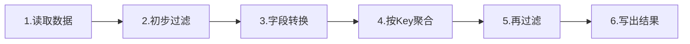
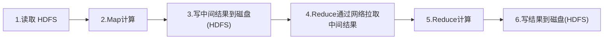
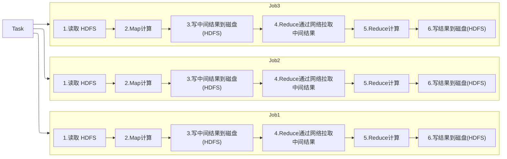
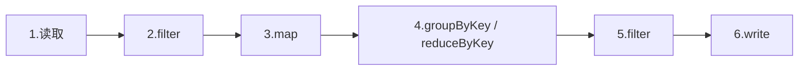
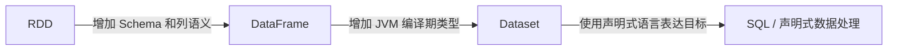

分布式计算有个绕不开的现实问题：**一个算子算完的结果，下游算子怎么拿到？**

两个算子可能跑在不同的机器上，上游某个 task 的输出，下游某个 task 要作为输入来读。解决办法是找个地方"寄存"一下，再网络传输。

# 1、Spark中DAG概念的引入

先用一个简单的例子看看一样的数据处理逻辑交给MapReduce和Spark会发生什么？

已知数据处理的执行逻辑如下



## 1.1、Hadoop MapReduce

Hadoop MapReduce采用的就是最朴素的做法：**每一步的上游算完，都把结果写进 HDFS，下游再从 HDFS 读出来**

传统 MapReduce 的执行模型相对固定，阶段之间必须将中间结果落盘



复杂逻辑通常要拆成多个 MapReduce Job（每个 Job 之间通常以文件系统作为边界）



落盘看着无害，其实开销巨大：

- **磁盘 I/O**：数据从内存刷到磁盘
- **序列化**：对象要变成字节流才能写
- **HDFS 多副本**：写一份数据默认要复制 3 份到不同机器

一次落盘就是一次"内存 → 磁盘 → 网络 → 磁盘 → 内存"的往返。如果你的 pipeline 有 10 个算子，每一步都落盘，那就是 10 次这样的往返。**这是 MapReduce 慢的根本原因之一**。

## 1.2、Spark

Spark则通过窄依赖将可以在同一个机器上执行的部分提前规划，将其整合为一个pipeline，再将剩余无法整合的stage一起组合成DAG

### 窄依赖

Spark 为什么能"不落盘"？——关键在**窄依赖（Narrow Dependency）**。

依赖说的是：**下游的每一个分区，只由上游的少数几个分区计算而来**。

- **窄依赖**（如 `map`、`filter`、`select`）：下游一个分区只依赖上游**一个**分区。既然数据没重分布，上下游算子可以安排给**同一台机器、同一个 task 串行执行**——中间结果不用存，直接拿对象在内存里传下去，这就是**流水线（pipeline）**

```
map → filter → map  全在一个 task 里一气呵成，中间不落盘
```

- **宽依赖**（如 `groupByKey`、`join`）：下游一个分区依赖上游**很多**分区，必须**Shuffle**——数据要按 key 重新分发到不同机器。这一步不可避免要落盘 + 网络传输。

所以准确说法是：

> **窄依赖之间不落盘，可以流水线；遇到宽依赖（Shuffle）才必须落盘。**

### DAG

**Pipeline**​ 是**局部视角**：**同一个 stage 内部**，那些窄依赖的算子被串成一条链，一个 task 一口气跑完

**DAG**​ 是**全局视角**：整个作业的所有算子、所有 stage 连成一张有向无环图，描述"谁依赖谁、整体怎么走"

Spark 会记录一系列转换关系，形成 DAG：



Spark 按宽依赖（Shuffle 边界）切分得到 stages

```textile
[ Stage 1: map → filter → map ]   ← 全是窄依赖，这一条就是一个pipeline
            ↓ Shuffle（落盘 + 网络）
[ Stage 2: groupByKey → map ]
```

总结： Spark 的优势通常来自多方面

1. **DAG 执行模型**，不局限于固定的 Map → Reduce 两阶段。
2. **窄依赖可以流水线执行**，不必在每个算子之间落盘。
3. **数据可以 Cache/Persist**，适合多次复用。
4. **Lazy Evaluation**，可以先记录转换关系，遇到 Action 再执行。
5. DataFrame/SQL 还能通过优化器优化执行计划。

# 2、Spark发展史

| 时间/版本            | 主要阶段              | 核心变化                                                   | 解决的问题                   | Spark 定位变化           |
| ---------------- | ----------------- | ------------------------------------------------------ | ----------------------- | -------------------- |
| 2009             | 伯克利 AMPLab 研究项目   | Spark 项目启动                                             | MapReduce 不适合迭代计算和交互式分析 | 面向工作集复用的集群计算框架       |
| 2010             | Spark 开源          | 早期 RDD、内存计算、DAG 执行                                     | 多个计算阶段之间频繁落盘            | 开源分布式计算框架            |
| 2012             | RDD 理论成熟          | RDD、lineage、分区恢复、粗粒度转换                                 | 在内存复用数据的同时实现容错          | 以 RDD 为核心的通用计算框架     |
| 2013             | 进入 Apache         | 社区化、标准化、生态扩展                                           | 项目治理和企业采用               | Apache 顶级开源生态的一部分    |
| 2014 / Spark 1.0 | 统一计算栈形成           | Spark SQL、Streaming、MLlib、GraphX、spark-submit          | 不同类型计算需要多个专用框架          | 统一大数据计算平台            |
| Spark 1.x 中后期    | 结构化数据抽象           | DataFrame、Catalyst                                     | RDD 语义不透明、优化空间有限        | 从底层 API 向声明式 API 演进  |
| 2015 前后          | 引擎深度优化            | Catalyst、Tungsten、代码生成                                 | JVM 对象、GC 和 CPU 开销      | 查询优化和高性能执行引擎         |
| 2016 / Spark 2.0 | SQL/DataFrame 核心化 | SparkSession、Dataset/DataFrame 统一、Structured Streaming | API 分散、批流模型不一致          | 统一结构化数据处理引擎          |
| Spark 2.x 后期     | SQL 成为主流          | SQL、DataFrame、Whole-stage CodeGen 持续增强                 | 提高 ETL 和 SQL 执行效率       | 以 Spark SQL 为核心的分析引擎 |
| 2020 / Spark 3.0 | 自适应优化             | AQE、动态分区裁剪、ANSI SQL、Python 增强                          | 静态执行计划无法处理运行时变化         | 自适应分布式查询引擎           |
| Spark 3.2        | SQL/Python/流处理增强  | AQE 默认开启、Pandas API、RocksDB StateStore、Session Window  | Python 生态融合和有状态流处理      | 数据工程与数据科学融合          |
| Spark 3.3        | 云原生和执行优化          | Bloom Filter、Data Source V2、Kubernetes 改进              | Join、数据源和云环境效率          | 云原生统一分析引擎            |
| Spark 3.4        | Spark Connect     | 客户端与 Spark 服务端解耦                                       | Driver 内嵌客户端带来的耦合       | 面向远程、多语言客户端的平台       |
| 2025 / Spark 4.0 | 新一代 Spark 平台      | Spark Connect、JDK 17、ANSI 默认、VARIANT、Python UDTF       | 跨语言、半结构化数据、现代 SQL 与运维需求 | 统一、跨语言、服务化的数据平台      |
| Spark 4.x        | 持续演进              | SQL、流处理、PySpark、Spark Connect 和云原生继续增强                 | 更高层的数据工程和低延迟计算需求        | 综合性分布式数据处理基础设施       |

Spark 的发展史可以总结成四条主线。

## 主线 1：数据抽象越来越高级




Spark 逐渐从“让程序员直接操作分布式数据”，发展到“让程序员描述数据的结构和目标，由 Spark 自动选择执行方式”。

- 用户需要关心的底层细节越来越少；
- Spark 能理解的业务语义越来越多；
- Catalyst、CBO、AQE 等优化器可以做的优化越来越多。

具体来说

## 主线 2：优化目标不断下沉


因此，“Spark 比 MapReduce 快是因为用了内存”只描述了 Spark 早期的一部分优势。

现代 Spark 性能优化的分类框架

| 层级      | 在省什么                    | 代表优化                    |
| ------- | ----------------------- | ----------------------- |
| L1 调度流  | 少跑、少传（别做无用功，别跨网络传垃圾）    | DAG、Pipeline、Shuffle 分区 |
| L2 查询优化 | 选对算法（SQL 写得好不如计划选得好）    | Catalyst、Broadcast Join |
| L3 执行引擎 | CPU 别浪费                 | Tungsten、WSCG、列存向量化     |
| L4 自适应  | 与存储数据的统计信息（数据跑起来才知道怎么调） | AQE、DPP动态分区裁剪           |

### L1 调度与数据流层：少干、少传

**核心思想：能不跑就不跑，能不传就不传。**

**DAG 调度**

MapReduce 每个 job 必须落盘才能进下一个，所以 `map → reduce → map → reduce` 要四次磁盘往返。Spark 把整个逻辑计划切成一张**有向无环图**，再划分成多个 Stage，Stage 内部的所有算子**在同一个 Task 里连续执行**——中间数据直接走内存，不落盘。落盘从"每个边界都落"降到"只在 Shuffle 边界落一次"。

**Pipeline 执行**

同一个 Stage 里，`map → filter → project` 不是一轮一轮扫数据，而是**一条记录一条记录地流水线穿过**，一次遍历完成所有变换。相比 MapReduce 每个算子都物化一遍，内存带宽和 CPU cache 利用率都好得多。

**Shuffle 分区优化**

Shuffle 是最贵的操作（要跨网络 + 落盘）。Spark 通过 `spark.sql.shuffle.partitions` 控制并行度：太小则数据倾斜、单 task 爆内存；太大则 task 调度开销压死你。配对了能让每个 task 处理量均匀且足够大。

---

### L2 查询优化层：选对计划

**核心思想：SQL 是声明式的，怎么算由优化器决定。**

**Catalyst 优化器**

四阶段：分析（绑定元数据）→ 逻辑优化（谓词下推、列裁剪、常量折叠、简化）→ 物理规划（选 Join 算法、选扫描方式）→ 代码生成准备。它最值钱的几招：

- **谓词下推**：`WHERE` 提前到数据源，Parquet/ORC 直接跳过不匹配的行组
- **列裁剪**：只读取 SQL 里真正用到的列，结合列式存储效果翻倍
- **常量折叠**：编译期算掉 `1+1`

**Broadcast Join**

普通 Sort-Merge Join 要两边都 Shuffle，代价是 O(n log n)。如果一张表小到能塞进 Executor 内存（默认 10MB 阈值），就把**小表全量广播到每个节点**，大表完全不用动，O(n) 搞定，零 Shuffle。这是"空间换时间"的经典操作。

---

### L3 执行引擎层：榨干 CPU

**核心思想：JVM 太慢？绕开它。**

**Tungsten**

JVM 对象的"税"太重：每个对象 16 字节 header + 指针开销，GC 压力大，cache locality 差。Tungsten 做了三件事：

1. **堆外内存管理**：用 `sun.misc.Unsafe` 直接操作二进制，绕过 GC
2. **紧凑二进制格式**：数据以连续字节存储，Tungsten binary format
3. **Cache-aware 数据结构**：比如 Shuffle 用的 `BytesToBytesMap`，按 CPU cache line 对齐

结果：同样 64GB 内存能装下更多数据，GC 几乎为零。

**Whole-stage Code Generation（全阶段代码生成）**

Volcano 迭代模型是"虚函数调用 + 拉取一条、处理一条"，每次 `next()` 都是虚函数分派，CPU 分支预测失败率极高，且一次只处理一行。

WSCG 的做法：把整个 Stage 的逻辑**编译成一个手写 for 循环**，比如：

```java
// 生成的伪代码
for (row in batch) {
    if (row.age > 18) {           // filter
        result += row.salary;      // aggregate
    }
}
```

好处是：消除虚函数调用、循环内联、CPU 能完美做分支预测和流水线。实测往往有 **2~5 倍**提升。

**列式存储 + 向量化读取**

行存（每行所有字段挨着放）做聚合要读进一堆无关字段。Parquet/ORC 是**列存**：同一列的值连续存放，所以：

- 只读需要的列（配合列裁剪）
- 压缩率极高（同一类型数据重复度高，RLE / 字典编码）
- 现代 CPU 可以用 SIMD 指令一次处理一批数据 → **向量化**，一次循环处理 64K 行，分摊解释开销

---

### L4 运行时自适应层：跑起来再调

**核心思想：编译期不知道的信息，运行时补。**

**AQE（Adaptive Query Execution）**

Catalyst 的优化基于统计信息，但统计信息经常是过时的或估算的。AQE 在**每个 Stage 执行完后**看看真实数据，再决定后续怎么干：

- **动态合并 Shuffle 分区**：跑完发现分区太小，自动合并减少 task 数
- **动态切换 Join 策略**：原本以为要走 Sort-Merge 的大表，跑完发现实际只有 5MB，自动改成 Broadcast Join
- **动态优化倾斜**：某个分区数据量异常大，自动拆成多个 task 并行处理

**动态分区裁剪（Dynamic Partition Pruning）**

静态分区裁剪是 Catalyst 的事，但有些过滤条件只有运行时才知道。比如 `fact JOIN dim WHERE dim.region = 'CN'`，维度表过滤后的分区列表在执行时才确定，DPP 会把它喂回事实表的扫描，直接跳过无关分区——对星型模型查询提升惊人（有时十倍级）。

---

## 主线 3：从批处理走向统一计算

批处理

+

SQL

+

流处理

+

机器学习

+

图计算

显示更多行

Spark 希望让这些工作负载共享：

- 相同的执行引擎
- 相同的集群资源
- 相似的 API
- 相同的数据源
- 相同的容错和调度机制

---

## 主线 4：从本地库走向客户端/服务端架构

传统 Spark 应用通常是：

Plain Text

用户代码与 Spark Driver 强绑定

显示更多行

Spark Connect 逐渐演进为：

Plain Text

Python / Java / Scala / 其他客户端

↓

Spark Connect

↓

远程 Spark 服务

显示更多行

这使 Spark 的发展方向越来越接近一个可被多种客户端使用的分布式数据计算服务。

# 2、Spark的优化

| 类型                          | 优化项                                                 | 说明           |
| --------------------------- | --------------------------------------------------- | ------------ |
| ① MapReduce 也有，Spark 做得更好   | 列式存储、数据本地性调度、Combiner                               | 思想同源，工程实现升级  |
| ② Spark 首创，MapReduce 架构上做不到 | **DAG 调度、Pipeline、Catalyst、WSCG、Tungsten、AQE、DPP**​ | 架构天花板决定了     |
| ③ 两边都缺，后来才有的                | 向量化读取（依赖 Parquet/ORC 生态）                            | 是存储格式演进，两边都补 |

---

## 2.1、第一类：两边都有，Spark 只是优化

**列式存储（Parquet / ORC）**

跟 Spark 没啥关系，是 Hadoop 生态共同的存储演进。Hive + MapReduce 读 Parquet 一样能享受列裁剪和谓词下推。这是**存储层的胜利**，不是计算引擎的。

**Shuffle 分区 / Combiner**

MapReduce 也有 partitioner，也有 Combiner（本质就是 map 端的 reduce）。Spark 的 `shuffle.partitions` 只是把可调参数暴露得更细，机制同源。

**数据本地性调度**

两者都有，都尽量把 task 调度到数据所在的节点。

---

## 2.2、第二类：为什么 MapReduce 做不到

这是重点。不是 MapReduce 团队"没想到"，而是**它的编程模型把路堵死了**。

### DAG 调度 & Pipeline —— 模型层面的不可能

MapReduce 的 API 就两个函数：`map(K, V)` 和 `reduce(K, V[])`。用户只能填这两个槽位，中间的一切由框架定死。

```
MapReduce 的世界：
  map → [spill to disk] → shuffle → reduce → [spill to disk] → 结束
  想做 map→filter→map？对不起，写两个 job 串起来，中间落盘。
```

**Pipeline 的前提是算子可组合**，而 MapReduce 没有"算子"这个概念，只有两个固定的槽。你无法告诉它"`filter` 和 `map` 可以合成一个循环"。

Spark 之所以能做，是因为它有**弹性分布式数据集（RDD）**这个抽象，把计算表达成一个变换图（`map`、`filter`、`flatMap`...），才有"把一个 Stage 里所有变换合成一条管道"的可能。

### Catalyst & WSCG —— 需要一个优化器入口

这两个优化有个共同前提：**输入是声明式的，引擎有权利改写执行方式。**

- Hive on MapReduce：SQL → 转成多个 MapReduce job。但**转完就交给 MapReduce 了**，一旦变成 Map/Reduce 两个槽位，就再也无法改写了。Hive 的优化器只能优化"怎么切 job"，不能优化"job 里面怎么跑"。
- Spark SQL：整个计划从头到尾都在 Catalyst 手里，一直到生成物理计划、生成代码，全链条可控。

**WSCG 更是硬门槛**：它需要访问 Spark 的内部算子实现，把多个算子编译成一个紧凑循环。MapReduce 的 `map()` 和 `reduce()` 是**用户自己写的任意 Java 代码**——框架根本不知道你里面写了什么，无从生成代码，只能老老实实调用你的函数。

> 类比：Catalyst 是"编译器"，WSCG 是"JIT"。MapReduce 相当于只提供了机器码接口，编译器进不来。

### Tungsten —— 需要绕过 JVM

Tungsten 的核心是**用二进制格式直接操作堆外内存**。这要求执行引擎完全掌控数据的内存布局。

MapReduce 的 value 是 `Writable` 对象——用户自己定义的 Java 对象，框架只能帮你序列化和反序列化，**它无法替你把对象改成紧凑二进制**，因为对象的形状是用户定的。Spark Dataset 用 Encoder 定义了固定 schema，才有资格做这件事。

### AQE & DPP —— 需要运行时接管控制权

AQE 要在 Stage 跑完后**重新走一遍优化器**，动态改后面的计划（比如把 Sort-Merge Join 换成 Broadcast Join）。

MapReduce 的 job 边界是**用户代码里硬编码的**：`Job.waitForCompletion()` 跑完，进程就退出了，下一个 job 是用户 main 函数里另起的一个 `Job` 对象。框架没有"job 跑一半回头改计划"的入口。

> AQE 需要引擎能在运行时"反悔"。MapReduce 的模型是线性的、一次性的，没有回头的接口。

---

## 第三类：两边都补上的

**向量化读取**严格来说不是引擎特性，而是 Parquet/ORC 文件格式 + `VectorizedParquetReader` 这类 reader 的产物。Hive 3.x、Presto、Spark 都陆续加上了，属于**整个生态跟着存储格式演进**。

---

## 所以回到你的假设

你说的"一开始 Spark 没有，后面补充"这个观察是对的——**时间线确实是后来才加的**：

- Spark 1.0（2014）：只有 RDD，连 SQL 都没有，更别提 Catalyst
- Spark 1.3（2015）：引入 DataFrame + Catalyst
- Spark 1.5（2015）：Tungsten Phase 1（堆外内存、cache-aware）
- Spark 2.0（2016）：Tungsten Phase 2 + **Whole-stage Code Generation**
- Spark 3.0（2020）：**AQE 默认开启**、**DPP**

但顺序不是"补 MapReduce 的老功能"，而是**一层层发现新的瓶颈**：

```
RDD 快了 → 发现用户写 RDD 太麻烦 → 做 DataFrame/Catalyst（声明式）
Catalyst 选好计划 → 发现 JVM 执行太慢 → 做 Tungsten + WSCG（绕开 JVM）
静态优化到顶 → 发现统计信息不准 → 做 AQE（运行时纠偏）
```

这是**纵向的技术演进**，不是横向的功能搬运。每一层都在补上一层的盲区。

---

## 一句话总结

MapReduce 是**面向批处理的、一次性的、用户控制代码的**模型；Spark 是**面向数据流、声明式、引擎全权控制执行**的模型。

前者的架构天花板决定了它无法拥有 Catalyst、WSCG、Tungsten、AQE 这些能力——不是懒，是**API 里没有给这些东西留位置**。而这些优化项，恰恰是 Spark 从"快一点的 MapReduce"进化成"统一计算引擎"的真正分水岭。

所以"Spark 比 MapReduce 快是因为内存"这个说法，错的不仅是"只说了一部分"，更是**把架构级的代差降级成了配置项的差别**。
