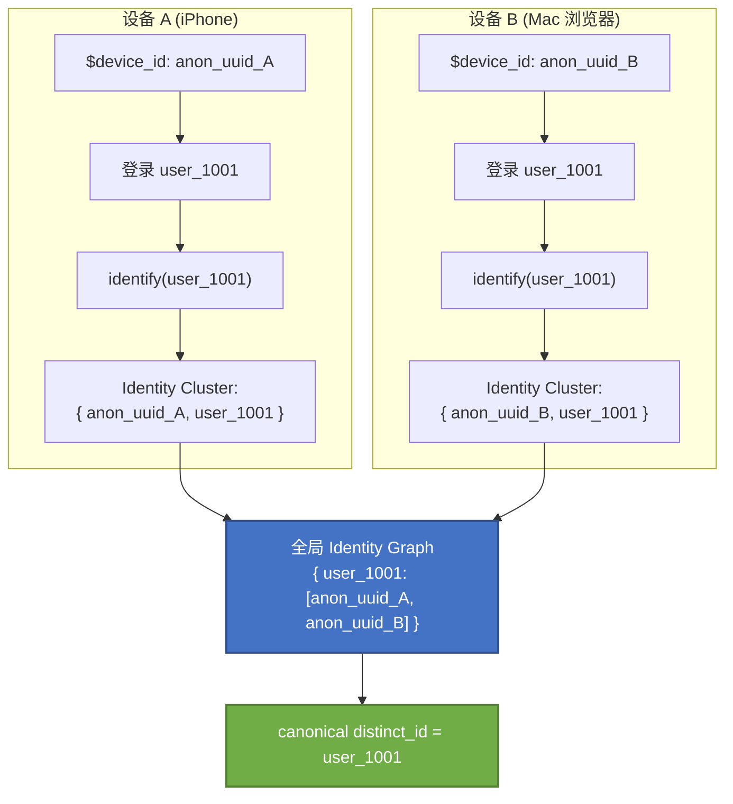

# 1. 什么是CanonicalUserId？

CanonicalUserId（规范化用户 ID）不**是某个特定系统强制规定的标准字段**，而是用户身份管理体系中的一个核心概念——它指的是将同一个自然人在不同状态（匿名/登录）、不同设备、不同渠道下的所有"碎片化身份标识"归并后，得到的一个**稳定、唯一、可用于查询和导出的"主用户标识"**。

主流 analytics 平台都有类似概念：在Mixpanel 叫 `canonical distinct_id`，在Amplitude 叫 `Amplitude ID`，Segment 维护 `anonymousId → userId` 映射表，国内业界统称 **One ID / ID-Mapping**。它们的本质都是同一件事——给"同一个人"发一张跨设备、跨状态的"身份证"。

Mixpanel、Amplitude、Segment这三者都是**用户行为数据领域的 SaaS 工具**，但解决的问题不在同一层：**Mixpanel 和 Amplitude 是"产品分析平台"**，用来分析用户做了什么；**Segment 是"客户数据平台（CDP）/ 数据管道"**，负责把数据收集起来并转发给下游工具——它本身不做分析。

## 1.1 用户行为数据领域的 SaaS 工具

简单来说，"用户行为数据领域的 SaaS 工具"就是**把你网站上、App 里、小程序中用户的一举一动（点了哪、看了多久、在哪退出）自动采集下来，并在云端帮你分析成图表和洞察的订阅制软件**。不用自己买服务器、不用自己搭数据管道，注册账号、嵌入一段 SDK 或 JS 代码就能用，按月/年付费 。

传统做法要搞用户行为分析，得自己搭采集 SDK → 消息队列 → 数据仓库 → 调度 → BI 这一长串（也就是大数据的 Hadoop/Hive/Flink 那一套）。但对很多公司来说，**业务等不及、人才也不够**。

用户行为 SaaS 就是把上面这一整条链路打包成开箱即用的产品：

1. **多渠道采集**：Web / H5 / App / 小程序，支持自动埋点、全埋点、自定义事件。
2. **事件与转化追踪**：把点击、注册、支付等都抽象成"事件"并自动采集，云端完成存储、清洗、计算
3. **分析模型**：路径分析、漏斗转化、留存分析
4. **用户体系**：标签系统、用户画像、用户分群
5. **可视化**：PV/UV、热力图、Session 回放、看板定制、数据导出

**它是大数据的"上层应用产品"，而 Hadoop/Hive/Flink 是"底层基础设施"**

**SaaS 工具 vs 自建大数据平台**

| 维度    | 用户行为 SaaS  | 自建（Hadoop/Hive/Flink 等） |
| ----- | ---------- | ----------------------- |
| 上线速度  | 嵌代码即用      | 需搭集群、建管道，周期长            |
| 成本    | 订阅费，随事件量增长 | 前期重，但边际成本低              |
| 数据自主权 | 数据在厂商云端    | 数据完全自持，合规性强             |
| 灵活性   | 受产品功能边界限制  | 可任意定制                   |
| 典型场景  | 中小企业、快速验证  | 大企业、数据安全/定制要求高          |

的本质都是同一件事——给"同一个人"发一张跨设备、跨状态的"身份证"。

## 1.2 为什么会出现 CanonicalUserId 这个概念

互联网业务里，标识一个用户通常有两套方案，但各有致命缺陷：

| 方案      | 做法                                    | 致命问题                                              |
| ------- | ------------------------------------- | ------------------------------------------------- |
| 设备 ID 派 | 用 IMEI / IDFA / OAID / Cookie UUID 标识 | 一人多机被拆成多人；一台设备多人登录被合并成一人；清 Cookie、卸载重装、换机都会生成新 ID |
| 账号 ID 派 | 用注册后的 userId / memberId               | 匿名浏览阶段完全抓不到，注册前的转化漏斗断裂                            |

现实场景极其复杂：**一个 userId 可能在手机、平板、备用机上登录过；一台手机可能先后登录过老公、老婆、孩子的账号**。如果不做身份归一，数据分析结果就会被严重扭曲——比如"注册转化率""购买归因""用户全生命周期行为"全都是错的。

所以行业里引入了第三层 ID——**CanonicalUserId**：它是系统在采集到 `deviceId`、`userId`（或其他匿名 ID）后，**通过 ID-Mapping 规则生成的一个稳定主标识**。

CanonicalUserId 的出现，本质是为了解决**设备 ID 不稳定、账号 ID 覆盖不到匿名期**这个二元困境。

它通过 ID-Mapping 把多层碎片标识归并成一个稳定主键，让你能准确回答"这个人到底是谁、他全生命周期做了什么"。匿名→登录的绑定靠的是 `identify()` 调用触发的 `deviceId ↔ userId` 映射；跨设备统一靠的是同一用户在每个端都完成 identify，由 Identity Graph 把所有端的身份簇归并到同一个 canonical ID 下。

# 2. CanonicalUserId的应用

## 2.1 匿名浏览 → 登录后行为绑定

以 Mixpanel 的 Simplified ID Merge 为例，整个机制非常清晰：

**1. 匿名阶段：客户端 SDK 自动生成 `$device_id`**

用户还没登录时，Web/Mobile SDK 会自动生成一个 UUID 作为 `$device_id`，所有事件都以它为 `distinct_id`。

**2. 登录/注册那一刻：调用 `.identify(userId)`**

```javascript
// 用户登录时
mixpanel.identify("user_1001");  
// 随后至少发一个事件，触发 $device_id 与 $user_id 的 merge
mixpanel.track("Login");
```

这一步在底层干了一件事——**建立映射：`$device_id` ↔ `$user_id` 形成一个 Identity Cluster（身份簇）**。

**3. 缝合事件流**

一旦映射建立，这个 `$device_id` 在登录前产生的所有匿名事件，会被**回溯性**地归到 `user_1001` 下。这样你就能回答："访客中有百分之多少最终注册了？""某篇博客文章的阅读对注册的转化贡献了多少？"

**4. 退出登录：调用 `.reset()`**

清除本地存储的 `$user_id` 和 `$device_id`，生成新的 `$device_id`，避免下一任使用者被误合并到上一任账号下。

> 💡 关键约束：Mixpanel 的 `$identify` 事件**只会合并 UUIDv4 格式的匿名 ID**，且该匿名 ID 此前未被合并到其他 userId 上——这是为了防止错误地"缝合"用户。

## 2.2 不同设备终端如何通过 CanonicalUserId 统一

跨设备归并的**前提条件只有一个：同一用户在每个设备上都调用过 `.identify(userId)`**。



只要 `user_1001` 在两个设备上都完成过 identify，两个设备上的匿名行为 + 登录后行为，会**全部归一到 `user_1001` 这个 canonical ID 下**。

但如果用户**只在 iPhone 上登录，没在 Mac 浏览器上登录**，那么 Mac 上的匿名行为会一直保持匿名，**无法归并**——这是跨设备统一的硬限制，只有让用户在每个端都走登录流程才能打通。

# 3. UserId + deviceId 能否唯一标识一个用户

**不能**​ ，原因如下：

**1. `deviceId` 本身就不稳定**

- Web 端：Cookie 被清理、隐私模式浏览，都会生成新的 deviceId
- iOS 端：IDFV 在不同厂商 App 间取值不同；IDFA 用户可随时重置
- Android 端：卸载重装、恢复出厂都会改变
- 一人换机 → 同一个 userId 对应多个 deviceId

**2. `deviceId + userId` 组合会遭遇"多对多"灾难**

- **一对多**：一个 userId 在多台设备登录 → 产生多个 `userId+deviceId` 组合
- **多对一**：一台设备先后登录多个账号 → 同一个 `deviceId` 对应多个 `userId`

如果直接用 `userId+deviceId` 作为用户唯一键，上面两种场景都会让"用户数"统计失真。

**3. 匿名阶段的 userId 是空的**

用户没登录时根本没有 userId，只能用 deviceId 顶着——这时候 `userId+deviceId` 这种组合根本不存在。

这就是为什么需要 **CanonicalUserId 作为独立的主键层**：它解耦了"业务账号"和"设备"两层标识，通过 ID-Mapping 把 `deviceId`、`userId`、`anonymousId` 等各种碎片 ID 都映射到同一个 canonical ID 上。**一个 canonical user 下可以挂多个 userId 和多台 deviceId；一个 userId 也可以出现在多台设备上**——这是 `userId+deviceId` 这种扁平组合做不到的。

# 4. 落地到工程实践的建议

如果你要在自己的数据体系里实现类似 CanonicalUserId 的机制，参考神策、Mixpanel、Segment 的通用做法：

**1. 数据采集层**：同时采集 `device_id`（匿名 ID）和 `user_id`（登录后业务 ID），用 UUIDv4 格式

**2. ID-Mapping 层**：维护一张映射表

```sql
-- 身份映射表（Identity Cluster 的存储形态）
CREATE TABLE id_mapping (
    canonical_user_id  VARCHAR(64) PRIMARY KEY,  -- 规范化用户ID
    user_id            VARCHAR(64),              -- 业务账号ID（可空）
    device_id          VARCHAR(64),              -- 设备匿名ID
    first_seen         TIMESTAMP,
    merged_at          TIMESTAMP
);
```

**3. 归并规则**（参考神策 IDM 的经验）：

- 一个注册用户可以与**任意多台设备**关联（解决换机问题）
- 一台设备先后被多个用户登录时，**匿名行为只归给第一个在此设备登录的用户**（这是业界通用妥协，避免复杂度爆炸）
- canonical_user_id 优先采用稳定的 `userId`；纯匿名用户则用 `device_id` 作为临时 canonical ID，等登录后再做一次 merge

**4. 查询层**：所有用户维度的分析、导出、人群圈选，**只用 canonical_user_id**，不用 deviceId 也不用原始的 userId。

> ⚠️ 一个容易踩的坑：调用 `.reset()` 的时机。频繁 reset 会快速消耗 Identity Cluster 的 ID 上限（Mixpanel 限制 500 个 ID/簇）。最佳实践是**只有在明确切换用户时才 reset**（比如点了"注册"而非"登录"），普通退出登录不必强求 reset。
