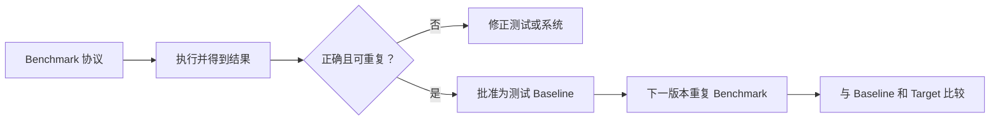

# 1. Benchmark 与 Baseline 分别是什么

在性能工程和大数据平台建设中，Benchmark 与 Baseline 经常同时出现，但它们并不处于同一个层次：

> **Benchmark（基准测试）是一把定义了使用方法的“尺子”，Baseline（基线）是团队选定并保存下来的“参考刻度”。**

- **Benchmark** 主要回答：在什么数据、负载、资源和执行规则下，系统表现如何？
- **Baseline** 主要回答：这次结果相对某个已知状态，是改善、退化，还是异常？

例如，团队固定使用 1 TB 数据、20 条 SQL、相同计算资源和 10 个并发用户测试两个查询引擎，这套测试协议和执行过程是 Benchmark。旧版本测得的 `P95 = 8.2 s` 被批准为后续版本的比较起点，这个值才是 Baseline。

实际交流中，英文 `benchmark` 还可能指测试套件、一次测试结果，甚至外部标杆。为了避免歧义，工程文档最好明确使用下面四个词：

| 术语                      | 含义                  | 示例                                 |
| ----------------------- | ------------------- | ---------------------------------- |
| Benchmark specification | 测试协议：数据、负载、环境、步骤和指标 | “1 TB 数据、并发 10、预热 2 次、正式运行 5 次”    |
| Benchmark run/result    | 某次执行及其测量结果          | “本次 P95 查询延迟为 8.2 秒”               |
| Baseline                | 被接受并保存的参考值或参考范围     | “发布版本 v3.2 的 P95 Baseline 为 8.2 秒” |
| Target / SLO            | 希望达到或承诺达到的目标        | “P95 必须小于 6 秒”                     |

**Baseline 描述的是参照状态，Target/SLO 描述的是期望状态。** Baseline 可以低于目标，也可能已经不满足目标，不能把二者混为一谈。

## 1.1 Benchmark（基准测试）

- **定义**：一套可重复执行的测试协议或工作负载，用于度量系统或组件在明确条件下的性能、容量、稳定性、正确性和成本。它包括测试方法，也包括承载该方法的数据集、脚本与工具。

- **特点**：测试目标、数据集、负载模型、运行环境、操作步骤和度量口径都必须明确并尽量保持一致。

- **举例**：TPC-H 的 22 条 SQL 查询；HiBench 中的 WordCount、K-Means 作业；JMeter 压测脚本。

- **用途**：
  
  | 场景            | 说明                                                          |
  | ------------- | ----------------------------------------------------------- |
  | **技术选型**​     | 选 Spark 还是 Flink？选 ClickHouse 还是 Doris？跑一套 Benchmark 用数据说话。 |
  | **版本升级验证**​   | 从 Spark 2.x 升到 3.x，性能是提升还是回退？用 Benchmark 量化对比。              |
  | **容量规划**​     | 数据量翻 10 倍需要加多少机器？通过 Benchmark 推算线性扩展能力。                     |
  | **参数调优验证**​   | 改了 JVM 参数或并行度，用 Benchmark 确认是否真的有提升。                        |
  | **SLA 定义**​   | 承诺客户 99% 查询 < 2 秒，需要先 Benchmark 验证平台能力。                     |
  | **硬件/云厂商评估**​ | 不同机型（如计算型 vs 内存型）跑同样任务，选性价比最高的。                             |

### 1.1.1 常见的 Benchmark 工具与标准

| 工具/标准               | 测什么                                       |
| ------------------- | ----------------------------------------- |
| **TPC-H / TPC-DS**​ | 决策支持/数仓查询性能（SQL 复杂度高）                     |
| **HiBench**​        | Hadoop/Spark 综合套件（含 WordCount、Sort、SQL 等） |
| **TPCx-HS**​        | Hadoop 系统整体性能                             |
| **YCSB**​           | NoSQL 数据库（HBase、Cassandra）的读写性能           |
| **TPCx-BB**​        | 大数据基准测试（BigBench，覆盖结构化+半结构化）              |
| **Sysbench**​       | 底层系统（CPU、内存、磁盘 IO）性能                      |

标准套件保证了工作负载有共同语言，但不等于真实生产负载。正式选型时通常需要同时运行“标准套件”和“从生产中抽取的代表性任务”。如果对外宣称官方 TPC 成绩，还需要遵守对应规范的审计和披露要求；内部跑了相似 SQL，不应直接称为官方 TPC 成绩。

### 1.1.2 Benchmark 在项目生命周期中的位置

```plain
架构设计 → 技术选型（Benchmark ①）
    ↓
开发完成 → 性能测试（Benchmark ②）
    ↓
预上线   → 容量规划（Benchmark ③）
    ↓
生产运行 → 建立 Baseline → 日常监控告警
    ↓
版本迭代 → 回归测试（Benchmark ④）
```

它是**贯穿始终**的活动，而不是只在某个阶段做一次。

## 1.2 Baseline（基线）

- **定义**：一个已经确认、可用于后续比较的**数值、范围或状态**。它既可以来自某次受控 Benchmark，也可以来自一段稳定的生产历史。
- **特点**：是一个具体的数字（如“单节点排序耗时 120 秒”）或一组指标（如“P99 延迟 50ms”）。它不一定是固定值，也可能是动态范围。
- **举例**：优化前的“旧版本 Flink 作业吞吐量 10 万条/秒”；生产环境的“正常 CPU 使用率 40%”。
- **用途**：
  1. **量化改进**：只有知道优化前是多少，才能说“提升了 30%”。
  2. **异常告警**：当线上指标偏离 Baseline 超过阈值时触发报警（例如 CPU 突然飙升到 80%，而 Baseline 是 40%）。
  3. **目标设定**：团队可以约定“新版本必须达到 Baseline 的 1.2 倍性能”作为交付标准。
  4. **历史追溯**：排查问题时能回看 Baseline，确认是从哪个版本开始变慢的。

一个可用的 Baseline 不能只保存孤立的数字，还要保存它成立的上下文：

```plain
Baseline = 指标值/范围
         + 工作负载与数据规模
         + 软件版本与配置
         + 硬件和运行环境
         + 统计口径与样本窗口
         + 生效时间与负责人
```

否则，“P95 延迟为 50 ms”无法说明是在单并发还是百并发、热缓存还是冷缓存、哪个版本和哪种数据规模下得到的，也就无法公平比较。

## 1.3 区别

在大数据场景里，**Baseline（基线）和 Benchmark（基准测试/标杆）** 都用于比较，但比较对象不同：

> **Baseline 主要回答“相对自己过去有没有异常或改善？”**  
> **Benchmark 主要回答“在统一条件下，系统能力到底怎么样，和目标或其他方案相比如何？”**

公开资料通常也把 Baseline 定义为衡量变化的起点，而 Benchmark 更多使用行业标准、竞争对象或统一测试标准作为参照。 [[usertesting.com]](https://www.usertesting.com/blog/research-benchmarking-vs-baselines)

| 维度       | Benchmark                   | Baseline                       |
| -------- | --------------------------- | ------------------------------ |
| **本质**   | 测量协议、工作负载和执行过程              | 被接受的参考值、范围或状态                  |
| **核心问题** | “在这些条件下，系统能力如何？”            | “相对参考状态，发生了多大变化？”              |
| **主要组成** | 数据、负载、环境、步骤、指标、报告           | 指标值、统计口径、适用条件、生效时间             |
| **典型用途** | 技术选型、参数调优、容量测试、版本回归         | 趋势比较、回归门禁、生产告警、异常检测            |
| **变化方式** | 测试协议应版本化；条件改变时形成新版本         | 系统稳定演进后可审批更新，旧值仍需保留            |
| **举例**   | “使用固定 1 TB 数据运行 TPC-DS 类查询” | “当前发布版本的 P95 是 8.2 秒”          |
| **常见误区** | 只跑一次、只看平均值，或在不同环境中比较        | 把 Baseline 当成目标、极限值，或发现异常后立即覆盖 |

## 1.4 关系

- Benchmark 结果经过正确性校验、重复性检查和团队确认后，**可以被选为测试 Baseline**。
- 生产系统稳定运行一段时间后，也可以根据历史分位数或动态区间建立**生产 Baseline**，不要求先跑标准 Benchmark。
- 没有历史 Baseline 时，Benchmark 仍然可以横向比较候选方案，或直接与 Target/SLO 比较。
- 有 Baseline 但不重复执行相同测量，也无法判断变化。因此，真正有价值的是“可重复的 Benchmark + 有上下文的 Baseline”。

实际工作中常说的“打 Baseline”，通常是指执行一轮受控测试，确认结果有效后，将它登记为后续版本的比较起点。



# 2. 如何设计一个可信的 Benchmark

Benchmark 的可信度不来自脚本跑得多复杂，而来自三个条件：

1. **可控**：除待比较变量外，其他关键条件尽量一致。
2. **可重复**：其他人根据记录可以重现测试。
3. **有代表性**：测试负载能够覆盖真正关心的生产模式。

## 2.1 先定义决策

开始测试前，先把问题写成可证伪的判断。例如：

```plain
决策：Spark 3.5 是否可以替换 Spark 3.4？

保持不变：数据快照、集群资源、作业代码、配置和执行时段
唯一变量：Spark 版本
正确性门槛：输出行数和关键指标必须一致
性能门槛：核心作业耗时回退不超过 5%
成本门槛：每 TB 计算成本回退不超过 10%
```

这比“比较两个版本谁更快”更有效，因为它明确了比较对象、控制变量和通过标准。技术选型也一样：不是寻找脱离场景的“最快引擎”，而是判断哪个候选方案更符合当前工作负载和约束。

## 2.2 固定测试契约

一份完整的 Benchmark specification 至少要记录下面这些信息：

| 维度  | 需要固定或记录的内容                | 常见陷阱              |
| --- | ------------------------- | ----------------- |
| 数据  | 规模、快照、分布、倾斜、文件格式、压缩方式     | 只生成均匀随机数据，掩盖生产倾斜  |
| 负载  | 查询/作业集合、读写比例、并发数、到达速率     | 只测单条最快 SQL，不测混合负载 |
| 环境  | 节点数、CPU、内存、磁盘、网络、可用区      | 两个方案实际拿到的资源不同     |
| 软件  | 引擎、JDK、依赖、配置、镜像和代码版本      | 升级引擎时顺便修改多个参数     |
| 执行  | 冷/热缓存、预热次数、重复次数、运行顺序      | A 永远先跑，结果受时段影响    |
| 指标  | P50/P95/P99、吞吐量、错误率、资源和成本 | 只看平均耗时，忽略长尾与失败请求  |

可以把这些内容版本化保存为测试清单：

```yaml
benchmark_id: sql-engine-1tb-v1
dataset: sales_snapshot_2026_08_20
data_size: 1TB
workload: decision_support_queries_v3
concurrency: 10
environment: 5_nodes_16c64g
cache_mode: warm
warmup_runs: 2
measured_runs: 5
metrics: [p50_latency, p95_latency, throughput, error_rate, cost]
```

只要数据、负载或环境发生了会影响可比性的变化，就应该生成新的协议版本，而不是悄悄覆盖旧定义。

## 2.3 让负载接近真实生产

标准套件适合建立共同语言，生产样本适合回答自己的问题。两者通常需要结合：

- 用 TPC-DS、YCSB 或 HiBench 覆盖标准化能力。
- 从生产日志中抽取高频、关键和长尾任务，形成业务工作负载。
- 保留真实的数据分布、热点 Key、小文件比例和数据倾斜。
- 按高峰期重放并发与请求到达节奏，而不是只做串行测试。
- 同时覆盖正常路径、资源紧张和故障恢复，但把不同场景分开报告。

性能比较之前必须先校验正确性。一个因为少处理了数据而更快的方案不是优化。常见校验包括输出行数、关键聚合值、空值率、主键重复数，以及文件或结果集校验和。

## 2.4 执行和统计结果

一次相对可靠的执行流程是：

1. 清理或明确缓存状态，并执行预热轮次。
2. 按预先规定的次数重复测试；A/B 交替或随机运行顺序，降低时段噪声。
3. 每次只改变一个待验证因素，其他配置保持一致。
4. 保存每轮原始结果，不只保存最终平均值。
5. 报告中位数和 P95/P99 等分位数，同时报告错误率与波动范围。
6. 保存执行日志、引擎指标、资源利用率、配置快照和代码版本。

不同指标的“变好方向”不同，报告中应明确标注：

| 指标             | 变好方向 | 相对变化示例                                      |
| -------------- | ---- | ------------------------------------------- |
| 延迟、作业耗时、错误率、成本 | 越低越好 | `(current - baseline) / baseline` 大于 0 表示回退 |
| 吞吐量、每秒处理行数     | 越高越好 | `(current - baseline) / baseline` 大于 0 表示提升 |

如果 Baseline 作业耗时为 100 分钟，新版本为 112 分钟，则耗时回退 12%。如果吞吐量从每秒 10 万条升到 11.5 万条，则吞吐量提升 15%。不要只写“快了 15%”，必须同时说明指标、方向和计算口径。

## 2.5 结果不是一个孤立排名

下面是一份简化后的查询引擎评测结果：

| 方案       | P50 延迟 | P95 延迟 | 吞吐量    | 错误率  | 每 1,000 次查询成本 |
| -------- | ------:| ------:| ------:| ----:| -------------:|
| Engine A | 1.8 s  | 7.6 s  | 42 QPS | 0.1% | 18 元          |
| Engine B | 2.2 s  | 5.1 s  | 39 QPS | 0%   | 14 元          |

不能简单得出“Engine A 更快”。它的中位延迟和吞吐量更好，但 Engine B 的长尾、稳定性和成本更好。最终结论应绑定决策条件，例如：

> 在 P95 小于 6 秒、错误率小于 0.1% 且月度预算固定的约束下，本次交互式查询场景选择 Engine B；该结论只适用于 `sql-engine-1tb-v1` 定义的负载和环境。

这才是一份可以被评审、复现和推翻的 Benchmark 结论。

# 3. 如何建立和治理 Baseline

Baseline 不是“第一次测出来的数字”那么简单。它必须能够代表某种稳定状态，并且和当前指标处于可比条件下。

## 3.1 测试 Baseline 与生产 Baseline

大数据工程中常见的 Baseline 可以分成两类：

| 类型          | 数据来源                   | 主要用途                  | 更新方式              |
| ----------- | ---------------------- | --------------------- | ----------------- |
| 测试 Baseline | 受控 Benchmark 中已批准版本的结果 | 升级、调优、代码变更和硬件变更的回归判断  | 随发布版本显式更新，旧版本永久留档 |
| 生产 Baseline | 稳定生产窗口中的历史指标分布         | 日常监控、异常检测、容量趋势和数据质量告警 | 按日/周滚动计算，但需防止异常污染 |

二者不要混用。测试环境的 50 分钟成绩不能直接成为生产告警线，因为生产还存在资源争用、数据倾斜和流量波动；生产历史值也不适合直接比较两个引擎，因为它无法控制其他变量。

## 3.2 建立生产 Baseline 的步骤

以每日离线 Pipeline 为例，可以按下面的顺序建立生产 Baseline：

1. **定义对象**：明确是哪个作业、数据集、租户、区域和版本。
2. **选择指标**：运行时间、输入行数、输入字节、数据到达时间、失败率、Shuffle 量等。
3. **划分可比组**：按工作日/周末、小时、数据量区间或业务季节分组。
4. **选择样本窗口**：例如最近 28 个正常生产日，覆盖四个完整星期。
5. **选择统计量**：使用中位数、P95、四分位距等稳健统计量，而不是只用平均值。
6. **定义告警规则**：Baseline 描述正常状态，告警阈值还要结合容忍度和 SLO。
7. **版本化保存**：记录计算口径、生效时间、排除窗口和审批人。

例如某文件在最近 30 个工作日的到达时间为：

| 指标       | Baseline  |
| -------- | --------- |
| P50 到达时间 | 08:08     |
| P95 到达时间 | 08:25     |
| 业务 SLO   | 08:35 前到达 |

可以将 `08:25` 设为预警观察点，将 `08:35` 设为违反 SLO 的严重告警点。这里的 P95 是历史 Baseline，08:35 是业务目标，两者含义不同。

数据量也应该按可比组建立基线。假设工作日通常写入 0.9 亿至 1.1 亿行，周末通常只有 0.5 亿至 0.7 亿行。如果只计算一个全月平均值，周一写入 0.65 亿行可能看似正常，实际上已经明显缺数。

## 3.3 静态、分组与动态 Baseline

| 方式          | 适用场景               | 优点        | 风险             |
| ----------- | ------------------ | --------- | -------------- |
| 静态 Baseline | 发布回归、固定负载测试        | 可审计、比较稳定  | 系统演进后可能失真      |
| 分组 Baseline | 工作日/周末、高峰/低峰、不同数据量 | 简单且能表达周期性 | 分组过细会导致样本不足    |
| 滚动 Baseline | 流量和业务持续缓慢变化        | 能跟随趋势     | 事故数据可能被学习成“正常” |
| 模型 Baseline | 多重季节性和复杂依赖关系       | 能表达复杂模式   | 可解释性和维护成本更高    |

动态 Baseline 不能无条件自动更新。常见保护措施包括：

- 延迟若干天再纳入新样本，给事故确认留出时间。
- 排除已确认故障、发布窗口、回填任务和节假日活动。
- 限制单次更新幅度，突变必须人工审批。
- 同时保留绝对 SLO，避免 Baseline 随性能持续恶化而不断放宽。
- 保存历史版本，保证事后能够还原“当时为什么告警”。

## 3.4 Baseline 记录示例

一个 Baseline 注册表可以使用数据库表或配置文件实现，重点是让参考值和上下文绑定：

```yaml
baseline_id: ingestion-runtime-prod-v4
object: ods_order_ingestion
metric: runtime_minutes
statistic: p95
value: 60
segment:
  input_size_tb: "0.8-1.2"
  day_type: weekday
sample_window: "2026-07-01/2026-07-28"
excluded_dates: ["2026-07-09"]
effective_from: "2026-08-01"
owner: data-platform
```

当输入量变成 3 TB、作业架构重写或资源池发生变化时，应建立新版本，而不是拿不再可比的数据强行延长旧 Baseline。

# 4. 应用实战场景

下面的数据均为说明方法而构造，重点是展示 Benchmark、Baseline 和决策如何衔接。

## 4.1 Spark 版本升级：性能回归门禁

### 场景

团队计划从 Spark 3.4 升级到 Spark 3.5，希望升级后结果正确，并且核心作业性能回退不超过 5%。

### Benchmark 设计

- 固定一份脱敏后的生产数据快照。
- 选择扫描、聚合、Join、窗口函数和数据倾斜等 20 个代表性作业。
- 使用相同节点、资源队列、JDK、作业代码和 Spark 配置。
- 每个版本先预热 2 次，再交替运行 5 次。
- 先比较行数、关键聚合值和校验和，再比较耗时与资源指标。

Spark 3.4 当前批准结果是**测试 Baseline**。部分结果如下：

| 作业              | 3.4 Baseline 中位耗时 | 3.5 中位耗时 | 相对变化   | 结论  |
| --------------- | -----------------:| --------:| ------:| --- |
| `orders_etl`    | 42 分钟             | 43 分钟    | +2.4%  | 通过  |
| `customer_join` | 24 分钟             | 28 分钟    | +16.7% | 阻断  |
| `session_agg`   | 31 分钟             | 29 分钟    | -6.5%  | 提升  |

`customer_join` 的输出正确，但耗时回退 16.7%，同时 Shuffle Read 从 310 GB 增至 470 GB。发布门禁应阻断升级，并继续检查执行计划、Join 策略、数据倾斜和 Adaptive Query Execution 配置，而不是用另外两个作业的提升抵消它。

回归判断的基本形式可以写成：

```plain
耗时回退率 = (当前耗时 - Baseline 耗时) / Baseline 耗时

当正确性校验失败：直接阻断
当耗时回退率 > 5%，且差异超过历史正常波动：阻断并分析
```

升级通过并稳定发布后，Spark 3.5 的批准结果可以成为下一轮变更的测试 Baseline，但 Spark 3.4 的记录仍需保留。

## 4.2 查询引擎选型：不仅比较谁最快

### 场景

为 3 TB 数据上的交互式 BI 查询选择引擎。业务要求 30 并发下 P95 小于 10 秒，数据新鲜度小于 15 分钟，同时控制总成本。

### Benchmark 设计

- 从生产查询日志中抽取 120 条查询，按频率和重要性加权。
- 使用相同数据快照、并发模型和测试时段。
- 允许每个引擎进行合理的生产级调优，但完整披露索引、物化视图和缓存策略。
- 成本包括计算、存储、数据导入和持续运维，不只比较机器单价。

一组示例结果如下：

| 方案         | P95 延迟 | 吞吐量      | 成功率   | 额外数据准备 | 综合成本 |
| ---------- | ------:| --------:| -----:| ------ | ---- |
| Spark SQL  | 24.8 秒 | 7.2 QPS  | 100%  | 无      | 低    |
| Trino      | 8.6 秒  | 18.4 QPS | 99.9% | 无      | 中    |
| ClickHouse | 2.1 秒  | 56.0 QPS | 100%  | 需要持续导入 | 高    |

Benchmark 不能自动替团队做决定：

- Spark SQL 没有达到交互式查询的 P95 目标。
- ClickHouse 的查询性能最好，但增加了数据复制、新鲜度和运维成本。
- Trino 达到当前 SLO，且可以直接查询现有数据湖。

如果当前目标是以较小架构改动满足 10 秒 SLO，可以选择 Trino；如果未来业务明确要求亚秒级查询，再评估 ClickHouse 的额外成本。这一结论只适用于本次负载，不能泛化为某个引擎“永远更快”。

## 4.3 容量规划：找到满足 SLA 的安全容量

### 场景

某 Ingestion Pipeline 当前每日处理 1 TB 数据，要求在 120 分钟内完成。团队需要判断现有 10 个节点能否支撑半年后的增长。

### Benchmark 设计与结果

保持数据分布、文件格式、节点数和作业配置不变，逐级增加输入量：

| 输入量    | 完成时间   | 是否满足 120 分钟 SLA | 现象                          |
| ------:| ------:| --------------- | --------------------------- |
| 0.5 TB | 28 分钟  | 是               | 资源充足                        |
| 1.0 TB | 55 分钟  | 是               | 接近线性增长                      |
| 1.5 TB | 88 分钟  | 是               | 出现少量磁盘 Spill                |
| 2.0 TB | 134 分钟 | 否               | Shuffle Spill 和长尾 Task 明显增加 |

测试说明性能在 1.5 TB 到 2 TB 之间出现拐点，不能按 0.5 TB 的结果做线性外推。下一步应在边界附近补测 1.6、1.7、1.8 TB，定位满足 SLA 的最大容量。

即使最终测得 1.7 TB 可以在 120 分钟内完成，也不应把 1.7 TB 当作日常规划容量。按 20% 的资源余量计算，安全规划容量约为 1.36 TB，用于吸收重试、资源争用和数据倾斜。若半年预测达到 1.5 TB，就应提前扩容或优化分区与 Shuffle，而不是等 SLA 已经失败再处理。

## 4.4 生产监控：从测试成绩到动态基线

### 场景

新 Ingestion Pipeline 上线前，固定 1 TB 数据的 Benchmark 结果为：

- 旧方案：90 分钟
- 新方案：55 分钟
- 上线目标：60 分钟以内

`55 分钟` 是一次 **Benchmark 结果**。团队确认测试可重复后，可以暂时把它登记为**初始测试 Baseline**，但它还不是生产系统的正常范围。

上线并稳定运行 30 天后，按 0.8 至 1.2 TB 的工作日任务统计：

| 指标         | 生产 Baseline  |
| ---------- | ------------ |
| 运行时间 P50   | 52 分钟        |
| 运行时间 P95   | 60 分钟        |
| 输入量正常范围    | 0.8 至 1.2 TB |
| 输入行数正常范围   | 0.9 亿至 1.1 亿 |
| 数据到达时间 P95 | 08:25        |

这组分布才是用于日常监控的**生产 Baseline**。之后某天输入量为 1 TB，作业却运行了 85 分钟，即使最终成功，也应该判定为性能异常。如果作业只运行 20 分钟，但输入行数只有 0.2 亿，则更可能是上游缺数，不能把“更快”误判为优化。

这一场景中可以同时建立三类规则：

1. **数据到达告警**：超过历史 P95 时预警，超过业务 SLO 时严重告警。
2. **数据质量告警**：行数、空值率、重复率偏离同类日期的正常范围。
3. **性能告警**：在相近输入量下，运行时间或单位数据成本显著偏离 Baseline。

因此，完整链路是：


# 5. 常见误区

## 5.1 把 Benchmark 等同于压测

性能测试是一个总称，几种常见测试关注的问题不同：

| 测试类型        | 主要问题                         |
| ----------- | ---------------------------- |
| Benchmark   | 在明确、可重复的条件下，系统表现如何，方案之间如何比较？ |
| Load Test   | 在预期业务负载下，系统是否满足要求？           |
| Stress Test | 不断增加压力时，系统在哪里失效，能否优雅降级？      |
| Soak Test   | 长时间运行后，是否出现泄漏、累积延迟或稳定性问题？    |

一次 Load Test 可以被设计成可重复的 Benchmark，但二者并非天然等价。

## 5.2 只看平均值

平均 2 秒可能掩盖 P99 为 40 秒，也可能掩盖 5% 请求直接失败。查询服务要关注延迟分位数、吞吐量和错误率；批处理要关注中位耗时、长尾 Task、失败重试和资源峰值。

## 5.3 忽略正确性和工作量

少扫描分区、漏掉 Join 结果或输入数据不足都会让作业“变快”。性能指标必须和输出校验、输入量、扫描字节数一起看。

## 5.4 在不可比的条件下比较

不同数据规模、资源配置、缓存状态、并发数和测试时段得到的结果不能直接放在一起排名。如果条件无法完全一致，应披露差异并说明它会怎样影响结论。

## 5.5 发现回退后立即刷新 Baseline

Baseline 的作用就是暴露变化。为了让告警消失而覆盖它，会把异常重新定义为正常。只有当变化符合预期、完成验证并经过审批后，才能创建新的 Baseline 版本。

## 5.6 把外部成绩当成自己的生产承诺

厂商或社区成绩可以帮助筛选候选方案，但无法替代自身工作负载测试。硬件、数据分布、查询模式、调优程度和成本口径不同，结论就可能完全不同。

# 6. 一份可直接复用的检查清单

执行 Benchmark 前，至少回答下面的问题：

- 这次测试要支持哪个具体决策？
- 唯一计划改变的变量是什么？
- 数据和负载是否代表真实场景？
- 哪些环境、配置和版本必须固定并记录？
- 如何校验结果正确性？
- 需要测量哪些延迟、吞吐、稳定性、资源和成本指标？
- 预热、重复次数和执行顺序是什么？
- 要与哪个 Baseline、Target 或 SLO 比较？

建立 Baseline 时，再确认下面的问题：

- 它是测试 Baseline 还是生产 Baseline？
- 指标值对应什么对象、分组、数据规模和统计口径？
- 样本窗口是否足够，是否包含事故或特殊活动？
- 告警阈值与业务 SLO 是否单独定义？
- 什么情况下允许更新，谁负责审批？
- 是否保留旧版本和原始测量数据？

# 7. 总结

最后可以用三句话记住这两个概念：

1. **Benchmark 定义怎样测**：固定数据、负载、环境、步骤和指标，得到可重复的测量结果。
2. **Baseline 定义和谁比**：保存某个已知状态及其上下文，用来判断改善、回退或异常。
3. **Target/SLO 定义要达到哪里**：它是期望或承诺，不等于当前 Baseline。

Benchmark 的结果可以被批准为测试 Baseline，稳定生产历史也可以形成生产 Baseline。真正完整的工程闭环不是“跑一次分”，而是持续执行：

```plain
明确决策 -> 设计 Benchmark -> 校验并测量 -> 建立 Baseline
         -> 监控与回归 -> 审批新 Baseline -> 保留历史
```

当测试协议可复现、参考值有上下文、判断标准提前定义时，Benchmark 和 Baseline 才能真正服务于技术选型、版本升级、容量规划和生产治理。

# 参考资料

- [Transaction Processing Performance Council](https://www.tpc.org/)：TPC 系列 Benchmark 的规范与结果。
- [Intel HiBench](https://github.com/Intel-bigdata/HiBench)：面向大数据框架的工作负载套件。
- [Yahoo Cloud Serving Benchmark](https://github.com/brianfrankcooper/YCSB)：面向云数据库和 NoSQL 系统的工作负载生成与评测框架。
