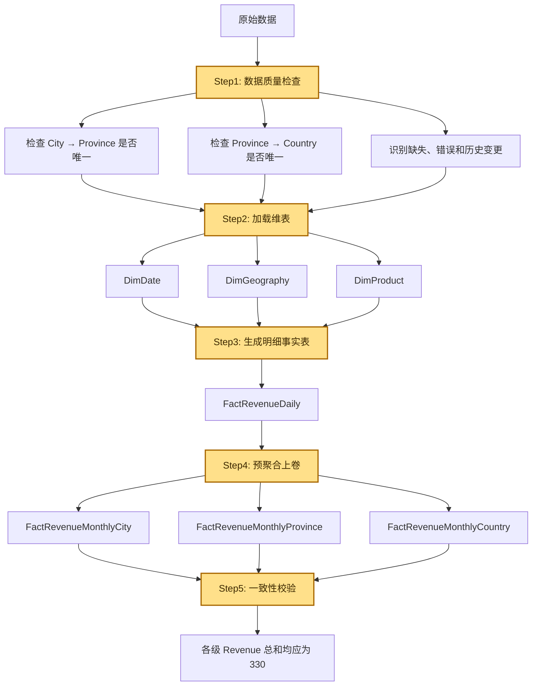
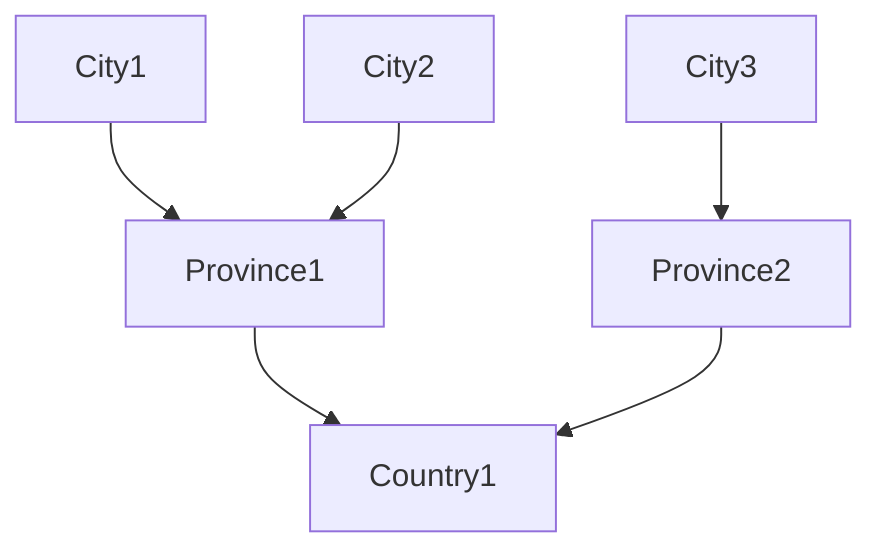
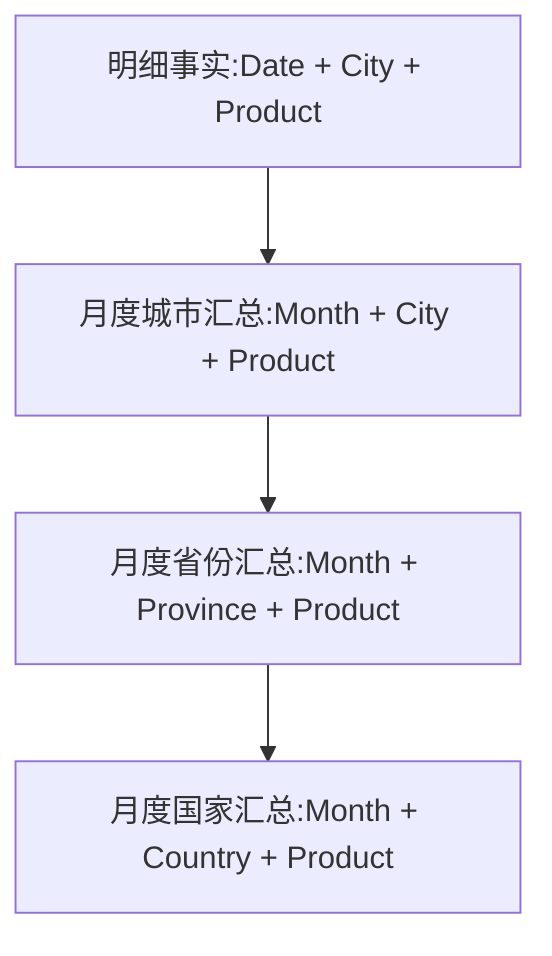

# 1. 什么是“维度上卷”

维度上卷 Roll-up 本质上是维度建模和 OLAP 中的分析概念；ETL 中的维度上卷，是通过数据转换和聚合，将细粒度事实数据加工为更高层级、更粗粒度的汇总数据。

- **Roll-up 是分析语义**
- **ETL 是实现手段**
- **聚合表、汇总事实表是落地结果**

所谓上卷，就是从**更细维度层级聚合成更高维度层**，例如：

- 时间维度：日 → 月 → 季度 → 年

- 地域维度：城市 → 省份 → 国家

- 产品维度：SKU → SubCategory → Category

例如原始数据是：

| Date       | City  | Province  | Country  | Product | Revenue |
| ---------- | ----- | --------- | -------- | ------- | ------- |
| 2026-08-01 | City1 | Province1 | Country1 | A       | 100     |
| 2026-08-02 | City3 | Province2 | Country1 | A       | 150     |
| 2026-08-01 | City2 | Province1 | Country1 | A       | 80      |

经过时间和地域上卷（C1/C2都属于P1）：

| Month   | Province   | Product | Revenue |
| ------- | ---------- | ------- | ------- |
| 2026-08 | Province1  | A       | 180     |
| 2026-08 | Province12 | A       | 150     |

这里发生了两个变化：

1. `Date → Month`
2. `City → Province`

同时：`Revenue = SUM(100 + 150 + 80) = 330`

# 2. ETL 中上卷的核心是“改变事实粒度”

上卷不能只理解为 `GROUP BY`。

它真正改变的是：

> **事实表中一行数据所代表的业务范围。**

例如：

| 状态  | 一行含义                   | 粒度                          |
| --- | ---------------------- | --------------------------- |
| 上卷前 | 某一天 + 某城市 + 某SKU 的销售情况 | Date + City + SKU           |
| 上卷后 | 某个月 + 某省份 + 某产品类别的销售情况 | Month + Province + Category |

事实表中的维度键决定事实数据的粒度。**事实可以存储在更高粒度，但高粒度事实通常无法再准确拆分回更细粒度**

即 日级 → 月级 通常是可完成的；

但 月级 → 日级 如果没有保留日级明细，无法准确恢复。

# 3. ETL 中上卷的完整流程



## 3.1 数据质量检查

**检查 City → Province**

| City  | Province  | 是否唯一 |
| ----- | --------- | ---- |
| City1 | Province1 | 是    |
| City2 | Province1 | 是    |
| City3 | Province2 | 是    |

当前数据中，每个 City 只属于一个 Province，因此层级关系正常。

**检查 Province → Country**

| Province  | Country  | 是否唯一 |
| --------- | -------- | ---- |
| Province1 | Country1 | 是    |
| Province2 | Country1 | 是    |

最终可以建立稳定的地理层级：



## 3.2 加载维表

不建议在事实表里重复保存 City、Province、Country 名称。所以按照星型模型可以**拆分事实数据与维度数据**：

- 地域维表 `DimGeography`

- 日期维表 `DimDate`

- 产品表 `DimProduct`

### 地域维表 DimGeography

| GeographyKey | City  | Province  | Country  |
| ------------ | ----- | --------- | -------- |
| 101          | City1 | Province1 | Country1 |
| 102          | City3 | Province2 | Country2 |
| 103          | City2 | Province1 | Country1 |

### 日期维表 DimDate

| DateKey  | Date       | Month   | Quarter | Year |
| -------- | ---------- | ------- | ------- | ---- |
| 20260801 | 2026-08-01 | 2026-08 | 2026-Q3 | 2026 |
| 20260802 | 2026-08-02 | 2026-08 | 2026-Q3 | 2026 |

### 产品表 DimProduct

| ProductKey | Product |
| ---------- | ------- |
| 201        | A       |

如果存在产品类别，还可以设计为：Product → ProductCategory → ProductLine

## 3.3 生成明细事实表

- 明细事实表`FactRevenueDaily`

| DateKey  | GeographyKey | ProductKey | Revenue |
| -------- | ------------ | ---------- | ------- |
| 20260801 | 101          | 201        | 100     |
| 20260802 | 103          | 201        | 150     |
| 20260801 | 102          | 201        | 80      |

粒度仍然是：`Date + GeographyKey + Product`

City、Province、Country 名称不需要重复保存在事实表中，而是通过 `GeographyKey` 关联 `DimGeography`

## 3.4 预聚合上卷

### 上卷一：Date → Month

目标粒度：Month + City + Product，生成 `FactRevenueMonthlyCity`

| Month   | City  | Product | Revenue |
| ------- | ----- | ------- | ------- |
| 2026-08 | City1 | A       | 100     |
| 2026-08 | City2 | A       | 80      |
| 2026-08 | City3 | A       | 150     |

这里只提升了时间层级：Date → Month

City 维度仍保留在原层级

---

### 上卷二：City → Province

目标粒度：Month + Province + Product，生成 `FactRevenueMonthlyProvince`

| Month   | Province  | Product | Revenue |
| ------- | --------- | ------- | ------- |
| 2026-08 | Province1 | A       | 180     |
| 2026-08 | Province2 | A       | 150     |

计算过程：

```plain
Province1 = City1 100 + City2 80 = 180
Province2 = City3 150
```

这里同时发生：

Date → Month

City → Province

---

### 上卷三：Province → Country

目标粒度：Month + Country + Product，生成 `FactRevenueMonthlyCountry`

| Month   | Country  | Product | Revenue |
| ------- | -------- | ------- | ------- |
| 2026-08 | Country1 | A       | 330     |

计算过程：

```Plain
Country1 = Province1 180 + Province2 150 = 330
```

完整上卷路径为：

Date → Month

City → Province → Country

## 3.5 一致性校验

| 层级               | Revenue 总和 |
| ---------------- | ---------- |
| 原始明细数据           | 330        |
| Monthly City     | 330        |
| Monthly Province | 330        |
| Monthly Country  | 330        |

因此满足：

```plain
明细层 Revenue
= 城市层 Revenue
= 省份层 Revenue
= 国家层 Revenue
= 330
```

最终的数据流可以概括为：



这就是 ETL 中维度上卷的核心：**维度层级向上提升，事实粒度变粗，同时按照目标粒度重新聚合度量值。**
