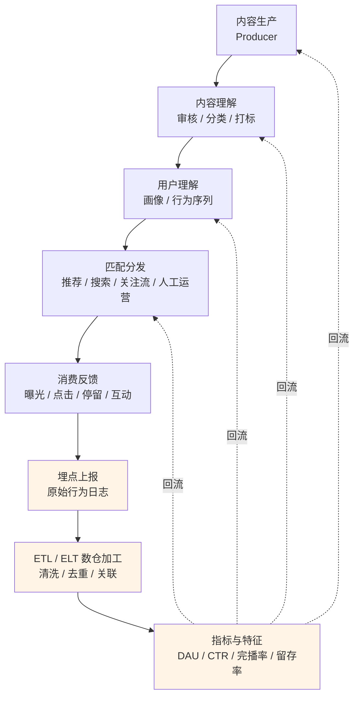
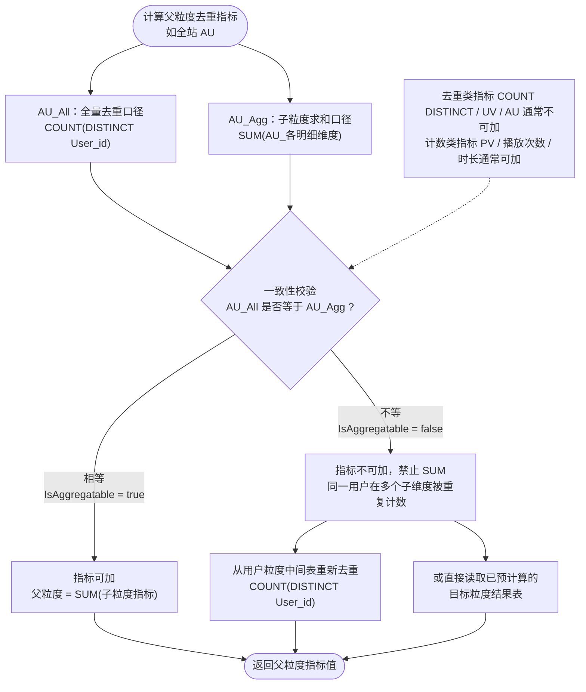

---

title: "【工作杂谈_20260910】多维分析与数据建模:应用案例"
date: 2026-08-17T20:51:34+08:00
draft: true
tags: ["维度上卷", "多维分析", "OLAP", "数据建模"]
categories: ["工作杂谈"]
description: "梳"

---

# 1、内容平台概念的介绍

定义：内容平台是一个**连接内容生产者与内容消费者，通过聚合、分发信息来匹配供需双方，并以此构建商业模式的数字化媒介系统**

（定义比较晦涩难懂，可以直接看下表格中的典型代表）

很多人以为内容平台就是个“容器”——把文章、视频放上去给人看。但实际上，它的本质是**匹配引擎**：

- **生产者**有表达、影响力、变现的需求
- **消费者**有获取信息、娱乐、社交的需求
- **平台**居中做三件事：**聚合内容 → 理解用户 → 匹配分发**

需要补充的是，消费者这一侧支付的通常不是钱，而是**注意力和时间**，平台再把注意力二次卖给广告主——所以更准确地说，它是"内容—注意力—广告"的**三角结构**，而不是简单的供需两方。把上面三方的行为展开可以得到一个**五步闭环**（具体请看下面的mermaid代码）：

**内容生产 → 聚合内容/内容理解（审核/分类/打标）→ 用户理解（画像/行为序列）→ 匹配分发（推荐/搜索/关注流/人工运营）→ 消费反馈（曝光/点击/停留/互动）→ 回流到前面每一环**



所以：**没有分发能力的内容仓库只是数据库，有了分发机制的内容聚合器才是平台。**

- 用户在平台上的每一次曝光、点击、播放、点赞、评论，都会由**埋点**上报成一条条原始行为日志；

- 大数据工程师再通过 **ETL/ELT 管道**把这些日志从消息队列搬运到数据仓库，清洗、去重、关联、聚合，加工成行为明细表、用户画像表、内容特征表和各类统计指标。

- 算法工程师消费上一步的明细表、用户画像表、内容特征表和各类统计指标，精准匹配分发内容给用户（可以理解为推荐内容）

**橙色部分："埋点产生 → ETL 搬运加工 → SQL 算成指标→ 算法消费指标与特征**

下面是一些根据常见划分出来的常见的内容平台

| 类型           | 核心特征         | 典型代表            |
| ------------ | ------------ | --------------- |
| **短视频平台**​   | 碎片化、强沉浸、算法驱动 | 抖音、快手、TikTok    |
| **中长视频平台**​  | 深度内容、社区氛围    | B站、YouTube      |
| **图文资讯平台**​  | 时效性强、信息密度高   | 今日头条、百家号        |
| **知识/问答社区**​ | 专业度、信任感、长尾价值 | 知乎、Quora        |
| **音频内容平台**​  | 伴随性、场景灵活     | 喜马拉雅、小宇宙        |
| **社交内容平台**​  | 关系链 + 内容双轮驱动 | 小红书、微博、微信视频号    |
| **垂直内容平台**​  | 聚焦特定领域或人群    | 雪球（财经）、Keep（健身） |

内容平台有一种"业务实体的天然层级"，大致可以分为四层

| 层级含义                 | Google Ads                                                                                                                      | Meta Ads                      | Google Campaign Manager 360                                                                                 |
| -------------------- | ------------------------------------------------------------------------------------------------------------------------------- | ----------------------------- | ----------------------------------------------------------------------------------------------------------- |
| 顶层：签约主体/账户 PartnerID | Customer/Account ID [[support.google.com]](https://support.google.com/google-ads/answer/1704396?hl=en)                          | Business Manager → Ad Account | Network/Partner ID [[learnandscale.com]](https://learnandscale.com/campaign-manager-360-account-hierarchy/) |
| 二层：品牌/活动分组 BrandID   | Campaign ID [[linkedin.com]](https://www.linkedin.com/pulse/complete-guide-google-ads-account-structure-narender--pfojc)        | Campaign                      | Advertiser                                                                                                  |
| 三层：内容/投放单元 ContentID | Ad Group ID [[developers...google.com]](https://developers.google.com/google-ads/api/docs/concepts/api-structure)               | Ad Set                        | Campaign / Placement                                                                                        |
| 四层：实例/创意 ItemID      | Ad ID（AdGroupId+AdId全局唯一） [[developers...google.com]](https://developers.google.com/google-ads/api/docs/concepts/api-structure) | Ad（Creative ID）               | Ad / Creative [[learnandscale.com]](https://learnandscale.com/campaign-manager-360-account-hierarchy/)      |

其中最细的层级是内容（可能是文章、视频、图片等），而实例则是为查询存储构造的“聚合对象键”，比如通过`Key=签约主体_品牌_内容`可以唯一确定一份投放的内容。

- 对于用户而言，当用户在不同的地区、设备、时间等多个场景的组合下点击/读取到这份内容，就会触发前端设置的埋点（比如点击广告/点赞/评论等），并产生一条用户行为记录，然后通过前后端的初步处理后进入对应的业务数据库。
  
  当平台管理的文章和用户逐渐增多，可以想象这个数据量是很大的，一个小时就可能产生TB级别的数据。想直接分析这部分海量数据是很困难的，所以需要大数据开发对这部分数据进行处理，初步清洗并聚合数据，以便后续的分析工作开展。

- 对于广告投放方而言，他们关注的不是每个用户，而是他们发布的内容被多少用户阅读、点击、评论、点赞等，最终用于判断内容投放是否合理，是否能够因此产生利益，所以需要在一定时间范围内对用户行为记录汇总，得到以内容为中心展开的各个维度信息。

# 2、ActiveUserCount指标概念的介绍

在了解了什么是内容平台后，以ActiveUserCount指标为切入点，看一下大数据开发是如何初步清洗并聚合数据来开展分析工作的？

ActiveUserCount=“活跃用户数”，简称AUCount，是用来统计在指定时间窗口内（日/周/月）有过活跃行为的独立用户数量（它是衡量平台用户参与度、内容粘性的核心 KPI 之一）

关于ActiveUserCount指标更加详细的拓展请看这篇： [【工作杂谈_20260810】用户分析与身份体系: Active User：定义、计算口径与常见应用](https://eleanora-lyh.github.io/MyLearningNotes/posts/work/useranalyticsidentity/20260810_%E7%94%A8%E6%88%B7%E5%88%86%E6%9E%90%E4%B8%8E%E8%BA%AB%E4%BB%BD%E4%BD%93%E7%B3%BB_activeuser%E6%8C%87%E6%A0%87%E5%8F%A3%E5%BE%84/)

计算方式和普通计数 Count的区别如下（AUCount是不可以直接聚合的）

| 指标类型             | 举例                                      | 能否直接 SUM 跨维度聚合 | 理由                         |
| ---------------- | --------------------------------------- | -------------- | -------------------------- |
| 普通计数 Count       | 文章阅读数PageViewCount、文章点击数ClickCount      | 可以             | 一周的浏览量 = 过去7天的日浏览量之和       |
| 去重活跃用户计数 AUCount | 文章活跃用户点击数ContentAUCount（Active User的缩写） | **不一定**        | 一周的活跃用户计数 ≠ 过去7天的日活跃用户计数之和 |

假设用户行为表记录的是用户在某一时间/某一国家/以某种方式阅读了n秒content，其表结构如下

| user_id | partner_id | brand_id | content_id | start_time           | market | device | end_time             | cost_time |
| ------- | ---------- | -------- | ---------- | -------------------- | ------ | ------ | -------------------- | --------- |
| user1   | partner1   | brand1   | content1   | 2026-08-05 13:58:00Z | China  | App    | 2026-08-05 14:05:00Z | 420.00s   |

当计算**Content 级**的`AUCount`时，需要以文章的唯一标识为Key进行数据汇总，先按照一定规则（比如判断是否是真人而不是机器刷的流量）将其标记为是否是ActiveUser，打上标签IsActiveUser=0/1，再以文章**Key+相应的统计维度**为`GROUP BY`条件`Sum(IsActiveUser)`

### 可加度量/半可加度量/不可加度量

| 类型                        | 定义                                | 典型例子                                |
| ------------------------- | --------------------------------- | ----------------------------------- |
| **可加度量 (Additive)**       | 沿事实表**所有**维度都能直接 SUM              | 销售额、PV、点击次数、TimeSpent（时长）           |
| **半可加度量 (Semi-Additive)** | 沿**部分**维度可加，但沿某一维（几乎总是**时间**维）不可加 | 账户余额、库存量、在线人数快照、DAU/MAU             |
| **不可加度量 (Non-Additive)**  | 沿**任何**维度都不能直接相加，必须由更底层的分子/分母重算   | 比率、百分比、CTR、平均值、去重计数（distinct count） |

半可加度量的关键判断法：把两行明细相加，结果是否还有业务含义。余额沿"客户"维可加（全行存款=各账户之和），沿"时间"维不可加（1月余额+2月余额无意义），所以是半可加。

只有在维度值互斥且用户不跨维度（例如按用户属性切分，一个用户只归属一个国家）时，AU 才表现得像半可加；只要维度可能重叠，它就是彻底的不可加。

### AUCount是不可加度量

去重计数ActiveUserCount严格讲它是**不可加度量（distinct count 类）**，在实践中常被当作半可加处理（后面讲为什么）：

- **沿时间不可加**：DAU 累加 30 天 ≠ MAU，因为同一用户在多天重复出现，会被重复计数。
- **沿其他维度也通常不可加**：因为同一个用户可能同时出现在两个渠道，把"手机端 AU + PC 端 AU"相加也不等于总 AU，因为存在跨端重合用户，相加会重复计数。这一点正是它比"账户余额"这种标准半可加度量更严格的地方——余额沿非时间维是真正可加的。

为了验证这一点，我们手动计算一下AUCount：为了方便理解，我们将上面的用户行为表简化一下得到

| user_id | partner_id | brand_id | content_id | market | device |
| ------- | ---------- | -------- | ---------- | ------ | ------ |
| user1   | Partner1   | Brand1   | ContentA   | CN     | Web    |
| user1   | Partner1   | Brand1   | ContentA   | US     | Web    |
| user2   | Partner1   | Brand1   | ContentA   | CN     | App    |
| user2   | Partner1   | Brand1   | ContentB   | CN     | Web    |

已知：

- Key= `签约主体_品牌_内容`即`PartnerId_BrandId_ContentId`

- 统计维度：market和device，用这两个维度可以得到market、device、market+device、all market+all device共4种组合，也就是说针对1张表的记录可以膨胀得到4张表的统计结果


market：market=CN时有user1+user2；market=US时有user1

| PartnerId | BrandId | ContentId | Market | Device | AUCount |
| --------- | ------- | --------- | ------ | ------ | ------- |
| Partner1  | Brand1  | ContentA  | CN     | all    | 2       |
| Partner1  | Brand1  | ContentA  | US     | all    | 1       |
| Partner1  | Brand1  | ContentB  | CN     | all    | 1       |

**device：device=Web时**

- Key=`Partner1_Brand1_ContentA`的有user1；device=App时有user2

- Key=`Partner1_Brand1_ContentA`的有user1；device=App时有user2

| PartnerId | BrandId | ContentId | Market | Device | AUCount |
| --------- | ------- | --------- | ------ | ------ | ------- |
| Partner1  | Brand1  | ContentA  | all    | Web    | 1       |
| Partner1  | Brand1  | ContentA  | all    | App    | 1       |
| Partner1  | Brand1  | ContentB  | all    | Web    | 1       |

market+device：和原表保持一致

| PartnerId | BrandId | ContentId | Market | Device | AUCount |
| --------- | ------- | --------- | ------ | ------ | ------- |
| Partner1  | Brand1  | ContentA  | CN     | Web    | 1       |
| Partner1  | Brand1  | ContentA  | US     | Web    | 1       |
| Partner1  | Brand1  | ContentA  | CN     | App    | 1       |

all market+all device：在忽略market、device维度的影响后，有user1+user2

| PartnerId | BrandId | ContentId | Market | Device | AUCount |
| --------- | ------- | --------- | ------ | ------ | ------- |
| Partner1  | Brand1  | ContentA  | all    | all    | 2       |

这4种维度组合按照我的理解就是：我们可以用这四个角度来对同一个用户记录表观察分析，以market、device的四种组合来统计对应的AUCount数值，就可以统计得到不同组合和AUCount数值的关系。

market+device组合得到的是

```text
CN + App = 1 个用户：user1
CN + Web = 1 个用户：user1
US + Web = 1 个用户：user2
```

All Market + All Device组合得到的是

```text
all + all = 2 个用户：user1 user2
```

很明显如果将market+device组合得到的各明细维度的AUCount累加，不能得到All Market + All Device组合的AUCount

```sql
AUAgg：SUM(各明细维度 AUCount) = 1 + 1 + 1 = 3 -- user1 被重复计算，错误结果
AUAll：COUNT(DISTINCT user_id) = 2         -- 正确结果
```

**这就是为什么AUCount是不可加度量，不可加度量虽然在语义上保护了数值的准确性，但是如果在任何情况下AUCount的值都是不可以直接Sum的也会有问题：**——就是上卷后无法获取AUCount

PS：上面为了好理解，我说的是通过多维分析会将原表膨胀为4张表，但是在实际生产中为了方便取数我们通常使用分组聚合函数或`CROSS JOIN`在计算阶段就将这四张表合并为一个，具体实现详见 [【工作杂谈_20260806】多维分析与数据建模: CROSS JOIN 实战：灵活生成多维聚合组合](https://eleanora-lyh.github.io/MyLearningNotes/posts/work/multidimensionalanalysis/20260806_%E5%A4%9A%E7%BB%B4%E5%88%86%E6%9E%90%E4%B8%8E%E6%95%B0%E6%8D%AE%E5%BB%BA%E6%A8%A1_crossjoin%E5%A4%9A%E7%BB%B4%E8%81%9A%E5%90%88%E5%AE%9E%E6%88%98/)

## 不可加度量AUCount的上卷

如果不了解什么是上卷，请详见 [【工作杂谈_20260817】多维分析与数据建模: 维度上卷——从明细粒度到汇总层级](https://eleanora-lyh.github.io/MyLearningNotes/posts/work/multidimensionalanalysis/20260817_%E5%A4%9A%E7%BB%B4%E5%88%86%E6%9E%90%E4%B8%8E%E6%95%B0%E6%8D%AE%E5%BB%BA%E6%A8%A1_%E7%BB%B4%E5%BA%A6%E4%B8%8A%E5%8D%B7/)
简单来说就是要把Content级别的数据汇总到上一级Brand

| PartnerId | BrandId | ContentId | Market | Device | AUCount |
| --------- | ------- | --------- | ------ | ------ | ------- |
| Partner1  | Brand1  | ContentA  | CN     | Web    | 1       |
| Partner1  | Brand1  | ContentA  | US     | Web    | 1       |
| Partner1  | Brand1  | ContentA  | CN     | App    | 1       |
| Partner1  | Brand1  | ContentB  | CN     | Web    |         |

即ContentId=all，对应的维度统计信息

| PartnerId | BrandId | ContentId | Market | Device | AUCount |
| --------- | ------- | --------- | ------ | ------ | ------- |
| Partner1  | Brand1  | all       | CN     | Web    | 1       |
| Partner1  | Brand1  | all       | US     | Web    | 1       |
| Partner1  | Brand1  | all       | CN     | App    | 1       |

此时如果想得到维度组合


**这是处理半可加/不可加度量的一种常规工程手法**，属于"元数据驱动的聚合规则"模式：在度量的元数据上标注它能否沿当前上卷路径相加，聚合引擎据此分流——能加的走 SUM，不能加的走另一条路。你描述的"读取另一个文件"属于其中最常见的一条路：**预计算（pre-aggregation）**。

应对方式也很简单，由于4种维度组合得到的AUCount彼此互不影响，所以把写四个groupby条件即可，更方便的做法是使用分组聚合函数或者CROSS JOIN，

### 维度上卷以及处理方式

因此对每个 `(partner_id, brand_id, content_id)` 分别计算 AUAgg和AUAll

$$
AUAgg = \sum PageViewAUCount_{各明细维度}
$$

$$
AUAll = COUNT(DISTINCT\ UserMUID)
$$

```text
IsAggregatable = (AUAgg == AUAll)
```

- `IsAggregatable=true`：各维度 AU 可以直接相加。
  
  举个例子：以

- `IsAggregatable=false`：同一用户跨维度重复出现，直接相加会重复计数，需要生成额外的 OffAgg 数据。为了方便后面向上计算Content=all的上卷，所以需要将这部分不能重复计数的指标单独记录在AUAgg文件中

## 3.3 spark插入数据的ETL流程介绍

以同一篇 Content A 为例，用户分布可能如下：

| user_id | partner_id | brand_id | content_id | market | device |
| ------- | ---------- | -------- | ---------- | ------ | ------ |
| user1   | Partner1   | Brand1   | ContentA   | CN     | Web    |
| user1   | Partner1   | Brand1   | ContentA   | US     | Web    |
| user2   | Partner1   | Brand1   | ContentA   | CN     | App    |

这里主要只写了关注的几列，`partner_id+brand_id+content_id`作为唯一标识一篇文章的Key，其中market、device是两个统计维度，用这两个维度可以得到market、device、market+device、all market+all device共4种组合。 也就是说一条用户记录我们可以用四个角度来观察进行分析。

结合上面提到的ActiveUser概念，以market、device的四种组合来统计对应的ActiveUser数值，就可以得出market、device对ActiveUser的影响。

这四种组合得到的ActiveUser数值之间是互不影响的，举例如下

```text
CN + App = 1 个用户：user1
CN + Web = 1 个用户：user1
US + Web = 1 个用户：user2
```

但是如果想查询“All Market + All Device”（）时，直接相加，会得到：

```sql
AUAgg：SUM(各明细维度 AUCount) = 1 + 1 + 1 = 3 -- user1 被重复计算，错误结果
AUAll：COUNT(DISTINCT user_id) = 2         -- 正确结果
```

但是如果`SUM(某统计维度 AUCount)`恰好等于`COUNT(DISTINCT user_id)`，比如device 维度下 device=Web的AUCount=1 ，device=App的AUCount=1，此时`SUM(某统计维度 AUCount)`=1+1=2，`COUNT(DISTINCT user_id)`=2，就可以增加一列`IsAggregatable=true`表示此时的 AU 在上卷后可以直接相加。

因此对每个 `(PartnerID, BrandID, ContentID)` 分别计算 AUAll和AUAgg

$$
AUAgg = \sum PageViewAUCount_{各明细维度}
$$

```text
IsAggregatable = (AUAgg == AUAll)
```

- `IsAggregatable=true`：各维度 AU 可以直接相加。
  
  举个例子：以

- `IsAggregatable=false`：同一用户跨维度重复出现，直接相加会重复计数，需要生成额外的 OffAgg 数据。为了方便后面向上计算Content=all的上卷，所以需要将这部分不能重复计数的指标单独记录在AUAgg文件中



2.3.1 `AllUpCombinations` 做了什么

`AllUpCombinations` 定义了 ContentType、Vertical、Market、Language、Device 这 5 个维度允许怎样保留明细值或上卷成 `All`。

例如一条原始记录为：

```text
ContentType=Article, Vertical=News, Market=CN, Language=zh-CN, Device=App
```

与 `AllUpCombinations` 做 CROSS JOIN 后，会产生多种聚合视角（具体详见另一篇 [CROSS JOIN出现背景引入](https://eleanora-lyh.github.io/MyLearningNotes/posts/work/20260806_crossjoin%E7%9A%84%E7%A5%9E%E5%A5%87%E7%94%A8%E6%B3%95/#21-%E9%97%AE%E9%A2%98%E5%87%BA%E7%8E%B0%E8%83%8C%E6%99%AF%E4%BB%A5%E5%8F%8Across-join%E5%BC%95%E5%85%A5)）例如：

```text
Article + News + CN  + zh-CN + App
Article + News + CN  + zh-CN + All
Article + News + All + All   + All
All     + All  + All + All   + All
```

代码中使用 `255` 表示某个维度的 `All`。随后再按以下字段分组并重新执行去重：

```text
PartnerID + BrandID + ContentID -- 确定唯一的一篇内容
+ ContentTypeId + VerticalId + MarketId + LanguageId + DeviceId -- 确定唯一的一个浏览
```

这一步会让**同一个 Content key(Key=PartnerID + BrandID + ContentID) 对应多条维度记录**，但不会创建新的 PartnerID、BrandID 或 ContentID。因此：

> `AllUpCombinations` 主要影响“每个 key 有多少行”，不会直接增加“有多少个 key”。

普通 `PageViewContent` 会保留所有 Content 及其 `IsAggregatable` 标记；`PageViewContentOffAgg` 是对 `IsAggregatable=false` Content 的额外精确 UU 数据，不是普通 PageView 的替代品。
