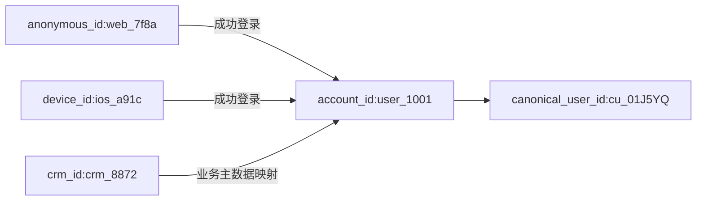
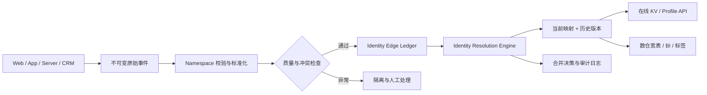

# 1. 先说结论：CanonicalUserId 到底是什么

**CanonicalUserId 不是行业统一标准字段，也不是天然存在于客户端的某个 ID。**

更准确地说，它是身份解析系统根据一组用户标识及其关联证据，为某个业务实体生成或选定的**内部主键**。它让下游不必分别使用 `user_id`、`device_id`、Cookie ID、手机号或第三方平台 ID，而是通过一个统一键查询该实体的事件、属性和关系。

可以先记住下面这句话：

> CanonicalUserId 是身份解析的结果，不是身份解析的依据；它代表的是规则定义下的业务实体，不一定等于现实世界中的自然人。

例如，系统收集到以下标识：

```plain
anonymous_id = web_7f8a
device_id    = ios_a91c
account_id   = user_1001
crm_id       = crm_8872
```

经过可靠的登录、绑定或业务系统映射后，它们可能被归到：

```plain
canonical_user_id = cu_01J5YQ...
```

这里的 `cu_01J5YQ...` 通常只是一个不透明、稳定的内部代理键。它本身不包含手机号、邮箱等业务含义。

## 1.1 第一个问题不是“用哪个 ID”，而是“要统一什么实体”

“用户”在不同业务中可能指完全不同的对象：

| 实体粒度 | 典型定义 | 适用场景 | 容易混淆的地方 |
| --- | --- | --- | --- |
| 自然人 Person | 现实中的一个人 | 跨渠道客户经营、合规客户视图 | 很难仅凭设备和行为绝对确认 |
| 账号 Account | 一个可登录账号 | 产品分析、权限、会员体系 | 一人可有多账号，家庭也可能共用账号 |
| 设备 Device | 一次安装或浏览器实例 | 设备风控、推送、匿名分析 | 会重装、清 Cookie，也可能多人共用 |
| 会话 Session | 一段连续访问 | 流量与访问路径分析 | 生命周期很短，不能代表长期用户 |
| 家庭 Household | 一组家庭成员或共用地址 | 家庭订阅、电视、零售营销 | 不能直接替代自然人视图 |
| 企业/组织 Organization | 公司、门店或租户 | B2B SaaS、账号层分析 | 一个自然人可属于多个组织 |

因此，在建立 CanonicalUserId 之前必须先写清楚：

1. 这个 ID 代表自然人、账号，还是设备？
2. 是否允许一个人对应多个账号？
3. 是否允许一个账号被多人共用？
4. 发生账号合并、手机号换绑时，历史如何处理？

对于大多数产品行为分析，**把“稳定业务账号”作为已登录用户实体，把匿名浏览器或 App 安装实例作为临时实体**，往往比宣称“已经识别出自然人”更准确。

## 1.2 几个容易混用的概念

| 概念 | 含义 | 示例 |
| --- | --- | --- |
| Identifier | 外部系统产生的标识值 | `user_1001`、`web_7f8a`、手机号 |
| Namespace | 标识所属的命名空间和语义 | `account_id`、`anonymous_id`、`crm_id` |
| Identity Edge | 两个标识属于同一实体的证据 | 某设备成功登录了某账号 |
| Identity Graph | 以标识为节点、关联证据为边的图 | `web_7f8a -> user_1001 <- ios_a91c` |
| Identity Resolution | 根据规则合并、拒绝或拆分身份的过程 | 登录绑定、冲突检测、解绑 |
| CanonicalUserId | 解析后实体的稳定内部主键 | `cu_01J5YQ...` |
| User Profile | 以统一主键聚合出的属性和行为视图 | 会员等级、最近活跃时间、累计消费 |

`One ID`、`ID-Mapping`、`Identity Graph`、`Entity Resolution` 经常在同一个话题中出现，但侧重点不同：

- **ID-Mapping** 强调标识之间如何建立映射。
- **Identity Graph** 强调标识和实体之间的图关系。
- **Entity Resolution** 范围更广，还可能根据姓名、地址、邮箱等进行规则或概率匹配。
- **CanonicalUserId / One ID** 强调最终供下游使用的统一主键。

# 2. 为什么需要身份归一

## 2.1 一个用户为什么会产生多个标识

假设同一个账号经历了下面的访问路径：

| 时间 | 行为 | 当时可见的标识 |
| --- | --- | --- |
| T1 | 在浏览器匿名查看商品 | `anonymous_id=web_7f8a` |
| T2 | 在该浏览器注册并登录 | `web_7f8a + account_id=user_1001` |
| T3 | 在 iPhone App 匿名浏览 | `device_id=ios_a91c` |
| T4 | 在 App 登录同一账号 | `ios_a91c + account_id=user_1001` |
| T5 | 在线下 CRM 完善资料 | `account_id=user_1001 + crm_id=crm_8872` |

如果只按原始标识计数，系统可能把它看成四个用户；如果利用 T2、T4、T5 的确定性关联，则可以得到：



身份归一真正解决的是：**同一个业务实体在不同时间、终端和系统中留下了不同的键，而分析与服务需要一个连续视图。**

## 2.2 不做身份归一会怎样

- 匿名浏览和注册事件分属两人，注册漏斗被截断。
- 同一账号换设备后被重复计算，AU、留存和新增用户数偏高。
- 广告点击、站内浏览和最终订单无法形成完整归因链路。
- 客服、CRM、交易和行为数据无法拼成统一客户视图。
- 已退订用户在另一个标识下仍被营销触达。
- 风控系统看不到同一账号与多个设备、支付工具之间的关系。

不过，错误合并通常比漏合并更危险。漏合并会把一人看成多人；错误合并则可能把甲的画像、订单或营销授权给乙，既污染数据，也可能形成隐私和合规事故。

## 2.3 为什么 `user_id + device_id` 不能成为统一用户键

`user_id + device_id` 描述的是“某账号在某设备上的组合”，不是用户实体：

- 一个账号登录三台设备，会产生三个组合键。
- 同一设备先后登录两个账号，会产生两个组合键。
- 匿名阶段没有 `user_id`，组合键无法生成。
- 清 Cookie、重装 App 或更换设备后，组合键会再次变化。

同样，下面这种写法也只能作为临时降级方案：

```sql
COALESCE(user_id, device_id)
```

匿名时它返回 `device_id`，登录后却返回 `user_id`，前后仍是两个用户。只有在身份解析已经建立 `device_id -> canonical_user_id` 映射后，`COALESCE` 才能用于选择解析结果或兜底标识。

# 3. 身份归一是怎样工作的

## 3.1 把标识看成节点，把证据看成边

最直观的模型是图：

- 节点：`(namespace, normalized_value)`，例如 `(account_id, user_1001)`。
- 边：两个节点属于同一实体的证据，例如“设备 D 在认证成功后登录账号 U”。
- 连通实体：经过规则校验后可归并到同一 CanonicalUserId 的节点集合。

为什么节点必须包含 Namespace？因为不同系统都可能出现值 `12345`：

```plain
(crm_id, 12345) != (account_id, 12345) != (store_member_id, 12345)
```

一条生产可用的边也不能只有 `left_id` 和 `right_id`，至少还要能回答：

- 关系来自登录、人工绑定、CRM 导入，还是模型推断？
- 哪个系统、哪条事件产生了这条关系？
- 关系何时生效、何时失效？
- 使用了哪个规则版本？
- 能否撤销，发生冲突时如何重算？

## 3.2 关联证据并不等价

| 证据类型 | 示例 | 一般处理方式 |
| --- | --- | --- |
| 强确定性证据 | 服务端确认账号登录、账号合并、主数据映射 | 可直接建立高可信边 |
| 中等确定性证据 | 已验证邮箱、已验证手机号 | 需考虑共享、回收、换绑和有效期 |
| 弱标识 | Cookie、广告 ID、安装 ID、设备 ID | 可辅助串联匿名行为，不应单独证明自然人相同 |
| 概率证据 | 姓名、地址、IP、User-Agent、行为相似度 | 输出候选或置信度，谨慎自动合并 |

产品行为分析通常优先采用**确定性匹配**：只有同一事件或可信业务关系同时带出两个标识时才建边。跨 CRM 的客户去重可能使用规则或机器学习匹配，但必须保留分数、阈值和人工复核机制。

需要特别注意：

- 邮箱和手机号会变更、共享或被运营商回收，不是天然永久主键。
- IP 地址、机型和 User-Agent 的共现不能证明是同一人。
- 对邮箱或手机号做哈希只是降低明文暴露，不会让错误数据变准确，也不自动满足匿名化要求。

## 3.3 标识规范化先于匹配

身份解析前通常需要进行标准化和质量校验：

- 邮箱按业务规则处理大小写、空格和非法格式。
- 手机号转换为带国家码的 E.164 格式。
- 明确业务 ID 是否区分大小写，不应无条件转小写。
- 拒绝 `null`、`unknown`、`-1`、全零值等公共占位符。
- 每个来源系统声明它能生产哪些 Namespace，以及这些值是否唯一。

如果把公共占位符当成有效标识，数以万计的用户可能通过 `user_id=null` 被合并成一个巨型身份簇，这类事故常被称为 **Graph Collapse（图坍缩）**。

## 3.4 CanonicalUserId 应该怎么生成

常见方案有三种：

| 方案 | 优点 | 风险与限制 |
| --- | --- | --- |
| 直接使用业务 `user_id` | 简单、可读、容易关联业务库 | 账号迁移、跨租户、多账号合并时不稳定 |
| 平台选定某个已有 ID | 无需额外生成主键 | 选择规则可能不可控，外部 ID 变化会影响使用 |
| 生成不透明内部 ID | 与邮箱、设备、账号解耦，便于合并和版本管理 | 需要额外维护成员关系和重定向表 |

复杂系统通常更适合第三种方案：为 Profile 生成 UUID、ULID 或内部序列号，把所有外部标识作为成员挂到 Profile 下。

当两个 Profile 合并时，不要批量修改所有下游事实表的主键。可以保留一个存活 ID，并记录重定向：

```plain
cu_old_02 -> cu_survivor_01
```

下游解析时沿重定向找到当前主 ID，同时仍能追溯历史上使用过的 ID。

## 3.5 为什么不能直接对所有边求连通分量

假设一台共享平板先后登录两个账号：

```plain
account_A -- device_shared -- account_B
```

如果只使用“存在路径即同一人”的传递闭包，`account_A` 和 `account_B` 会被合并。这显然不合理：设备可以共享，而账号 ID 在当前业务中可能要求一个 Profile 最多只能有一个。

生产系统会增加约束和保护规则：

1. **唯一性约束**：一个 Profile 最多允许一个 `account_id` 或 `crm_id`。
2. **标识优先级**：稳定账号 ID 高于邮箱，邮箱高于匿名 ID。
3. **数量与时间窗口**：限制一个 Profile 在一定时间内可关联的设备、邮箱或匿名 ID 数量。
4. **来源可信度**：服务端认证关系高于客户端自报关系。
5. **阻断值**：占位符、测试账号和已知异常值不能参与合并。
6. **冲突隔离**：规则无法判断时进入待处理队列，而不是强行归并。
7. **可解绑与重算**：错误边失效后可以重新计算受影响的局部身份簇。

## 3.6 确定性 ID-Mapping 与概率实体解析

两者解决的是相邻但不完全相同的问题：

| 维度 | 确定性 ID-Mapping | 概率 Entity Resolution |
| --- | --- | --- |
| 输入 | 登录关系、绑定关系、稳定业务 ID | 姓名、地址、邮箱、电话等属性 |
| 判断 | 有明确证据才关联 | 根据规则或模型计算相似度 |
| 输出 | 绑定/不绑定 | 匹配组和置信度 |
| 典型场景 | 埋点、跨设备产品分析 | 多 CRM 去重、线下客户主数据整合 |
| 主要风险 | 埋点错误导致错误合并 | 阈值不当导致误匹配或漏匹配 |

第一次建设时，应该先把确定性的登录和绑定链路做好，再评估是否真的需要概率匹配。不要用 IP、设备指纹等弱信号偷偷“猜人”，然后把结果包装成确定的 CanonicalUserId。

# 4. 用完整用户旅程理解 CanonicalUserId

## 4.1 匿名浏览到登录

以 Mixpanel 的 **Simplified ID Merge API** 为例，客户端 SDK 会先生成 `$device_id`。调用 `identify(user_id)` 后，后续事件会同时包含 `$device_id` 和 `$user_id`；当 Mixpanel 首次收到二者共存的事件时，会建立映射。

```javascript
mixpanel.identify("user_1001");
mixpanel.track("Login Succeeded");
```

官方文档特别要求 `identify()` 后至少发送一个事件，因为 Simplified API 是由同时包含 `$device_id` 与 `$user_id` 的事件触发合并，而不是仅凭本地函数调用完成服务端映射。

在自己的数仓中，也应该保留两个层次：

| 层次 | 保存内容 | 是否允许重写 |
| --- | --- | --- |
| 原始事实 | 事件发生时实际携带的匿名 ID、账号 ID、时间和来源 | 不重写 |
| 解析结果 | 当前或指定版本下的 CanonicalUserId | 可随规则重算 |

这样既能用“当前映射”回看完整注册漏斗，也能用“事件发生时映射”复现历史报表。不同平台的“回溯合并”实现并不相同：有的平台在查询时应用映射，有的平台会更新分析索引；不能简单理解为所有历史原始事件都被物理改写。

## 4.2 跨设备统一

跨设备不是通过相似设备特征自动完成的，而是两个设备都出现了同一个可信账号标识：

```plain
web_7f8a  --登录--> user_1001
ios_a91c --登录--> user_1001
```

于是二者可解析到同一个 CanonicalUserId。若 Mac 浏览器始终没有登录、绑定或其他可靠证据，它就应继续保持匿名。**无法确认的身份不合并，是正确结果，不是系统缺陷。**

## 4.3 退出登录与共享设备

共享设备是最容易发生错误合并的场景。建议把以下状态变化写入统一的 SDK 规范：

1. 登录成功后设置稳定账号 ID，并发送一条成功事件。
2. 退出或认证超时后清理本地账号身份。
3. 当使用者可能变化时，生成新的匿名 ID 或会话作用域 ID。
4. 不要把硬件设备 ID 永久等同于最近一次登录账号。

`reset()` 的具体语义是厂商和版本相关的：

- Mixpanel 当前 Simplified API 文档建议在退出或认证超时时调用 `.reset()`。
- Mixpanel Original API 文档为了避免频繁增加身份簇成员，讨论了只在明确切换使用者时 reset 的策略。
- Amplitude 要显式匿名化时，建议把 User ID 设为 `null`，同时生成新的 Device ID；否则后续匿名事件可能继续归到该设备上最后一个已知用户。

因此，不能总结成“退出一定 reset”或“普通退出永远不 reset”。正确做法是先确认所用 SDK 版本，再根据共享设备、匿名期归因和身份簇限制设计状态机。

## 4.4 账号合并、解绑与手机号回收

真实系统还会遇到：

- 用户把两个业务账号申请合并。
- 客服误绑账号后需要撤销。
- 手机号从用户 A 换绑，并在未来被用户 B 使用。
- 企业客户更换 CRM，主数据 ID 被重新编码。

这说明映射不是静态字典，而是带时间和版本的关系：

```plain
(phone, +86138...) -> account_A  [2025-01-01, 2026-03-01)
(phone, +86138...) -> account_B  [2026-07-01, ...)
```

解绑不应删除原始事件和审计记录，而应使关系在某个时间点失效，并重新计算受影响的 Profile。对历史报表，还要明确使用“当时身份”还是“当前最新身份”。

## 4.5 CanonicalUserId 能支持哪些应用

| 应用 | CanonicalUserId 的作用 | 仍需额外定义的规则 |
| --- | --- | --- |
| AU、留存 | 跨设备去重同一用户 | 活跃事件、时间窗口、实体粒度 |
| 注册漏斗 | 串联注册前匿名行为与注册后行为 | 转化窗口、匿名行为归属策略 |
| 渠道归因 | 连接广告点击、站内行为和订单 | First-touch、Last-touch 等归因模型 |
| 用户画像 | 汇总 CRM、交易和行为属性 | 属性优先级、有效期、冲突规则 |
| 营销触达 | 跨渠道去重、退订和频控 | 授权、同意状态、渠道可达性 |
| 风控 | 发现账号、设备、支付工具之间的关系 | 风险边、图遍历、模型和人工审核 |

CanonicalUserId 只解决“这些记录当前应归到哪个实体”。它不会自动解决指标口径、归因模型、画像属性冲突和隐私授权。

# 5. 从旧方案到身份图谱

| 方案 | 能解决什么 | 主要问题 |
| --- | --- | --- |
| 只用 `device_id` | 匿名设备内连续访问 | 换设备、清 Cookie、共享设备都会失真 |
| 只用 `user_id` | 已登录账号分析 | 注册前行为丢失，未登录用户不可见 |
| `COALESCE(user_id, device_id)` | 为每条事件临时选一个非空键 | 登录前后仍是两个实体 |
| 拼接 `user_id + device_id` | 标识账号和设备的组合 | 一人多设备会被拆分，匿名期无法表示 |
| 单行 `user_id -> device_id` 映射 | 最简单的一对一关联 | 无法表示多设备、多个 Namespace、历史和解绑 |
| 节点、边、Profile 模型 | 多标识、可追溯、可合并和拆分 | 需要规则治理、版本管理和质量监控 |

并不是所有公司都必须一开始就建设图平台：

- 产品只允许登录后使用，而且 `user_id` 全局稳定时，直接使用 `user_id` 已经足够。
- 需要串联注册前后行为时，增加 `anonymous_id -> user_id` 的确定性映射即可。
- 需要跨 CRM、多渠道、绑定/解绑和共享设备治理时，才需要完整 Identity Graph。
- 需要根据姓名、地址等模糊属性匹配时，再引入 Entity Resolution。

复杂度应该由真实业务问题推动，而不是因为“CanonicalUserId”听起来高级就先造一套大系统。

# 6. 如何在自己的数据平台中落地

## 6.1 先写 Identity Contract

在建表和写 Flink 任务之前，先由产品、账号、数据、隐私和安全团队共同确认一份身份契约：

1. CanonicalUserId 代表什么实体，在哪些租户和业务域内唯一？
2. 有哪些 Namespace，格式、大小写和标准化规则是什么？
3. 哪些标识是强标识，哪些可能共享或回收？
4. 哪些事件可以创建绑定，客户端自报是否可信？
5. 一个 Profile 允许出现多少个同类标识？
6. 冲突时按来源、时间还是人工结果决定？
7. 合并和拆分是否需要回算历史，保留多久？
8. 哪些标识属于 PII，谁可以查询和导出？

规则不明确时，技术系统只会更快地产生不明确的结果。

## 6.2 推荐的数据模型

一行同时放 `canonical_user_id + user_id + device_id` 无法表达一对多、来源、有效期和解绑。更可扩展的模型至少包含以下几类表：

```sql
CREATE TABLE identity_node (
    node_id                 BIGINT PRIMARY KEY,
    namespace               VARCHAR(64) NOT NULL,
    identifier_token        VARCHAR(128) NOT NULL,
    pii_class               VARCHAR(32) NOT NULL,
    first_seen_at           TIMESTAMP NOT NULL,
    last_seen_at            TIMESTAMP NOT NULL,
    UNIQUE (namespace, identifier_token)
);

CREATE TABLE identity_edge (
    edge_id                 BIGINT PRIMARY KEY,
    left_node_id            BIGINT NOT NULL,
    right_node_id           BIGINT NOT NULL,
    evidence_type           VARCHAR(64) NOT NULL,
    source_system           VARCHAR(64) NOT NULL,
    source_event_id         VARCHAR(128),
    confidence              DECIMAL(5, 4) NOT NULL,
    valid_from              TIMESTAMP NOT NULL,
    valid_to                TIMESTAMP,
    status                  VARCHAR(32) NOT NULL,
    rule_version            VARCHAR(32) NOT NULL
);

CREATE TABLE canonical_profile (
    canonical_user_id       VARCHAR(64) PRIMARY KEY,
    entity_type             VARCHAR(32) NOT NULL,
    profile_status          VARCHAR(32) NOT NULL,
    created_at              TIMESTAMP NOT NULL,
    updated_at              TIMESTAMP NOT NULL
);

CREATE TABLE profile_membership (
    node_id                 BIGINT NOT NULL,
    canonical_user_id       VARCHAR(64) NOT NULL,
    valid_from              TIMESTAMP NOT NULL,
    valid_to                TIMESTAMP,
    mapping_version         BIGINT NOT NULL,
    is_current              BOOLEAN NOT NULL,
    PRIMARY KEY (node_id, canonical_user_id, mapping_version)
);

CREATE TABLE profile_redirect (
    retired_user_id         VARCHAR(64) PRIMARY KEY,
    survivor_user_id        VARCHAR(64) NOT NULL,
    reason                  VARCHAR(128) NOT NULL,
    created_at              TIMESTAMP NOT NULL
);
```

其中 `identifier_token` 可以是受控的内部 Token，或由密钥保护的 HMAC。普通无盐哈希仍容易遭受邮箱、手机号字典枚举，不能替代访问控制和加密。

## 6.3 数据处理链路



核心原则是：

- 原始事件保持不可变。
- 标识关系采用追加式事实和有效期，而不是直接覆盖。
- 当前映射和历史映射同时保留。
- 在线服务与离线分析可以共享规则，但使用不同的物化形式。

## 6.4 一次解析决策的基本步骤

```plain
1. 从事件中提取所有已声明的 Namespace 和标识值
2. 标准化并过滤空值、占位符、测试值和非法格式
3. 查找每个标识当前所属的 Profile
4. 若均未命中，创建新 Profile
5. 若只命中一个，检查数量和唯一性约束后添加成员
6. 若命中多个，按证据、来源和优先级判断是否允许合并
7. 冲突时拒绝该边或进入隔离队列
8. 记录决策、规则版本和来源事件
9. 更新受影响 Profile 的成员关系和在线缓存
```

登录关系最好由服务端认证成功事件确认，而不是完全信任客户端传来的任意 `user_id`。否则攻击者或埋点错误可能把一个设备绑定到其他账号。

## 6.5 合并容易，拆分更难

Union-Find（并查集）非常适合只增加边的离线合并，但不擅长删除边。一旦发生误绑或手机号回收，需要拆分身份簇时，单纯并查集很难恢复原关系。

可撤销系统通常会：

1. 保留不可变的边和决策日志。
2. 将错误边标记为失效，而不是物理删除。
3. 从受影响连通子图重新计算 Profile。
4. 生成新的 Membership 版本。
5. 通过 Redirect 或变更日志通知下游更新。

这也是为什么“支持解绑”不是多写一个 `DELETE` 接口，而是一项涉及历史、缓存、画像、分群和下游导出的系统能力。

## 6.6 实时链路与离线链路

| 链路 | 目标 | 常见实现 |
| --- | --- | --- |
| 实时解析 | 登录后立即拿到统一 Profile，用于个性化和风控 | Kafka/Flink + KV/缓存 + 规则服务 |
| 离线重算 | 处理迟到数据、规则升级、合并和拆分 | Spark/Hive/图计算 + 版本化结果表 |
| 在线查询 | 按任一标识查当前 CanonicalUserId | Profile API、KV 索引 |
| 历史分析 | 按当前映射或 As-of 映射统计 | 数仓 Membership 快照或 SCD2 表 |

CanonicalUserId 不等于必须使用图数据库。若主要查询是“给定 ID 找 Profile”，关系表加 KV 索引通常已经足够；只有在风控等场景需要多跳关系遍历、路径查询和高扇出分析时，图数据库的价值才明显。

## 6.7 必须监控什么

建议至少监控：

- 匿名事件占比、已解析事件占比和映射延迟。
- 每种 Namespace 的空值率、非法率和阻断值命中率。
- 每日新增边、合并、拒绝、冲突和解绑数量。
- Profile 成员数、设备数的 P95/P99 与最大值。
- 超大连通分量数量，是否出现单点异常增长。
- 同一 Profile 包含多个唯一账号 ID 的违规数量。
- 使用身份归一前后的 DAU、漏斗和留存变化。
- 规则版本发布后被重分配的事件和 Profile 数量。

上线前应覆盖以下测试：

| 场景 | 预期结果 |
| --- | --- |
| 同一账号登录两台设备 | 两台设备可解析到同一账号 Profile |
| 两个账号先后使用共享设备 | 两个账号不被设备节点合并 |
| 退出后新用户注册 | 新用户的匿名行为不归到旧账号 |
| 手机号换绑或回收 | 新旧有效期正确，历史可追溯 |
| `user_id=null` 或测试占位值 | 不参与合并并触发告警 |
| 错误绑定后解绑 | 受影响身份簇可拆分并生成新版本 |
| 迟到登录事件到达 | 当前视图更新，原始事件保持不变 |

## 6.8 隐私和安全不是附加项

- 只采集业务确实需要的标识，并记录用途和同意状态。
- PII 与普通分析字段分层存储，使用加密、Tokenization 和最小权限。
- 不把邮箱、手机号直接编码进 CanonicalUserId。
- Profile API 只允许服务端访问，避免在客户端暴露可枚举的身份查询能力。
- 删除请求需要传播到节点、Profile、画像、导出和备份策略中。
- 跨地区、跨产品合并前确认数据驻留和用途限制。
- 概率匹配结果必须可解释、可申诉，不能直接用于高风险自动决策。

# 7. 主流平台和大规模系统的公开实现

以下内容基于截至 **2026-08-21** 可访问的官方文档。各平台解决的问题和术语并不完全相同，不能把某一家的实现直接当成行业标准。

## 7.1 Mixpanel：产品分析中的事件流拼接

[Mixpanel Simplified ID Merge](https://docs.mixpanel.com/docs/tracking-methods/id-management/identifying-users-simplified) 使用 `$device_id` 和 `$user_id`：

- 匿名事件只有 `$device_id` 时，以设备标识作为 `distinct_id`。
- 首次收到同时包含 `$device_id` 与 `$user_id` 的事件时创建身份簇。
- Simplified API 中 canonical `distinct_id` 固定为 `$user_id`。
- 可以用簇内任一 ID 写入，但查询和导出使用 canonical ID。
- Simplified API 不允许合并两个不同的 `$user_id`。
- 官方建议在退出或认证超时时调用 `.reset()`，避免共享设备误合并。

[Mixpanel Original ID Merge](https://docs.mixpanel.com/docs/tracking-methods/id-management/identifying-users-original) 则不同：

- `$identify` 只接受 UUIDv4 匿名 ID，且该匿名 ID 不能已属于其他 identified ID。
- `$merge` 可以合并任意两个 ID，但身份簇不能超过 500 个 ID。
- canonical `distinct_id` 由平台从簇内选择，未必是业务 `user_id`。
- Original 文档对 `reset()` 的建议也更偏向“明确要切换使用者时再调用”。

原文将 UUIDv4、500-ID 上限、canonical 选择和 Simplified 流程写在了一起，实际上这些约束分属不同版本。

## 7.2 Amplitude：生成内部 Amplitude ID

[Amplitude 的唯一用户文档](https://amplitude.com/docs/data/sources/instrument-track-unique-users) 描述了三层标识：Device ID、User ID 和平台生成的 Amplitude ID。

- 匿名事件先按 Device ID 获得 Amplitude ID。
- 同一设备后来出现 User ID 时，匿名事件可与已识别用户合并。
- 同一 User ID 出现在多个设备上时，平台优先按 User ID 归一。
- Amplitude 不能合并两个不同的 User ID；更换 User ID 会被视为不同用户。
- 共享设备上的后续匿名事件默认归给最后一个已知用户，除非将 User ID 设为 `null` 并生成新的 Device ID。
- 合并映射会在分析查询中生效，但导出到 Redshift 的原始事件不可变，使用原始数据计算 DAU 可能与平台界面不同。

这个例子很好地说明了“统一查询视图”和“改写原始事件”不是同一回事。

## 7.3 Segment Unify：持久 ID 加合并保护

[Twilio Segment Unify](https://www.twilio.com/docs/segment/unify/identity-resolution/) 将 Cookie、设备、邮箱、`userId` 和自定义 External ID 连接到一个持久内部 ID，并公开了比较完整的治理规则：

- 新事件匹配零个 Profile 时创建，匹配一个时追加，匹配多个时尝试合并。
- 可为标识设置阻断值、数量限制和优先级。
- 默认 `user_id` 限制为一个，其他标识默认允许多个。
- 高优先级稳定 ID 可以阻止低优先级邮箱或匿名 ID 把两个账号错误合并。
- Merge Protection 专门处理共享设备、公共匿名 ID 等问题。

Segment 不只是“收集后转发数据的管道”。它的 Connections 偏采集和路由，而 Unify 提供 Identity Resolution、Profile 和受众能力，两者要分层理解。

## 7.4 Adobe Experience Platform：防止 Graph Collapse

[Adobe Identity Graph Linking Rules](https://experienceleague.adobe.com/en/docs/experience-platform/identity/features/identity-graph-linking-rules/overview) 将生产级保护明确抽象为：

- **Unique Namespace**：一个身份图中某类标识最多只能有一个，例如 CRMID。
- **Namespace Priority**：冲突时稳定账号标识优先于设备或浏览器标识。
- **Identity Optimization Algorithm**：违反唯一性约束时重放边，并移除导致两个 Person 合并的低优先级关系。

在共享平板上先后登录两个 CRMID 时，Adobe 不会简单通过共同 ECID 把两人合并，而会拆成两个图。公开文档中的默认匿名归属采用“最后一个已认证用户”逻辑，这也再次说明“匿名行为归第一个用户”不是行业通则。

## 7.5 神策 ID-Mapping 3.0：显式 ID Key 与绑定/解绑

[神策全域用户关联文档](https://manual.sensorsdata.cn/sa/docs/idm_sdk_intro/v0204) 的公开机制包括：

- 预先定义参与关联的 ID Key，明确手机号、邮箱、OpenID 等标识语义。
- 事件包含未定义的 ID Key 时拒绝入库，避免含义不明的标识进入图谱。
- 客户端通过 `loginWithKey`、`bind`、`unbind` 建立或解除关系。
- 客户端绑定结果会进入本地缓存，后续事件携带相关 ID 信息。
- 服务端 SDK 发送绑定事件，但不会把绑定 ID 持久化到服务端 SDK 本地状态。

神策公开的[全域用户关联服务](https://www.sensorsdata.cn/blog/20220518)还强调来源可信度差异、历史数据治理以及手机号等标识发生变更时的绑定和解绑。这比“一台设备的匿名行为永远给首个登录用户”更接近真实治理过程。

## 7.6 AWS Entity Resolution：规则、机器学习与匹配组

[AWS Entity Resolution](https://docs.aws.amazon.com/entityresolution/latest/userguide/what-is-service.html) 更接近跨数据源实体解析，而不是客户端埋点 SDK：

- 对输入进行 Schema Mapping 和标准化。
- 支持基于规则、机器学习和数据供应商的匹配流程。
- 规则匹配输出命中的规则编号，机器学习匹配输出 0 到 1 的置信度。
- 支持批处理、规则场景的增量处理，以及通过 `GetMatchId` 进行近实时查找。
- ID Mapping Workflow 可把 Source Namespace 翻译到 Target Namespace。

它说明了当问题从“登录前后是否同一账号”扩展到“两个 CRM 记录是否属于同一客户”时，系统需要标准化、匹配规则、置信度和工作流，而不只是 `identify()`。

## 7.7 Airbnb：大规模关系图基础设施

[Airbnb 公开的 Identity Graph 架构](https://airbnb.tech/infrastructure/scaling-airbnbs-identity-graph-with-a-unified-knowledge-graph-infrastructure/)主要服务 Trust & Safety，不等同于产品分析中的 CanonicalUserId，但展示了大厂在多跳关系查询下的实现方式：

- 图中约有 70 亿节点、110 亿条边，每天增加约 500 万条边。
- 大部分数据通过异步事件近实时写入，在线服务进行低延迟查询。
- 存储采用 JanusGraph + DynamoDB，OpenSearch 建索引，前面还有 KV 缓存。
- 典型查询需要 4 到 8 跳，重点处理高扇出、长尾延迟和稳定性。
- 通过事件写入、批量加载、在线服务和复杂查询预计算等多个应用分离读写职责。

这个案例的启示不是“做 CanonicalUserId 必须上 JanusGraph”，而是：当需求从单跳 ID 映射升级为账号、设备、支付工具和风险关系的多跳遍历时，图存储、缓存、预计算和查询治理才会成为核心问题。

## 7.8 这些公开实现的共同模式

尽管产品不同，它们大体都在做以下几件事：

1. 为标识声明类型和语义，而不是只存一个字符串。
2. 以登录、绑定、主数据或匹配结果作为关联证据。
3. 使用内部 Profile ID 或 canonical ID 隔离外部标识变化。
4. 为共享设备、公共值和异常高扇出设置合并保护。
5. 保留原始数据，通过映射层提供当前统一视图。
6. 支持冲突检测、解绑、版本或局部重算。
7. 同时服务实时 Profile 查询和离线分析。

# 8. 一条适合从零开始的建设路径

## 8.1 第一阶段：只解决匿名到登录

最小可用方案不需要图数据库：

1. 业务账号使用永不复用的数据库 ID，不用邮箱作为 `user_id`。
2. Web/App 为匿名访问生成随机 `anonymous_id`。
3. 每条事件保留事件发生时的 `anonymous_id` 和可选 `account_id`。
4. 只有认证成功事件可以建立二者的确定性边。
5. 数仓生成 `anonymous_id -> canonical_user_id` 的当前映射。
6. 原始事件不改写，分析层按映射版本补充 CanonicalUserId。
7. 先覆盖同设备注册、跨设备登录、退出和共享设备测试。

这一阶段已经能改善注册漏斗、跨设备 AU 和留存。

## 8.2 第二阶段：增加多来源标识与治理

当 CRM、小程序、门店和客服系统接入后，再增加：

- Namespace 注册表和标准化规则。
- 来源可信度、唯一性、数量和时间窗口约束。
- Edge Ledger、Profile Membership 和 Redirect 表。
- 冲突隔离、解绑、局部重算和审计界面。
- 当前视图与 As-of 历史视图。

## 8.3 第三阶段：按需要增加实时和概率能力

只有在业务需要实时个性化或风控时，才把解析结果同步到 KV/Profile API；只有在缺少确定性键、确实需要跨系统客户去重时，才引入规则评分或机器学习匹配。

可以用下面的决策表控制复杂度：

| 当前问题 | 建议方案 |
| --- | --- |
| 产品必须登录才能使用 | 直接使用稳定 `user_id` |
| 需要分析注册前后的行为 | 匿名 ID + 确定性登录映射 |
| 多终端、多 CRM、需要解绑 | 版本化 Identity Graph |
| 姓名地址相似但无共同 ID | Entity Resolution + 置信度 |
| 风控需要多跳关系查询 | 图数据库、缓存与预计算 |

# 9. 对原文几个结论的集中修正

1. **CanonicalUserId 不保证对应唯一自然人。**它对应的是业务定义和规则版本下的实体，可能是账号或 Profile。
2. **不是所有 ID 都应使用 UUIDv4。**匿名 ID 常用 UUID；业务账号可以使用稳定、不可复用的内部主键。Mixpanel Original 的 UUIDv4 是特定 API 约束。
3. **一个 CanonicalUserId 能否包含多个 `user_id` 取决于系统规则。**Mixpanel Simplified 不允许合并两个 `$user_id`，Segment 等系统则可以配置不同限制。
4. **共享设备的匿名行为没有统一行业归属。**有的平台采用最近一次认证用户，有的平台要求 reset，也可以选择保持未解析。
5. **“匿名行为归首个登录用户”不是通用最佳实践。**它会在共享设备和账号切换中造成错误归属。
6. **500 个 ID 的簇限制不是 CanonicalUserId 的普遍限制。**它来自 Mixpanel Original API 的具体实现。
7. **`reset()` 策略必须结合厂商版本和业务状态机。**Simplified、Original、Amplitude 的建议并不相同。
8. **一张以 `canonical_user_id` 为主键的扁平映射表不够。**生产系统还需要节点、边、有效期、来源、版本和重定向。
9. **Segment 不只是数据管道。**其 Connections、Unify 和 Engage 分别覆盖采集路由、身份解析/Profile 与受众激活能力。

# 10. 总结

CanonicalUserId 表面上是“给多个 ID 找一个主 ID”，更深一层其实是一个数据治理问题：

- 先定义要统一的实体，而不是先挑一个字段。
- 用 Namespace 区分标识语义，用证据边描述为什么关联。
- 强标识和弱标识采用不同规则，宁可暂不合并，也不要错误合并。
- CanonicalUserId 最好与外部账号、邮箱和设备解耦。
- 原始事件不可变，映射关系要有来源、有效期、版本和审计。
- 合并之外还要设计冲突、解绑、拆分、回算和删除。
- 简单 ID-Mapping 不需要图数据库，多跳关系查询才需要图基础设施。

最终，CanonicalUserId 不是一张“身份证”，而是系统在特定业务边界、证据和规则下，对“这些记录当前属于同一实体”做出的可追溯判断。
